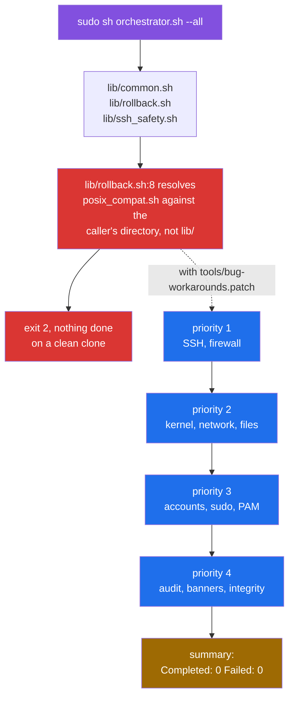
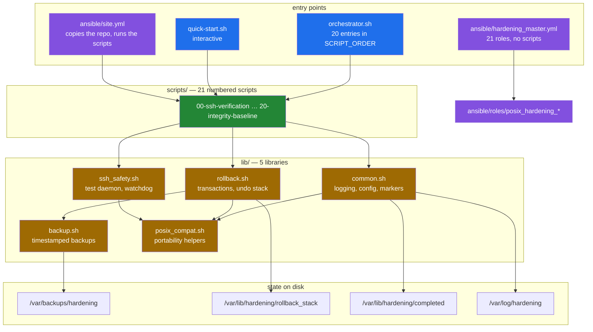

# POSIX Shell Server Hardening Toolkit

A set of POSIX `sh` scripts that harden a Debian server over SSH, plus an
Ansible tree that does the same thing across a fleet. The design goal that
shapes every part of it is not locking the operator out: SSH changes are
validated against a throwaway daemon on port 2222, a watchdog reverts the
configuration if the connection dies, and each script opens a transaction that
is meant to undo its own changes on failure. This README documents what the
code does today, measured in a container, rather than what it is designed to
do — and the two differ enough that the difference is the first thing below.

> **Status note.** Every capture, diagram and figure on this page was recorded
> before the verified-bug fix pass. Fifteen of the twenty-four entries in
> [`docs/BUGS-FOUND.md`](docs/BUGS-FOUND.md) have since been fixed on the
> default branch, including the startup failure shown in the next diagram.
> [Known limitations](#known-limitations) lists what is still open and what
> was fixed.

## What a run does, and where it stops



Both red boxes and the amber one were observed, not inferred. On an unpatched
clone every documented entry point exits 2 before doing any work
([`media/captures/pristine.txt`](media/captures/pristine.txt)); with the
workaround applied, `orchestrator.sh --all` ran 13 of its 20 declared scripts
and then reported `Completed: 0  Failed: 0`
([`media/captures/orchestrator.log`](media/captures/orchestrator.log)).

All 24 defects behind that picture are written up, with reproductions and with
the diff that would fix each one, in
[`docs/BUGS-FOUND.md`](docs/BUGS-FOUND.md). Nothing in the toolkit's source was
changed to produce this documentation.

## Quick start

Everything in this section was run on macOS 15 (arm64) with Docker 24.0.7 and
produced the output committed under `media/captures/`.

### See what a clean clone does

```sh
git clone https://github.com/Bissbert/POSIX-hardening.git
cd POSIX-hardening
sh tools/static-analysis.sh .
```

`static-analysis.sh` is read-only: it runs the same syntax and lint gates the
CI runs and prints a Markdown report. It needs `dash`, `bash`, `busybox`,
`shellcheck` and `checkbashisms` on `PATH`; if you do not have them,

```sh
sh tools/analysis-env.sh
```

builds a throwaway `debian:12-slim` container that does, runs the same script
inside it, and removes the container afterwards. Nothing is installed on the
host.

### Watch it harden something, safely

```sh
sh tools/container-image.sh          # build a throwaway Debian 12 target
sh tools/capture-hardening-run.sh    # run three hardening scripts inside it
sh tools/capture-rollback-demo.sh    # open a transaction and roll it back
sh tools/capture-ssh-watchdog.sh     # trip the SSH lockout watchdog
```

Each tool builds its own container, copies the repository in, runs, writes its
transcript to `media/captures/`, and destroys the container. **Do not point
them at a host you care about**: the scripts they run rewrite `/etc/ssh`,
`/etc/sysctl.conf`, PAM configuration and firewall rules in place.

These tools apply [`tools/bug-workarounds.patch`](tools/bug-workarounds.patch)
to the container's copy of the source, because without it nothing starts. The
patch changes where two libraries look for a sibling file and the order of two
statements in `emergency-rollback.sh`. It changes no hardening logic.

### Harden an actual server

Not yet, without patching. On a clean clone `sudo sh orchestrator.sh` and
`sudo sh scripts/NN-*.sh` both exit 2 on
[BUG-1](docs/BUGS-FOUND.md#bug-1) before doing anything, and `quick-start.sh`
ends by invoking the orchestrator, so it reaches the same wall. The Ansible
path copies the same `lib/` to the managed host and hits it there instead.
[`docs/deployment-paths.md`](docs/deployment-paths.md) compares the three
paths and says what each one would do once it can start.

## Architecture



The two Ansible entry points do not overlap: `site.yml` copies the shell
toolkit to the managed host and runs `scripts/NN-*.sh` over SSH, while
`hardening_master.yml` ignores the scripts entirely and applies 21 roles.
Both are maintained; they are not two views of one thing.
[`docs/deployment-paths.md`](docs/deployment-paths.md) has the details, and
[`docs/library-reference.md`](docs/library-reference.md) covers the load order
of `lib/`, which is where BUG-1 lives.

## Claimed capabilities, and what was measured

| Capability | Claimed in the source | Measured |
|---|---|---|
| Works on `dash`, `ash`, BusyBox `sh` | "100% POSIX compliant, no bash required" | `dash -n`, `bash -n` and `busybox sh -n` accept all 29 files in the CI set. `shellcheck -s sh` reports `local` (SC3043) 74 times, all in `orchestrator.sh`, `scripts/` and `ansible/utils/`; `lib/` is clean |
| Never locks you out of SSH | "multiple safety mechanisms" | The watchdog fires and restores `sshd_config` — captured. The config test that gates it passes whenever anything holds port 2222, including the toolkit's own emergency daemon ([BUG-20](docs/BUGS-FOUND.md#bug-20)) |
| Automatic rollback on failure | "all operations wrapped in transactions" | 11 of 21 scripts open a transaction; 1 of 21 registers an undo action. A rollback with an empty stack logs `Rollback completed` and undoes nothing ([BUG-24](docs/BUGS-FOUND.md#bug-24)) |
| Every change backed up | "timestamped backups of all modified files" | Backups are written correctly, with `.meta` and `.sha256` sidecars. The path handed to the rollback machinery has a log line glued to the front, so the restore finds no file ([BUG-3](docs/BUGS-FOUND.md#bug-3)) |
| Idempotent | "scripts can be run multiple times safely" | Not measured. Every capture starts from a fresh container |
| Dry-run mode | `DRY_RUN=1` | A dry run writes the completion marker, so the real run is then skipped ([BUG-13](docs/BUGS-FOUND.md#bug-13)); and `config/defaults.conf` overrides the environment, so with a config file present `DRY_RUN=1` is discarded ([BUG-14](docs/BUGS-FOUND.md#bug-14)) |
| CI/CD tested | ShellCheck, checkbashisms, ansible-lint | The ShellCheck gate (`-S error`) finds 0 issues over 31 files and `checkbashisms` 0 over 29 — both gates pass. `ansible-lint` reports 1394 findings in 138 files; the `min` profile passes and `production` does not |

## Measured results

### Static analysis

Reproduce with `sh tools/static-analysis.sh .`, or in a container with
`sh tools/analysis-env.sh`.

| Measurement | Value |
|---|---|
| Files in the CI syntax set | 29 |
| `dash -n` / `bash -n` / `busybox sh -n` failures | 0 / 0 / 0 |
| `checkbashisms` files with findings | 0 of 29 |
| ShellCheck at the CI gate (`-S error -s sh`) | 0 findings over 31 files |
| `SC3043` (`local` is undefined in POSIX `sh`) | 74, none under `lib/` |
| `SC3012` (lexicographical `\>`) | 2 |
| Numbered scripts / libraries / Ansible roles | 21 / 5 / 23 |
| Entries in `orchestrator.sh` `SCRIPT_ORDER` | 20 |
| Files tracked by git | 283 |
| Shell bytes in the CI file set | 180,365 |

### A hardening run

`sh tools/capture-hardening-run.sh`, inside the throwaway container:

| Script | Exit | Output lines |
|---|---|---|
| `scripts/01-ssh-hardening.sh` | 0 | 129 |
| `scripts/03-kernel-params.sh` | 1 | 18 |
| `scripts/05-file-permissions.sh` | 0 | 16 |

The effects were read back with `sshd -T` rather than taken from the script's
own output: all eleven advertised SSH settings were in place and port 22 was
still answering
([`media/captures/effects.txt`](media/captures/effects.txt)).
`03-kernel-params.sh` exits 1 because one sysctl key cannot be set in a
container and `sysctl -p` is fatal under `set -e`
([BUG-6](docs/BUGS-FOUND.md#bug-6)); it may well succeed on a real host.

### The SSH watchdog, recorded


Every frame is a line from
[`media/captures/ssh-watchdog.log`](media/captures/ssh-watchdog.log), in order.
Nothing is typed or staged. [`docs/ssh-safety.md`](docs/ssh-safety.md) walks
through the decision flow this exercises.

### A rollback, recorded


From [`media/captures/rollback-demo.log`](media/captures/rollback-demo.log).
The file was not restored and the run reported `Rollback completed`.
[`docs/rollback.md`](docs/rollback.md) explains the state machine and how much
of the toolkit is inside a transaction at all.

Every number on this page, the command that produced it, and the list of what
could not be measured are in
[`docs/measurement.md`](docs/measurement.md).

## Repository layout

```text
.
├── orchestrator.sh              # runs the numbered scripts in priority order
├── quick-start.sh               # interactive installer
├── emergency-rollback.sh        # manual restore, outside the toolkit
├── lib/                         # 5 POSIX sh libraries
│   ├── common.sh                # logging, config loading, completion markers
│   ├── rollback.sh              # transactions and the undo stack
│   ├── ssh_safety.sh            # test daemon, watchdog, emergency access
│   ├── backup.sh                # timestamped backups with checksums
│   └── posix_compat.sh          # portability helpers
├── scripts/                     # 21 numbered hardening scripts, 00 … 20
├── config/                      # defaults.conf.template, firewall.conf.example
├── tests/                       # validation_suite.sh and friends
├── ansible/
│   ├── site.yml                 # copies the toolkit out and runs the scripts
│   ├── hardening_master.yml     # applies 21 roles instead
│   ├── roles/                   # 23 posix_hardening_* roles
│   └── playbooks/               # a second, drifted copy of four playbooks
├── docs/                        # see docs/README.md for the index
├── tools/                       # the scripts that produced every number here
└── media/
    ├── captures/                # raw transcripts, one per tool
    └── *.gif                    # rendered from those transcripts
```

`tools/` and `media/` were added by this documentation pass. Everything else
is the project's own.

## Known limitations

Measured in a container on Debian 12 arm64, **before** the verified-bug fix
pass. Fifteen entries have since been fixed on the default branch; the ones
below that are still open each need a decision rather than a patch. Every item
links to its full entry with a reproduction.

### Still open — each needs a decision

- `config/defaults.conf` is sourced after the environment and overrides it, so
  a caller's `DRY_RUN=1` is discarded, and with the file present the
  orchestrator cannot start. Closing this means committing to a precedence
  contract between CLI flags, environment and config file
  ([BUG-7](docs/BUGS-FOUND.md#bug-7), [BUG-8](docs/BUGS-FOUND.md#bug-8),
  [BUG-14](docs/BUGS-FOUND.md#bug-14)).
- Without `config/defaults.conf`, automatic rollback is silently disabled.
  Picking a default changes the toolkit's behaviour on failure
  ([BUG-4](docs/BUGS-FOUND.md#bug-4)).
- 20 of 21 scripts open transactions but register no undo actions, so their
  rollback stack is empty and `Rollback completed` means nothing was undone.
  Registering real undo actions requires deciding what each script guarantees
  ([BUG-24](docs/BUGS-FOUND.md#bug-24)).
- A fresh clone ships public keys nobody holds the private half of, and the
  Ansible path deploys them. Removal, rotation or documented ownership is a
  policy call ([BUG-18](docs/BUGS-FOUND.md#bug-18)).
- The emergency options and the emergency SSH template use different names.
  Renaming them activates an additional password-enabled SSH service, so a
  provisional fix was written and then reverted
  ([BUG-21](docs/BUGS-FOUND.md#bug-21)).

### Unresolved

- The live-daemon SSH config test passes whenever anything holds port 2222 —
  including the toolkit's own emergency daemon. Settling this needs an
  isolated OpenSSH target, which was not available
  ([BUG-20](docs/BUGS-FOUND.md#bug-20)).

### Fixed on the default branch since this pass

Library path resolution and the readonly-assignment abort that made every
entry point exit 2 ([BUG-1](docs/BUGS-FOUND.md#bug-1),
[BUG-2](docs/BUGS-FOUND.md#bug-2)); the backup path captured together with a
log line ([BUG-3](docs/BUGS-FOUND.md#bug-3)); rollback reporting success after
failed actions ([BUG-5](docs/BUGS-FOUND.md#bug-5)); suppressed sysctl
diagnostics ([BUG-6](docs/BUGS-FOUND.md#bug-6)); dependency checks that never
matched and a summary that always counted zero
([BUG-9](docs/BUGS-FOUND.md#bug-9)); `--help` handling
([BUG-11](docs/BUGS-FOUND.md#bug-11)); the script-count and version
disagreements ([BUG-12](docs/BUGS-FOUND.md#bug-12)); the dry run writing the
completion marker ([BUG-13](docs/BUGS-FOUND.md#bug-13)); `--priority N`
running nothing ([BUG-15](docs/BUGS-FOUND.md#bug-15)); `FAIL_FAST` continuing
into the next priority ([BUG-16](docs/BUGS-FOUND.md#bug-16)); the checkpoint
action loop ([BUG-17](docs/BUGS-FOUND.md#bug-17)); the unguarded SSH probes
([BUG-19](docs/BUGS-FOUND.md#bug-19)); the two drifted Ansible playbook copies
([BUG-22](docs/BUGS-FOUND.md#bug-22)); and the pre-flight check that started
services instead of reporting on them
([BUG-23](docs/BUGS-FOUND.md#bug-23)).

[BUG-10](docs/BUGS-FOUND.md#bug-10) was rejected on review: the modern-Bash
requirement it describes is documented and intended.

### Limits of this evidence

- Only Debian 12 on arm64 was tested. RHEL and Alpine are claimed and were not
  tested.
- Only 4 of the 21 hardening scripts were executed.
- No Ansible task was run against any host. The playbooks were parsed
  (`--syntax-check`) and read, not applied.
- Every capture is local to a container. The lockout guarantees concern a
  remote operator's SSH session, and that scenario was not reproduced.
- Idempotence and performance were not measured at all.

## Documentation

[`docs/README.md`](docs/README.md) is the index. The pages written with
measurements behind them are
[execution-model](docs/execution-model.md),
[ssh-safety](docs/ssh-safety.md),
[rollback](docs/rollback.md),
[deployment-paths](docs/deployment-paths.md),
[library-reference](docs/library-reference.md),
[BUGS-FOUND](docs/BUGS-FOUND.md) and
[measurement](docs/measurement.md).

## License

MIT — see [LICENSE](LICENSE).

## Version

`VERSION` says 1.1.0. `lib/common.sh:10` declares `VERSION="1.0.0"` and
`docs/releases/CHANGELOG.md` has no 1.1.0 entry
([BUG-12](docs/BUGS-FOUND.md#bug-12)).
