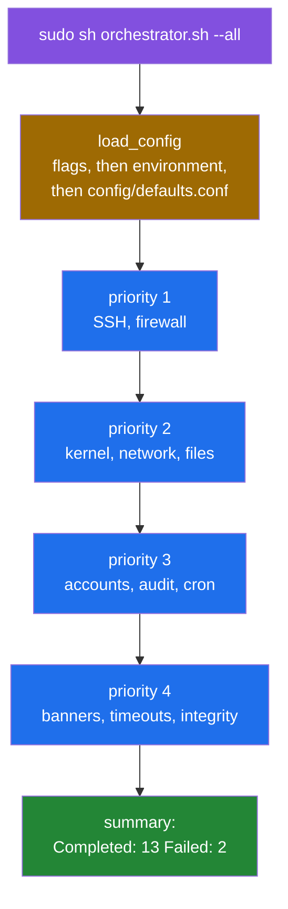
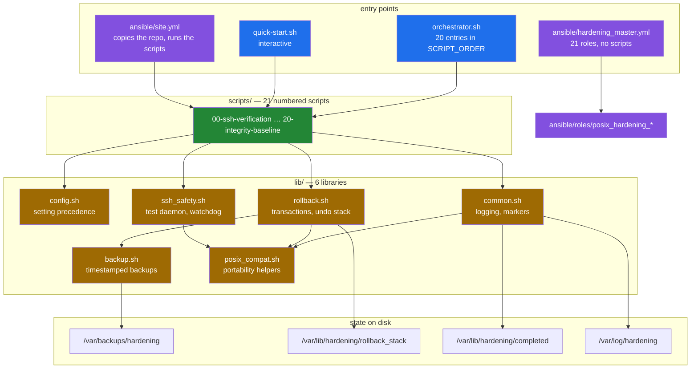

# POSIX Shell Server Hardening Toolkit

A set of POSIX `sh` scripts that harden a Debian server over SSH, plus an
Ansible tree that does the same thing across a fleet. The design goal that
shapes every part of it is not locking the operator out: SSH changes are
validated against a throwaway daemon on port 2223, a watchdog reverts the
configuration if the connection dies, and each script opens a transaction that
undoes its own changes on failure. This README documents what the
code on the default branch does, measured in a Debian 12 container.

## What a run does, and where it stops



This was observed in a Debian 12 container, not inferred
([`media/captures/orchestrator.log`](media/captures/orchestrator.log)):

- Settings are resolved in one order everywhere: command-line flags, then the
  environment, then `config/defaults.conf`, then the built-in defaults
  (`lib/config.sh`). With the config file present, as `quick-start.sh`
  creates it, `--status` and `--dry-run --all` exit 0
  ([#13](https://github.com/Bissbert/POSIX-hardening/issues/13), [#14](https://github.com/Bissbert/POSIX-hardening/issues/14),
  [#15](https://github.com/Bissbert/POSIX-hardening/issues/15)).
- `--all` runs in priority order. With the default `FAIL_FAST` it stops at
  the first failure: `01` and `02` complete, `03-kernel-params` fails, and
  the summary reports `Completed: 2  Failed: 1`. With `FAIL_FAST=0` it
  carries on: 13 scripts complete, 2 fail and 5 are skipped because a
  dependency did not complete.

The two failures are properties of the test container:

- `03-kernel-params` sets `net.ipv4.tcp_congestion_control = htcp`, which the
  Docker Desktop kernel (6.5.11-linuxkit, `reno cubic` only) does not
  provide.
- `15-cron-restrictions` runs `chmod` on `/etc/crontab`, and the image has no
  `cron` package.

Neither was run on a host that has them. Four of the five skipped scripts
depend on `03-kernel-params`. The fifth, `10-sudo-restrictions`, is declared
at priority 2 but depends on `09-account-lockdown` at priority 3, so `--all`
reaches it before its dependency and skips it on every fresh run.

Defects are tracked as
[GitHub issues](https://github.com/Bissbert/POSIX-hardening/issues), each with
a reproduction and, once fixed, a regression test under `tests/regression/`.

## Quick start

Everything in this section runs inside Docker containers (Debian 12,
linux/arm64, Docker 24.0.7) and produced the output committed under
`media/captures/`. Nothing is installed on or changed on the workstation.

### Static checks

```sh
git clone https://github.com/Bissbert/POSIX-hardening.git
cd POSIX-hardening
sh tools/analysis-env.sh
```

`analysis-env.sh` builds a throwaway `debian:12-slim` image with `dash`,
`bash`, `busybox`, `shellcheck` and `checkbashisms`, runs
`tools/static-analysis.sh` against a read-only mount of the repository, and
prints a Markdown report. These are the same syntax and lint gates the CI
runs.

### Watch it harden something, safely

```sh
sh tools/container-image.sh          # build a throwaway Debian 12 target
sh tools/capture-hardening-run.sh    # run three hardening scripts inside it
sh tools/capture-orchestrator.sh     # drive orchestrator.sh through seven cases
sh tools/capture-rollback-demo.sh    # open a transaction and roll it back
sh tools/capture-ssh-watchdog.sh     # trip the SSH lockout watchdog
```

Each tool starts its own container, copies the repository in, runs,
writes its transcript to `media/captures/`, and destroys the container. The
source runs as committed; no patch is applied. **Do not point them at a host
you care about**: the scripts they run rewrite `/etc/ssh`, `/etc/sysctl.conf`,
PAM configuration and firewall rules in place.

The three read-only captures, which inspect the Ansible tree, the committed
team keys and the rollback coverage, run in a container too:

```sh
sh tools/host-tools-env.sh capture-ansible.sh
sh tools/host-tools-env.sh capture-team-keys.sh
sh tools/host-tools-env.sh capture-rollback-coverage.sh
```

### Harden an actual server

`sudo sh quick-start.sh` writes `config/defaults.conf` and calls the
orchestrator; `sudo sh orchestrator.sh --all` and the numbered scripts
(`sudo sh scripts/01-ssh-hardening.sh`) run with or without that file.
Automatic rollback is on unless `ROLLBACK_ENABLED=0` is set
([#12](https://github.com/Bissbert/POSIX-hardening/issues/12)), and the emergency SSH daemon is off unless
`ENABLE_EMERGENCY_SSH=1` is set ([#18](https://github.com/Bissbert/POSIX-hardening/issues/18)).

The repository ships no SSH keys. Generate your own with
`sh ansible/team_keys/generate_keys.sh` before using
`deploy_team_keys.yml`
([#16](https://github.com/Bissbert/POSIX-hardening/issues/16)).

The Ansible path copies the same `lib/` and `scripts/` to the managed host.
[`docs/deployment-paths.md`](docs/deployment-paths.md) compares the three
paths.

## Architecture



The two Ansible entry points do not overlap: `site.yml` copies the shell
toolkit to the managed host and runs `scripts/NN-*.sh` over SSH, while
`hardening_master.yml` ignores the scripts entirely and applies 21 roles.
Both are maintained; they are not two views of one thing.
[`docs/deployment-paths.md`](docs/deployment-paths.md) has the details, and
[`docs/library-reference.md`](docs/library-reference.md) covers the load order
of `lib/`.

## Results

### Static analysis

Reproduce with `sh tools/analysis-env.sh`
([`docs/measurement.md`](docs/measurement.md) has the full report).

| Measurement | Value |
|---|---|
| Files in the CI syntax set | 30 |
| `dash -n` / `bash -n` / `busybox sh -n` failures | 0 / 0 / 0 |
| `checkbashisms` files with findings | 0 of 30 |
| ShellCheck at the CI gate (`-S error -s sh`) | 0 findings over 32 files |
| `SC3043` (`local` is undefined in POSIX `sh`) | 77, none under `lib/` |
| `SC3012` (lexicographical `\>`) | 2 |
| `ansible-lint`, six top-level playbooks | 1394 findings in 138 files; `min` profile passes, `production` does not |
| Numbered scripts / libraries / Ansible roles | 21 / 6 / 23 |
| Entries in `orchestrator.sh` `SCRIPT_ORDER` | 20 |
| Files tracked by git | 336 |
| Shell bytes (lib + scripts + root scripts) | 210,706 |

The `local` findings matter for the "no bash required" claim: `dash`,
`bash` and BusyBox `sh` all accept `local`, but it is not POSIX, so a strictly
POSIX `sh` would reject `orchestrator.sh` and ten of the scripts.

### A hardening run

`sh tools/capture-hardening-run.sh`, inside the throwaway container:

| Script | Exit | Output lines |
|---|---|---|
| `scripts/01-ssh-hardening.sh` | 0 | 129 |
| `scripts/03-kernel-params.sh` | 1 | 64 |
| `scripts/05-file-permissions.sh` | 0 | 16 |

The effects were read back with `sshd -T` rather than taken from the script's
own output: all eleven advertised SSH settings were in place and port 22 was
still answering
([`media/captures/effects.txt`](media/captures/effects.txt)).
`03-kernel-params.sh` prints each setting as `sysctl -p` applies it, including
the one this kernel rejects (`net.ipv4.tcp_congestion_control = htcp`), and
exits 1. Its rollback restores `/etc/sysctl.conf` and the kernel values, and
afterwards the file loads cleanly with `sysctl -p`.

A dry run leaves no completion marker behind, and `DRY_RUN=1` in the
environment wins over the file's `DRY_RUN=0`
([`media/captures/dry-run.txt`](media/captures/dry-run.txt)).

### The SSH watchdog, recorded


Every frame is a line from
[`media/captures/ssh-watchdog.log`](media/captures/ssh-watchdog.log), in order.
Nothing is typed or staged. `sshd` is killed after the reload, the probe
reports it unreachable, and the watchdog restores `sshd_config` (identical
SHA-256 before and after) and brings `sshd` back.
[`docs/ssh-safety.md`](docs/ssh-safety.md) walks through the decision flow
this exercises.

The configuration test that runs before the reload starts its own daemon on
port 2223 (`SSHD_TEST_PORT`), away from the emergency daemon's 2222. It
fails instead of passing if the port is already taken or if its own daemon
did not start
([#17](https://github.com/Bissbert/POSIX-hardening/issues/17),
[`media/captures/emergency-ssh.txt`](media/captures/emergency-ssh.txt)).

### A rollback, recorded


From [`media/captures/rollback-demo.log`](media/captures/rollback-demo.log).
The demo does what a script would do: back up the file, register the backup
with the transaction, change the file, roll back. The original content comes
back. All 21 scripts open a transaction and register an undo action before
each change
([`media/captures/rollback-coverage.txt`](media/captures/rollback-coverage.txt)),
and `tests/regression/rollback-coverage.sh` checks that a failed run of each
of scripts 01 to 20 leaves the system as it found it
([#19](https://github.com/Bissbert/POSIX-hardening/issues/19)).
[`docs/rollback.md`](docs/rollback.md) explains the state machine and the
three changes a rollback deliberately leaves in place.

Every number on this page, the command that produced it, and the list of what
could not be measured are in
[`docs/measurement.md`](docs/measurement.md).

## Repository layout

```text
.
├── orchestrator.sh              # runs the numbered scripts in priority order
├── quick-start.sh               # interactive installer
├── emergency-rollback.sh        # manual restore, outside the toolkit
├── lib/                         # 6 POSIX sh libraries
│   ├── config.sh                # config loading: flags, environment, file
│   ├── common.sh                # logging, completion markers
│   ├── rollback.sh              # transactions and the undo stack
│   ├── ssh_safety.sh            # test daemon, watchdog, emergency access
│   ├── backup.sh                # timestamped backups with checksums
│   └── posix_compat.sh          # portability helpers
├── scripts/                     # 21 numbered hardening scripts, 00 … 20
├── config/                      # defaults.conf.template, firewall.conf.example
├── tests/                       # docker.sh, regression/, validation_suite.sh
├── ansible/
│   ├── site.yml                 # copies the toolkit out and runs the scripts
│   ├── hardening_master.yml     # applies 21 roles instead
│   ├── roles/                   # 23 posix_hardening_* roles
│   └── playbooks/               # a second, drifted copy of four playbooks
├── docs/                        # see docs/README.md for the index
├── tools/                       # the container tools behind every number here
└── media/
    ├── captures/                # raw transcripts, one per tool
    └── *.gif                    # rendered from those transcripts
```

`tools/` and `media/` were added by this documentation pass. Everything else
is the project's own.

## Known limitations

Measured in a Debian 12 arm64 container.

### Seen in the container runs

- `SCRIPT_ORDER` puts `10-sudo-restrictions.sh` at priority 2 and its
  dependency `09-account-lockdown.sh` at priority 3, so `--all` skips it on
  every fresh run.
- `15-cron-restrictions.sh` fails when `cron` is not installed, because it
  expects `/etc/crontab` to exist.
- A rollback does not bring back old files that `12-tmp-hardening.sh`
  deleted, SSH package files that `00-ssh-verification.sh` reinstalled, or
  stop an emergency sshd started for the run
  ([`docs/rollback.md`](docs/rollback.md#what-rollback-does-not-undo)).

### Fixed

[#12](https://github.com/Bissbert/POSIX-hardening/issues/12) rollback on by default,
[#13](https://github.com/Bissbert/POSIX-hardening/issues/13) and
[#15](https://github.com/Bissbert/POSIX-hardening/issues/15) one precedence order for
flags, environment and config file,
[#14](https://github.com/Bissbert/POSIX-hardening/issues/14) `--dry-run` with a config file,
[#16](https://github.com/Bissbert/POSIX-hardening/issues/16) no shipped SSH keys,
[#17](https://github.com/Bissbert/POSIX-hardening/issues/17) the SSH config test fails closed when its
port is taken,
[#18](https://github.com/Bissbert/POSIX-hardening/issues/18) one name for the emergency SSH setting, off by default,
and [#19](https://github.com/Bissbert/POSIX-hardening/issues/19) undo actions in every script. Each has a
regression test under `tests/regression/`, run in a Debian 12 container with
`sh tests/docker.sh`.

### Limits of this evidence

- Only Debian 12 on arm64 was tested, in Docker Desktop's LinuxKit VM. RHEL
  and Alpine are claimed and were not tested.
- The orchestrator ran all 20 scripts in `SCRIPT_ORDER`; the effects of three
  of them were read back from the system.
- No Ansible task was run against any host. The playbooks were parsed
  (`--syntax-check`) and linted, not applied.
- Every capture is local to a container. The lockout guarantees concern a
  remote operator's SSH session, and that scenario was not reproduced.
- Idempotence and performance were not measured.

## Documentation

[`docs/README.md`](docs/README.md) is the index. The pages written with
measurements behind them are
[execution-model](docs/execution-model.md),
[ssh-safety](docs/ssh-safety.md),
[rollback](docs/rollback.md),
[deployment-paths](docs/deployment-paths.md),
[library-reference](docs/library-reference.md) and
[measurement](docs/measurement.md).

## License

MIT — see [LICENSE](LICENSE).

## Version

1.1.0, from `VERSION`. `lib/common.sh` reports the same.
