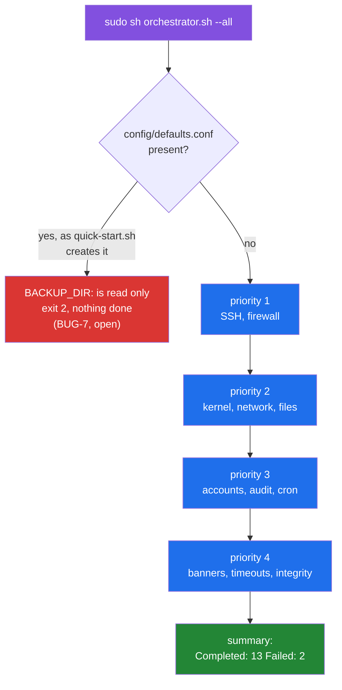
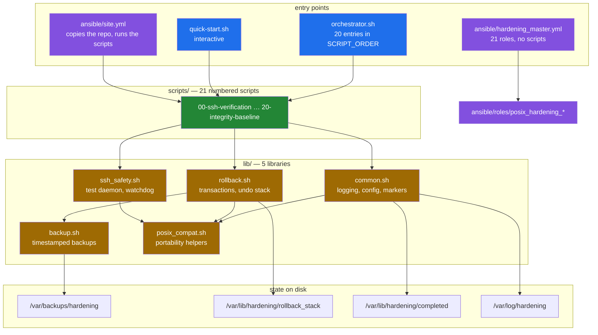

# POSIX Shell Server Hardening Toolkit

A set of POSIX `sh` scripts that harden a Debian server over SSH, plus an
Ansible tree that does the same thing across a fleet. The design goal that
shapes every part of it is not locking the operator out: SSH changes are
validated against a throwaway daemon on port 2222, a watchdog reverts the
configuration if the connection dies, and each script opens a transaction that
is meant to undo its own changes on failure. This README documents what the
code on the default branch does, measured in a Debian 12 container.

## What a run does, and where it stops



Both branches were observed in a Debian 12 container, not inferred
([`media/captures/orchestrator.log`](media/captures/orchestrator.log)):

- With `config/defaults.conf` present the orchestrator exits 2 on its first
  line of real work, because the config file assigns variables that
  `lib/common.sh` has already made read-only
  ([BUG-7](docs/BUGS-FOUND.md#bug-7)). `--dry-run` fails the same way
  ([BUG-8](docs/BUGS-FOUND.md#bug-8)).
- Without it, `--all` runs in priority order. With the default `FAIL_FAST`
  it stops at the first failure: `01` and `02` complete, `03-kernel-params`
  fails, and the summary reports `Completed: 2  Failed: 1`. With
  `FAIL_FAST=0` it carries on: 13 scripts complete, 2 fail and 5 are skipped
  because a dependency did not complete.

The two failures are properties of the test container:

- `03-kernel-params` sets `net.ipv4.tcp_congestion_control = htcp`, which the
  Docker Desktop kernel (6.5.11-linuxkit, `reno cubic` only) does not
  provide.
- `15-cron-restrictions` runs `chmod` on `/etc/crontab`, and the image has no
  `cron` package.

Neither was run on a host that has them. Four of the five skipped scripts
depend on `03-kernel-params`. The fifth, `10-sudo-restrictions`, is declared
at priority 2 but depends on `09-account-lockdown` at priority 3, so `--all`
reaches it before its dependency and skips it on every fresh run.

All 24 defects found while documenting the toolkit are written up, with
reproductions, in [`docs/BUGS-FOUND.md`](docs/BUGS-FOUND.md). Fifteen have
been fixed on the default branch; the rest are listed under
[Known limitations](#known-limitations).

## Quick start

Everything in this section runs inside Docker containers (Debian 12,
linux/arm64, Docker 24.0.7) and produced the output committed under
`media/captures/`. Nothing is installed on or changed on the workstation.

### Static checks

```sh
git clone https://github.com/Bissbert/POSIX-hardening.git
cd POSIX-hardening
sh tools/analysis-env.sh
```

`analysis-env.sh` builds a throwaway `debian:12-slim` image with `dash`,
`bash`, `busybox`, `shellcheck` and `checkbashisms`, runs
`tools/static-analysis.sh` against a read-only mount of the repository, and
prints a Markdown report. These are the same syntax and lint gates the CI
runs.

### Watch it harden something, safely

```sh
sh tools/container-image.sh          # build a throwaway Debian 12 target
sh tools/capture-hardening-run.sh    # run three hardening scripts inside it
sh tools/capture-orchestrator.sh     # drive orchestrator.sh through seven cases
sh tools/capture-rollback-demo.sh    # open a transaction and roll it back
sh tools/capture-ssh-watchdog.sh     # trip the SSH lockout watchdog
```

Each tool starts its own container, copies the repository in, runs,
writes its transcript to `media/captures/`, and destroys the container. The
source runs as committed; no patch is applied. **Do not point them at a host
you care about**: the scripts they run rewrite `/etc/ssh`, `/etc/sysctl.conf`,
PAM configuration and firewall rules in place.

The three read-only captures, which inspect the Ansible tree, the committed
team keys and the rollback coverage, run in a container too:

```sh
sh tools/host-tools-env.sh capture-ansible.sh
sh tools/host-tools-env.sh capture-team-keys.sh
sh tools/host-tools-env.sh capture-rollback-coverage.sh
```

### Harden an actual server

The numbered scripts run on a clean clone:
`sudo sh scripts/01-ssh-hardening.sh` and the others start, do their work
and write a completion marker. The orchestrator is the awkward part, because
of the open config-precedence decision
([BUG-7](docs/BUGS-FOUND.md#bug-7)):

- **With** `config/defaults.conf`, which `quick-start.sh` creates before it
  calls the orchestrator, `orchestrator.sh` exits 2 before doing anything.
- **Without** it, the orchestrator runs, but `ROLLBACK_ENABLED` is unset, so
  automatic rollback is off ([BUG-4](docs/BUGS-FOUND.md#bug-4)).

The Ansible path copies the same `lib/` and `scripts/` to the managed host.
[`docs/deployment-paths.md`](docs/deployment-paths.md) compares the three
paths.

## Architecture



The two Ansible entry points do not overlap: `site.yml` copies the shell
toolkit to the managed host and runs `scripts/NN-*.sh` over SSH, while
`hardening_master.yml` ignores the scripts entirely and applies 21 roles.
Both are maintained; they are not two views of one thing.
[`docs/deployment-paths.md`](docs/deployment-paths.md) has the details, and
[`docs/library-reference.md`](docs/library-reference.md) covers the load order
of `lib/`.

## Results

### Static analysis

Reproduce with `sh tools/analysis-env.sh`
([`docs/measurement.md`](docs/measurement.md) has the full report).

| Measurement | Value |
|---|---|
| Files in the CI syntax set | 29 |
| `dash -n` / `bash -n` / `busybox sh -n` failures | 0 / 0 / 0 |
| `checkbashisms` files with findings | 0 of 29 |
| ShellCheck at the CI gate (`-S error -s sh`) | 0 findings over 31 files |
| `SC3043` (`local` is undefined in POSIX `sh`) | 77, none under `lib/` |
| `SC3012` (lexicographical `\>`) | 2 |
| `ansible-lint`, six top-level playbooks | 1394 findings in 138 files; `min` profile passes, `production` does not |
| Numbered scripts / libraries / Ansible roles | 21 / 5 / 23 |
| Entries in `orchestrator.sh` `SCRIPT_ORDER` | 20 |
| Files tracked by git | 326 |
| Shell bytes (lib + scripts + root scripts) | 188,246 |

The `local` findings matter for the "no bash required" claim: `dash`,
`bash` and BusyBox `sh` all accept `local`, but it is not POSIX, so a strictly
POSIX `sh` would reject `orchestrator.sh` and ten of the scripts.

### A hardening run

`sh tools/capture-hardening-run.sh`, inside the throwaway container:

| Script | Exit | Output lines |
|---|---|---|
| `scripts/01-ssh-hardening.sh` | 0 | 129 |
| `scripts/03-kernel-params.sh` | 1 | 63 |
| `scripts/05-file-permissions.sh` | 0 | 16 |

The effects were read back with `sshd -T` rather than taken from the script's
own output: all eleven advertised SSH settings were in place and port 22 was
still answering
([`media/captures/effects.txt`](media/captures/effects.txt)).
`03-kernel-params.sh` prints each setting as `sysctl -p` applies it, including
the one this kernel rejects (`net.ipv4.tcp_congestion_control = htcp`), and
exits 1. Its transaction then reports `Rollback completed`, but its
`/etc/sysctl.conf` block is still there afterwards, because the script
registers no undo action ([BUG-24](docs/BUGS-FOUND.md#bug-24)).

A dry run no longer leaves a completion marker behind. With
`config/defaults.conf` present, `DRY_RUN=1` in the environment is still
overridden by the file's `DRY_RUN=0`
([BUG-14](docs/BUGS-FOUND.md#bug-14),
[`media/captures/dry-run.txt`](media/captures/dry-run.txt)).

### The SSH watchdog, recorded


Every frame is a line from
[`media/captures/ssh-watchdog.log`](media/captures/ssh-watchdog.log), in order.
Nothing is typed or staged. `sshd` is killed after the reload, the probe
reports it unreachable, and the watchdog restores `sshd_config` (identical
SHA-256 before and after) and brings `sshd` back.
[`docs/ssh-safety.md`](docs/ssh-safety.md) walks through the decision flow
this exercises.

The configuration test that runs before the reload has a gap: it passes
whenever something already listens on port 2222, including the toolkit's own
emergency daemon
([BUG-20](docs/BUGS-FOUND.md#bug-20),
[`media/captures/emergency-ssh.txt`](media/captures/emergency-ssh.txt)).

### A rollback, recorded


From [`media/captures/rollback-demo.log`](media/captures/rollback-demo.log).
The demo does what a script would do: back up the file, register the backup
with the transaction, change the file, roll back. The original content comes
back. The catch is coverage: 11 of the 21 scripts open a transaction and only
one, `02-firewall-setup.sh`, registers anything to undo
([`media/captures/rollback-coverage.txt`](media/captures/rollback-coverage.txt)).
[`docs/rollback.md`](docs/rollback.md) explains the state machine.

Every number on this page, the command that produced it, and the list of what
could not be measured are in
[`docs/measurement.md`](docs/measurement.md).

## Repository layout

```text
.
├── orchestrator.sh              # runs the numbered scripts in priority order
├── quick-start.sh               # interactive installer
├── emergency-rollback.sh        # manual restore, outside the toolkit
├── lib/                         # 5 POSIX sh libraries
│   ├── common.sh                # logging, config loading, completion markers
│   ├── rollback.sh              # transactions and the undo stack
│   ├── ssh_safety.sh            # test daemon, watchdog, emergency access
│   ├── backup.sh                # timestamped backups with checksums
│   └── posix_compat.sh          # portability helpers
├── scripts/                     # 21 numbered hardening scripts, 00 … 20
├── config/                      # defaults.conf.template, firewall.conf.example
├── tests/                       # validation_suite.sh and friends
├── ansible/
│   ├── site.yml                 # copies the toolkit out and runs the scripts
│   ├── hardening_master.yml     # applies 21 roles instead
│   ├── roles/                   # 23 posix_hardening_* roles
│   └── playbooks/               # a second, drifted copy of four playbooks
├── docs/                        # see docs/README.md for the index
├── tools/                       # the container tools behind every number here
└── media/
    ├── captures/                # raw transcripts, one per tool
    └── *.gif                    # rendered from those transcripts
```

`tools/` and `media/` were added by this documentation pass. Everything else
is the project's own.

## Known limitations

Measured in a Debian 12 arm64 container on the default branch. Every item
links to its full entry with a reproduction.

### Open, each needs a decision

- `config/defaults.conf` is sourced after the environment and assigns
  variables that are already read-only. With the file present the
  orchestrator cannot start and `--dry-run` aborts, and in the scripts a
  caller's `DRY_RUN=1` is overridden by the file. Closing this means committing
  to a precedence contract between CLI flags, environment and config file
  ([BUG-7](docs/BUGS-FOUND.md#bug-7), [BUG-8](docs/BUGS-FOUND.md#bug-8),
  [BUG-14](docs/BUGS-FOUND.md#bug-14)).
- Without `config/defaults.conf`, automatic rollback is silently disabled.
  Picking a default changes the toolkit's behaviour on failure
  ([BUG-4](docs/BUGS-FOUND.md#bug-4)).
- Only one script registers an undo action, so for the others a rollback has
  an empty stack and `Rollback completed` means nothing was undone.
  Registering real undo actions requires deciding what each script guarantees
  ([BUG-24](docs/BUGS-FOUND.md#bug-24)).
- A fresh clone ships public keys nobody holds the private half of, and the
  Ansible path deploys them. Removal, rotation or documented ownership is a
  policy call ([BUG-18](docs/BUGS-FOUND.md#bug-18)).
- The emergency options and the emergency SSH template use different names.
  Renaming them activates an additional password-enabled SSH service, so a
  provisional fix was written and then reverted
  ([BUG-21](docs/BUGS-FOUND.md#bug-21)).

### Unresolved

- The live-daemon SSH config test passes whenever anything holds port 2222,
  including the toolkit's own emergency daemon. Settling this needs an
  isolated OpenSSH target ([BUG-20](docs/BUGS-FOUND.md#bug-20)).

### Seen in the container re-run, not yet written up

- `SCRIPT_ORDER` puts `10-sudo-restrictions.sh` at priority 2 and its
  dependency `09-account-lockdown.sh` at priority 3, so `--all` skips it on
  every fresh run.
- `15-cron-restrictions.sh` fails when `cron` is not installed, because it
  expects `/etc/crontab` to exist.

### Fixed on the default branch

BUG-1, BUG-2, BUG-3, BUG-5, BUG-6, BUG-9, BUG-11, BUG-12, BUG-13, BUG-15,
BUG-16, BUG-17, BUG-19, BUG-22 and BUG-23. The status column in
[`docs/BUGS-FOUND.md`](docs/BUGS-FOUND.md) links each to its commit.
[BUG-10](docs/BUGS-FOUND.md#bug-10) was rejected on review: `00-ssh-verification.sh`
is deliberately absent from `SCRIPT_ORDER`, because `01-ssh-hardening.sh`
runs it.

### Limits of this evidence

- Only Debian 12 on arm64 was tested, in Docker Desktop's LinuxKit VM. RHEL
  and Alpine are claimed and were not tested.
- The orchestrator ran all 20 scripts in `SCRIPT_ORDER`; the effects of three
  of them were read back from the system.
- No Ansible task was run against any host. The playbooks were parsed
  (`--syntax-check`) and linted, not applied.
- Every capture is local to a container. The lockout guarantees concern a
  remote operator's SSH session, and that scenario was not reproduced.
- Idempotence and performance were not measured.

## Documentation

[`docs/README.md`](docs/README.md) is the index. The pages written with
measurements behind them are
[execution-model](docs/execution-model.md),
[ssh-safety](docs/ssh-safety.md),
[rollback](docs/rollback.md),
[deployment-paths](docs/deployment-paths.md),
[library-reference](docs/library-reference.md),
[BUGS-FOUND](docs/BUGS-FOUND.md) and
[measurement](docs/measurement.md).

## License

MIT — see [LICENSE](LICENSE).

## Version

1.1.0, from `VERSION`. `lib/common.sh` reports the same.
