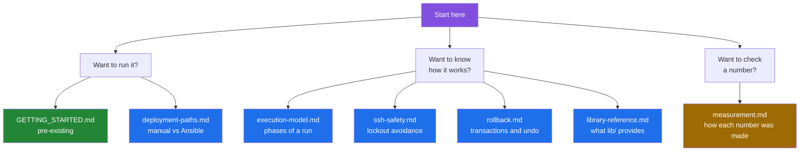

# Documentation index

This directory holds two kinds of page.

The first group was written during a documentation pass that ran the toolkit
in throwaway Linux containers and recorded what it did. Those pages carry
diagrams and captured output, and every number in them comes from a command in
[`tools/`](../tools) whose raw output is in
[`media/captures/`](../media/captures). The captures were re-recorded against
the default branch after the fixes for issues #12 to #19, so the pages
describe the code as it behaves today. Defects are tracked as
[GitHub issues](https://github.com/Bissbert/POSIX-hardening/issues).

The second group is the project's own earlier documentation. It is kept
unchanged. Where it disagrees with a measurement, the measured page wins.

## Pages written during the documentation pass

| Page | What it covers | Evidence behind it |
|---|---|---|
| [execution-model.md](execution-model.md) | The phases of a hardening run, what the orchestrator does with `SCRIPT_ORDER`, and which of the 21 scripts a container run reached | [`media/captures/orchestrator.log`](../media/captures/orchestrator.log), [`dry-run.txt`](../media/captures/dry-run.txt) |
| [ssh-safety.md](ssh-safety.md) | The lockout-avoidance chain as a decision flow: test daemon, watchdog, emergency access, `AllowUsers` | [`ssh-watchdog.log`](../media/captures/ssh-watchdog.log), [`emergency-ssh.txt`](../media/captures/emergency-ssh.txt), [`media/ssh-watchdog.gif`](../media/ssh-watchdog.gif) |
| [rollback.md](rollback.md) | The transaction state machine, what the rollback stack holds, and what each script registers for undo | [`rollback-demo.log`](../media/captures/rollback-demo.log), [`rollback-coverage.txt`](../media/captures/rollback-coverage.txt), [`media/rollback-demo.gif`](../media/rollback-demo.gif) |
| [deployment-paths.md](deployment-paths.md) | The three entry points — `orchestrator.sh`, `ansible/site.yml`, `ansible/hardening_master.yml` — compared side by side | [`ansible.txt`](../media/captures/ansible.txt) |
| [library-reference.md](library-reference.md) | The six files in `lib/`, their load order, and which helpers have callers | [`shell-semantics.txt`](../media/captures/shell-semantics.txt), [`summary.txt`](../media/captures/summary.txt) |
| [measurement.md](measurement.md) | Every published number, the command that produced it, and what could not be measured | the tools themselves |

## The project's earlier documentation

Kept as written. The "accuracy" column records only what this pass checked
against the code; a blank cell means the page was not audited, not that it is
correct.

| Page | Lines | What it covers | Accuracy as checked |
|---|---|---|---|
| [GETTING_STARTED.md](GETTING_STARTED.md) | 303 | Five-minute quick start, Ansible and manual | Says "23 roles / 22 scripts" at `:12`; there are 23 roles and 21 scripts |
| [SCRIPTS.md](SCRIPTS.md) | 937 | Per-script reference for the numbered hardening scripts | Says "all 20 scripts" at `:832`; there are 21 |
| [ROLE_EXECUTION_ORDER.md](ROLE_EXECUTION_ORDER.md) | 142 | Role dependencies, grouped into priorities 0-6 | Names roles by short name (`ssh`, `firewall`), not by the `posix_hardening_*` directory names `hardening_master.yml` uses |
| [FUTURE_IMPROVEMENTS.md](FUTURE_IMPROVEMENTS.md) | 295 | Planned work, not current behaviour | Not audited |
| [architecture/overview.md](architecture/overview.md) | 243 | Layer diagram and design intent | Describes intent; see [execution-model.md](execution-model.md) for measured behaviour |
| [reference/configuration.md](reference/configuration.md) | 325 | Configuration variables and their precedence | `:17-23` puts environment variables above the config file, which is what `lib/config.sh` does ([#15](https://github.com/Bissbert/POSIX-hardening/issues/15)); `:57` gives `SSH_TEST_PORT` as 2223 |
| [guides/HARDENING_REQUIREMENTS.md](guides/HARDENING_REQUIREMENTS.md) | 421 | Which standards the toolkit targets | Not audited |
| [guides/IMPLEMENTATION_GUIDE.md](guides/IMPLEMENTATION_GUIDE.md) | 773 | Step-by-step deployment | Not audited |
| [guides/QUICK_REFERENCE.md](guides/QUICK_REFERENCE.md) | 286 | Safety rules, emergency SSH recovery, and a staged deployment order | Invokes the scripts directly; it documents no `orchestrator.sh` flag |
| [guides/TESTING_FRAMEWORK.md](guides/TESTING_FRAMEWORK.md) | 507 | The validation suite and testing approach | Not audited |
| [development/CONTRIBUTING.md](development/CONTRIBUTING.md) | 251 | How to contribute | Not audited |
| [development/AUTHORS.md](development/AUTHORS.md) | 19 | Contributors | Not audited |
| [releases/CHANGELOG.md](releases/CHANGELOG.md) | 67 | Version history | Newest released entry is 1.0.0; `VERSION` and `lib/common.sh` both say 1.1.0, for which there is no released entry yet |

Outside this directory: [`../ansible/README.md`](../ansible/README.md) and
[`../ansible/QUICK_START_ROLES.md`](../ansible/QUICK_START_ROLES.md) document
the Ansible tree; [deployment-paths.md](deployment-paths.md) records where
they diverge from what `ansible.cfg` actually loads.

## Reading orders

| If you are | Read, in order |
|---|---|
| Deciding whether to run this on a server | The [open issues](https://github.com/Bissbert/POSIX-hardening/issues), then [execution-model.md](execution-model.md) |
| Running it on one server by hand | [execution-model.md](execution-model.md), [ssh-safety.md](ssh-safety.md), [rollback.md](rollback.md) |
| Running it on a fleet | [deployment-paths.md](deployment-paths.md), then [`../ansible/README.md`](../ansible/README.md) |
| Fixing the code | The [open issues](https://github.com/Bissbert/POSIX-hardening/issues), then [library-reference.md](library-reference.md) and the regression tests in [measurement.md](measurement.md#regression-tests) |
| Checking this documentation | [measurement.md](measurement.md), then run anything in [`../tools`](../tools) |

## Known limitations of this index

- The "Accuracy as checked" column is not a full audit of the pre-existing
  pages. Only the claims that collided with something this pass measured were
  checked.
- Nothing in the pre-existing pages was edited, so their internal
  cross-references and their counts still disagree with each other.
