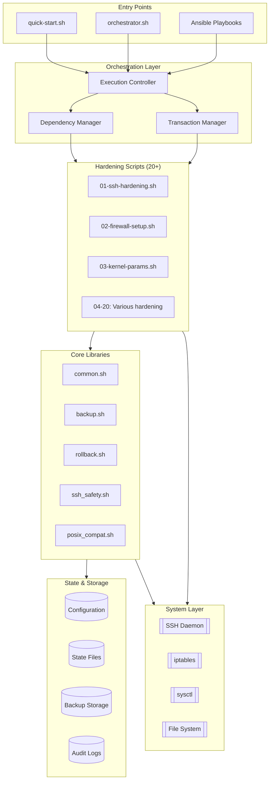

# POSIX-Hardening Architecture Overview

## Executive Summary

Transaction-based, safety-first server hardening toolkit using orchestrated POSIX shell
scripts with automatic rollback. Supports both standalone and Ansible deployment.

### Core Principles

- Safety-first: Multiple lockout prevention layers
- Transaction model: All-or-nothing with auto-rollback
- Pure POSIX shell: Maximum portability
- Layered architecture: Clear component separation
- Dual deployment: Shell or Ansible

## System Architecture

## Core Components

### Libraries (`/lib/*.sh`)

- **common.sh**: Core utilities, logging, validation
- **backup.sh**: File/directory backup with manifests
- **rollback.sh**: Transaction system with auto-rollback
- **ssh_safety.sh**: SSH preservation and testing
- **posix_compat.sh**: POSIX-compliant alternatives

### Scripts (`/scripts/*.sh`)

20 hardening scripts in 4 priority levels:

- **Priority 1**: SSH, Firewall (critical access)
- **Priority 2**: Kernel, Network, Files, Sudo (core security)
- **Priority 3**: Audit, Password, Account, Services (enhanced)
- **Priority 4**: Integrity baseline (final)

### Orchestration (`orchestrator.sh`)

- Manages execution order and dependencies
- Coordinates transactions and rollbacks
- Functions: dependency check, priority execution, transaction wrapper

### Ansible Layer

Key playbooks: `site.yml`, `preflight.yml`, `rollback.yml`

Task flow: Pre-flight → Deploy → Configure → Execute → Validate

## Design Patterns

### Transaction-Based Operations

All changes wrapped in transactions: Begin → Execute → Test → Commit/Rollback

### Backup Strategy

- File-level: Individual config backups
- Service-level: Configuration snapshots
- System-level: Full state preservation
- Manifest format: `timestamp|type|source|backup_path`

### SSH Preservation

Workflow: Backup → Test on alternate port → Apply or Rollback

Prevents lockouts through test-before-apply pattern

### Configuration Hierarchy

Precedence: Ansible vars → defaults.conf → Environment → Built-in

### State Tracking

- `/var/backups/hardening/manifest`: Backup registry
- `/var/lib/hardening/`: Transaction state, completed scripts

## Safety Mechanisms

### Protection Layers

1. **Pre-flight**: OS validation, disk space, SSH test, dependencies
2. **Active Monitoring**: SSH validation, service health, config syntax
3. **Rollback Triggers**: Connection loss, service failure, timeout, errors
4. **Emergency Access**: Port 2222, password fallback, recovery scripts

### Validation Pipeline

Pre-execution (root, OS, commands, space) → During (syntax, health) → Post (services, SSH, firewall)

## Execution Flow

### Standalone

`quick-start.sh` → Interactive setup → Config generation → Orchestrator →
Priority-based script execution → Transaction commit → Report

### Ansible

`ansible-playbook site.yml` → Facts → Pre-flight → Deploy toolkit → Generate config →
Execute scripts → Validate → Report

## Data Flow

### Configuration

Sources: Template → Ansible vars → Environment → Commands

Output: `/opt/posix-hardening/config/defaults.conf`

### Logs & Backups

- `/var/log/hardening/`: Execution logs (30 day retention)
- `/var/backups/hardening/`: Backups with manifest, metadata, checksums
- `/var/lib/hardening/`: Runtime state files

## Key Design Decisions

### POSIX Shell

- **Why**: Maximum portability, minimal dependencies, reduced attack surface
- **Tradeoff**: No arrays, `[[`, or process substitution

### Dual Mode (Shell + Ansible)

- **Why**: Shell for emergencies, Ansible for scale
- **Benefit**: Works without dependencies, scales with automation

### Transaction Model

- **Why**: Prevent partial application, enable auto-recovery
- **Implementation**: Rollback stack with timeout triggers

### Safety-First

- **Why**: Remote servers can't afford lockouts
- **Approach**: Multiple redundant mechanisms at every layer

## Extension Points

### Adding Scripts

1. Create in `/scripts/NN-description.sh`
2. Add to orchestrator with dependencies
3. Implement: pre_flight_checks() and main() with transactions

### Customization

- Edit `defaults.conf` directly
- Override via Ansible `group_vars/`
- Set environment variables at runtime

## Performance & Security

### Performance

- **Time**: 5-15 min full hardening
- **Bottlenecks**: Sequential execution, backup I/O, SSH tests
- **Optimization**: Parallel priority groups, incremental backups

### Security

- **Assumptions**: Admin has root, system not compromised, secure network
- **Threats**: Unauthorized access, network attacks, privilege escalation
- **Secrets**: None in scripts, use Ansible Vault

## Risks & Future

### Limitations

- POSIX constraints, sequential execution, Unix-only

### Key Risks

- SSH lockout (Low/High) → Multiple safety mechanisms
- Partial application (Low/Medium) → Transaction system
- Rollback failure (Very Low/High) → Manual recovery

### Future

- Native Ansible modules, parallel execution, compliance reporting, cloud-specific hardening

---

## Version

Architecture Overview v1.0
