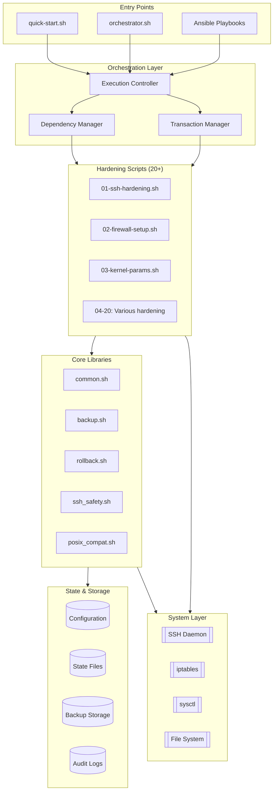
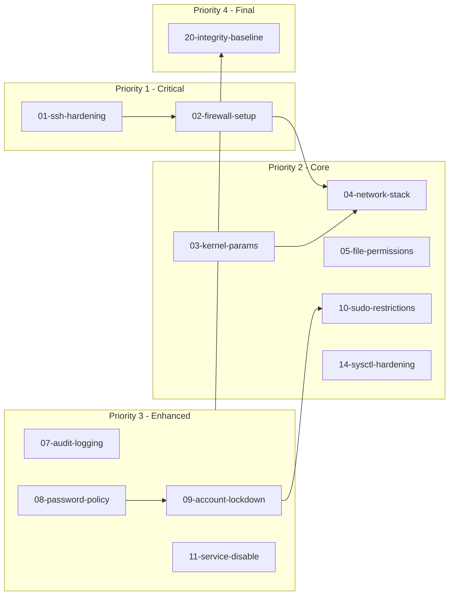
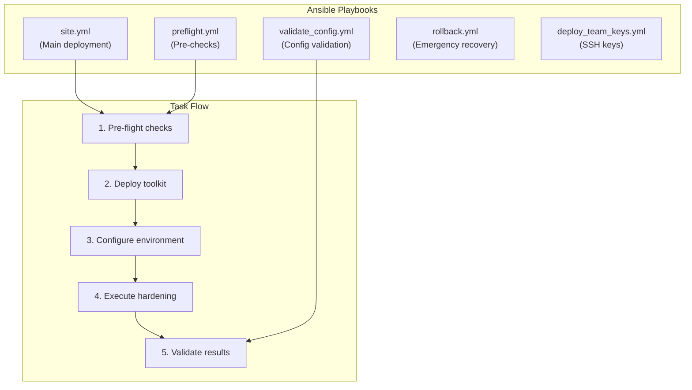
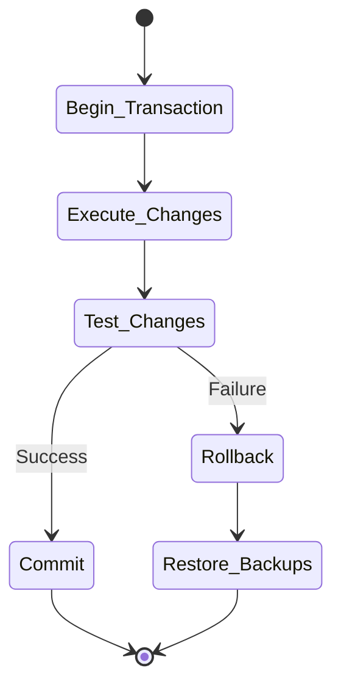
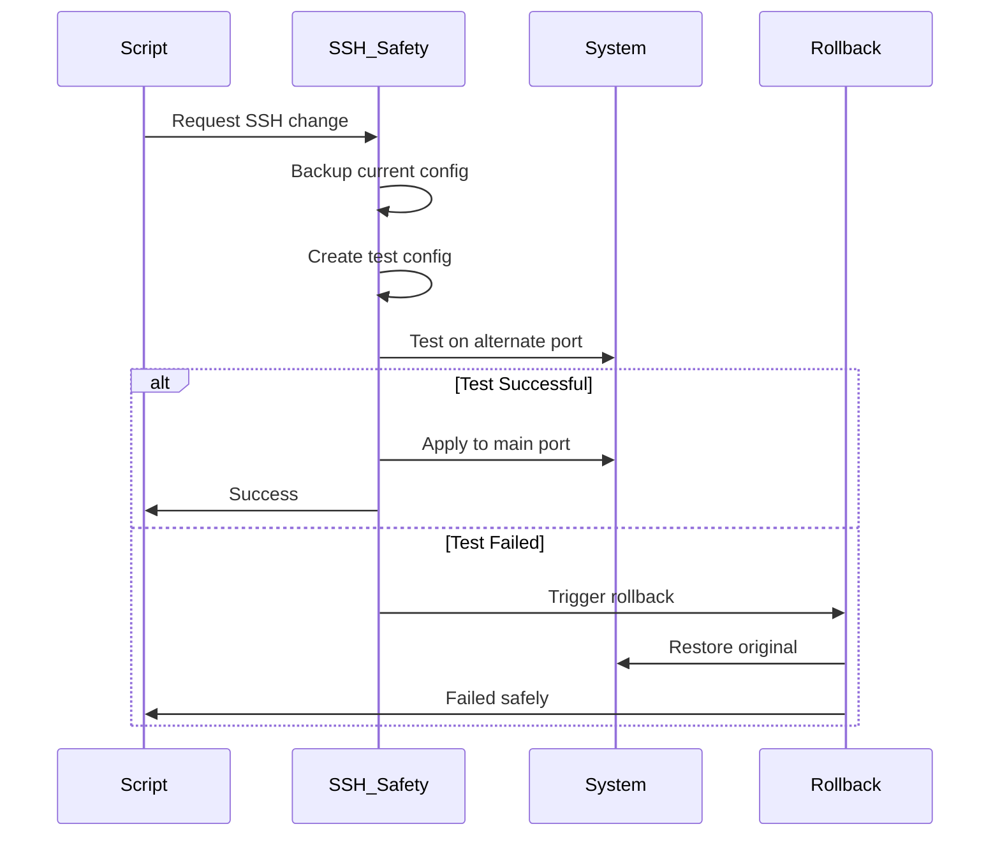
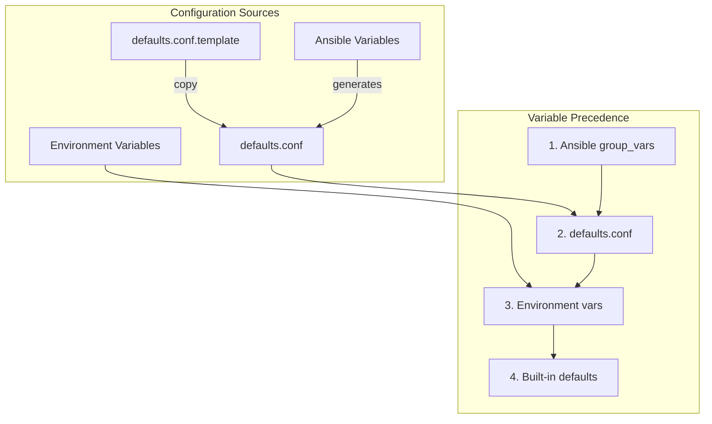
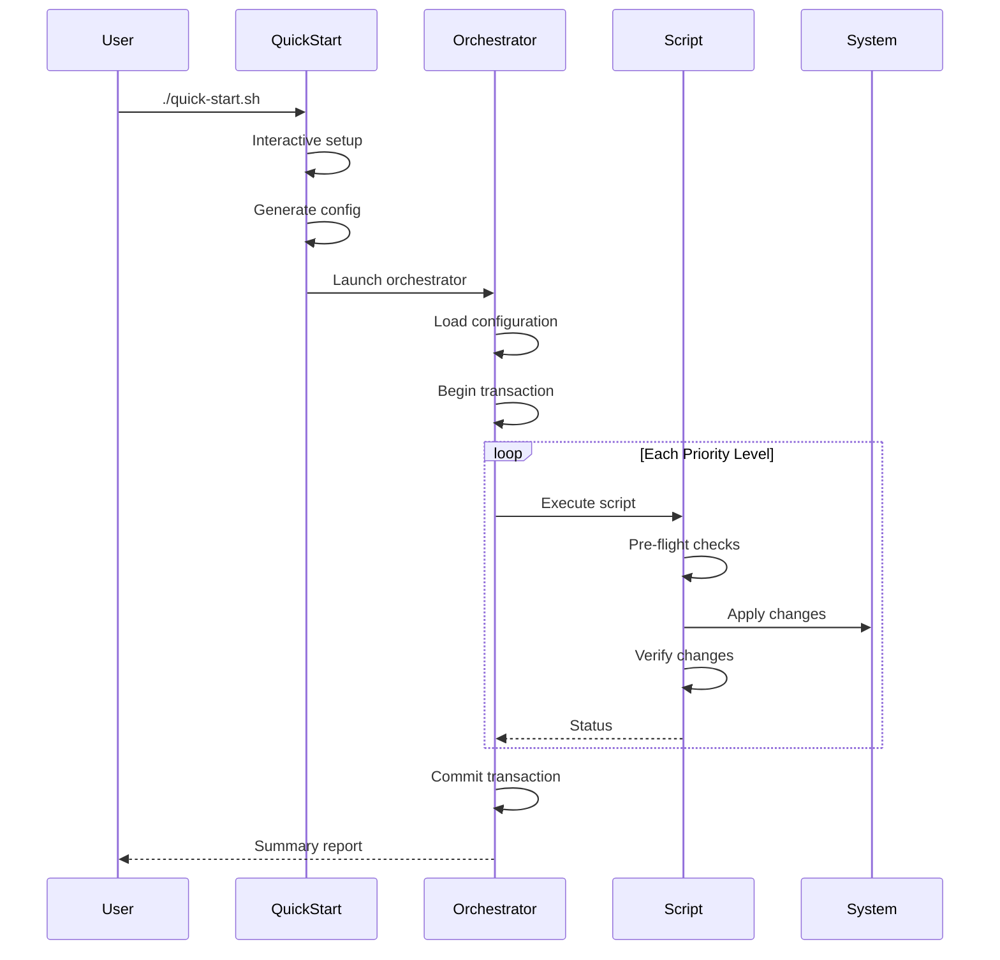
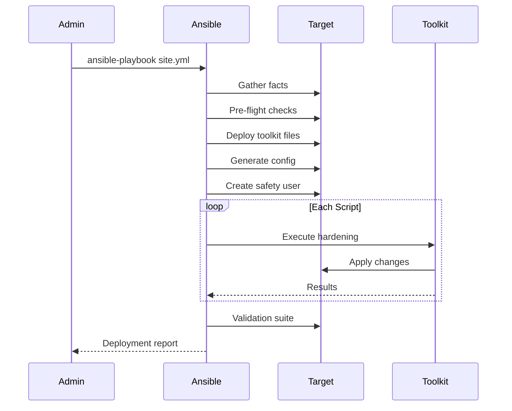
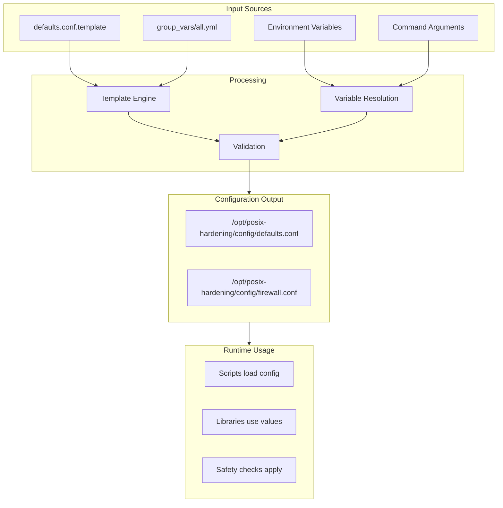

# POSIX-Hardening Architecture Overview

**Version:** 1.0.0
**Last Updated:** 2025-11-04
**Target Audience:** [Developer][Architecture][Operations]

---

## Executive Summary

The POSIX-hardening project is a **transaction-based, safety-first** server hardening toolkit that applies security configurations through orchestrated shell scripts with multiple recovery mechanisms. Built on pure POSIX shell for maximum portability, it provides both standalone execution and Ansible-managed deployment with comprehensive rollback capabilities to prevent system lockouts.

**Key architectural principles:**
- **Safety-first design** — Multiple layers of protection against lockouts
- **Transaction model** — All-or-nothing operations with automatic rollback
- **POSIX compliance** — Maximum portability across Unix-like systems
- **Layered architecture** — Clear separation between library, script, and orchestration layers
- **Dual deployment** — Standalone shell execution or Ansible automation

---

## System Architecture

The system follows a layered architecture with clear boundaries between components:



**Caption:** High-level component architecture showing data flow from entry points through orchestration to system modifications
**Evidence:** `/Users/fabian/sources/posix/POSIX-hardening/orchestrator.sh:L6-L14` (orchestration setup), `/Users/fabian/sources/posix/POSIX-hardening/lib/common.sh:L1-L31` (library initialization)

---

## Core Components

### 1. Library Layer (`/lib/*.sh`)

The foundation providing core functionality:

| Library | Purpose | Key Features |
|---------|---------|--------------|
| `common.sh` | Core utilities | Logging, validation, safety checks |
| `backup.sh` | Backup management | File/directory backup with manifests |
| `rollback.sh` | Transaction system | Automatic rollback on failure |
| `ssh_safety.sh` | SSH preservation | Connection validation, test configs |
| `posix_compat.sh` | Compatibility | POSIX-compliant alternatives |

**Evidence:** `/Users/fabian/sources/posix/POSIX-hardening/lib/common.sh:L1-L150` (core functions)

### 2. Script Layer (`/scripts/*.sh`)

Twenty individual hardening scripts with specific priorities:



**Caption:** Script execution dependencies and priority levels
**Evidence:** `/Users/fabian/sources/posix/POSIX-hardening/orchestrator.sh:L24-L45` (script order definition)

### 3. Orchestration Layer

**`orchestrator.sh`** — Main execution controller:
- Manages script execution order
- Enforces dependencies
- Coordinates transactions
- Handles rollback triggers

**Key functions:**
- `check_script_dependencies()` — Validates prerequisites
- `get_scripts_by_priority()` — Priority-based execution
- `run_script()` — Individual script execution
- `run_with_rollback()` — Transaction wrapper

**Evidence:** `/Users/fabian/sources/posix/POSIX-hardening/orchestrator.sh:L51-L96` (helper functions)

### 4. Ansible Automation Layer

Provides managed deployment with additional safety:



**Caption:** Ansible deployment workflow
**Evidence:** `/Users/fabian/sources/posix/POSIX-hardening/ansible/site.yml:L6-L80` (playbook structure)

---

## Design Patterns

### 1. Transaction-Based Operations

Every modification is wrapped in a transaction:



**Caption:** Transaction lifecycle with automatic rollback
**Evidence:** `/Users/fabian/sources/posix/POSIX-hardening/lib/rollback.sh:L27-L67` (transaction functions)

### 2. Backup/Rollback Pattern

Multi-level backup strategy:
- **File-level** — Individual config backups
- **Service-level** — Configuration snapshots
- **System-level** — Full state preservation

**Backup manifest structure:**
```
timestamp|type|source|backup_path
```

**Evidence:** `/Users/fabian/sources/posix/POSIX-hardening/lib/backup.sh:L35-L67` (backup implementation)

### 3. SSH Preservation Pattern

Critical for preventing remote lockouts:



**Caption:** SSH configuration change workflow with safety checks
**Evidence:** `/Users/fabian/sources/posix/POSIX-hardening/lib/ssh_safety.sh:L21-L100` (SSH safety mechanisms)

### 4. Configuration Management

Hierarchical configuration with defaults and overrides:



**Caption:** Configuration precedence and sources
**Evidence:** `/Users/fabian/sources/posix/POSIX-hardening/lib/common.sh:L14-L27` (config loading)

### 5. State Tracking

Persistent state management for idempotency:

| State File | Purpose | Location |
|------------|---------|----------|
| `manifest` | Backup registry | `/var/backups/hardening/` |
| `rollback_stack` | Transaction state | `/var/lib/hardening/` |
| `current_transaction` | Active transaction | `/var/lib/hardening/` |
| `completed_scripts` | Execution tracking | `/var/lib/hardening/` |

**Evidence:** `/Users/fabian/sources/posix/POSIX-hardening/lib/rollback.sh:L12-L14` (state files)

---

## Safety Mechanisms

### Multiple Layers of Protection

1. **Pre-flight Checks**
   - OS validation
   - Disk space verification
   - SSH connectivity tests
   - Dependency validation
   **Evidence:** `/Users/fabian/sources/posix/POSIX-hardening/scripts/01-ssh-hardening.sh:L76-L80`

2. **Active Monitoring**
   - SSH connection validation
   - Service health checks
   - Configuration syntax validation
   **Evidence:** `/Users/fabian/sources/posix/POSIX-hardening/lib/ssh_safety.sh:L22-L58`

3. **Automatic Rollback Triggers**
   - SSH connection loss
   - Critical service failure
   - Transaction timeout
   - Explicit error conditions
   **Evidence:** `/Users/fabian/sources/posix/POSIX-hardening/lib/rollback.sh:L69-L100`

4. **Emergency Access Methods**
   - Alternate SSH port (2222)
   - Password authentication fallback
   - Team key deployment
   - Recovery scripts
   **Evidence:** `/Users/fabian/sources/posix/POSIX-hardening/config/defaults.conf.template:L63-L66`

### Validation and Verification

```mermaid
flowchart LR
  subgraph PreChecks["Pre-Execution"]
    V1["Root user check"]
    V2["OS compatibility"]
    V3["Required commands"]
    V4["Disk space"]
    V5["SSH connectivity"]
  end

  subgraph DuringExec["During Execution"]
    V6["Config syntax test"]
    V7["Service health"]
    V8["Network connectivity"]
  end

  subgraph PostChecks["Post-Execution"]
    V9["Service status"]
    V10["SSH access test"]
    V11["Firewall rules"]
    V12["Log verification"]
  end

  PreChecks --> DuringExec --> PostChecks
```



**Caption:** Three-phase validation pipeline
**Evidence:** `/Users/fabian/sources/posix/POSIX-hardening/lib/common.sh:L99-L146` (validation functions)

---

## Execution Flow

### Standalone Execution



**Caption:** Standalone execution workflow
**Evidence:** `/Users/fabian/sources/posix/POSIX-hardening/quick-start.sh:L86-L100` (setup flow)

### Ansible Deployment



**Caption:** Ansible-managed deployment flow
**Evidence:** `/Users/fabian/sources/posix/POSIX-hardening/ansible/site.yml:L6-L558` (playbook tasks)

---

## Data Flow

### Configuration Sources

Configuration flows from multiple sources with clear precedence:



**Caption:** Configuration data flow from sources to runtime
**Evidence:** `/Users/fabian/sources/posix/POSIX-hardening/config/defaults.conf.template:L1-L80`

### Variable Precedence

1. **Command-line arguments** (highest)
2. **Ansible variables** (`group_vars/all.yml`)
3. **Configuration file** (`defaults.conf`)
4. **Environment variables**
5. **Built-in defaults** (lowest)

**Evidence:** `/Users/fabian/sources/posix/POSIX-hardening/lib/common.sh:L14-L20` (precedence implementation)

### Log Management

Comprehensive logging at multiple levels:

| Log Type | Location | Purpose | Retention |
|----------|----------|---------|-----------|
| Hardening logs | `/var/log/hardening/` | Execution audit | 30 days |
| Rollback logs | `/var/log/hardening/rollback.log` | Recovery tracking | Permanent |
| Backup manifests | `/var/backups/hardening/manifest` | Backup registry | With backups |
| State files | `/var/lib/hardening/` | Runtime state | Session |

**Evidence:** `/Users/fabian/sources/posix/POSIX-hardening/lib/common.sh:L34` (log file creation)

### Backup Storage

Structured backup organization:

```
/var/backups/hardening/
├── manifest                    # Backup registry
├── snapshots/                  # System snapshots
├── sshd_config.20241104-120000.bak
├── sshd_config.20241104-120000.meta
├── sshd_config.20241104-120000.sha256
└── iptables.rules.20241104-120100.bak
```

**Evidence:** `/Users/fabian/sources/posix/POSIX-hardening/lib/backup.sh:L11-L13` (backup structure)

---

## Key Design Decisions

### Why POSIX sh?

**Decision:** Use pure POSIX shell instead of Bash/Zsh
**Rationale:**
- Maximum portability across Unix-like systems
- Available on minimal/embedded systems
- No external dependencies
- Reduces attack surface (simpler interpreter)

**Consequences:**
- No arrays (use space-delimited strings)
- No `[[` conditionals (use `[` or `test`)
- No process substitution
- Custom implementations for missing features

**Evidence:** `/Users/fabian/sources/posix/POSIX-hardening/lib/posix_compat.sh` (compatibility layer)

### Why Shell Scripts + Ansible?

**Decision:** Dual implementation supporting both shell and Ansible
**Rationale:**
- Shell scripts for emergency/manual intervention
- Ansible for scale and automation
- Scripts remain functional without Ansible
- Ansible provides inventory and reporting

**Alternatives considered:**
- Pure Ansible (rejected: no fallback for emergencies)
- Pure shell (rejected: difficult to scale)
- Configuration management tools (rejected: additional dependencies)

**Evidence:** Design supports both modes equally

### Transaction Model Rationale

**Decision:** Wrap all changes in transactions with automatic rollback
**Rationale:**
- Prevents partial application of hardening
- Automatic recovery from failures
- Consistent system state
- Audit trail of all changes

**Implementation:**
- Begin transaction → Execute → Test → Commit/Rollback
- Rollback stack maintains undo operations
- Timeout triggers automatic rollback

**Evidence:** `/Users/fabian/sources/posix/POSIX-hardening/lib/rollback.sh:L27-L100`

### Safety-First Approach

**Decision:** Multiple redundant safety mechanisms
**Rationale:**
- Remote servers cannot afford lockouts
- Recovery is expensive and time-consuming
- Trust must be earned through reliability
- Better to fail safely than succeed dangerously

**Mechanisms:**
1. Pre-flight validation
2. Test configurations
3. Automatic rollback
4. Emergency access
5. Manual recovery tools

**Evidence:** Every script includes safety checks

---

## Extension Points

### How to Add New Hardening Scripts

1. **Create script file** in `/scripts/` with naming pattern `NN-description.sh`
2. **Add to orchestrator** script order with dependencies:
   ```sh
   SCRIPT_ORDER="
   ...
   3:21-new-hardening.sh:05-file-permissions.sh
   "
   ```

3. **Implement required structure:**
   ```sh
   #!/bin/sh
   # Load libraries
   . "$LIB_DIR/common.sh"
   . "$LIB_DIR/backup.sh"

   # Pre-flight checks
   pre_flight_checks() {
       init_hardening_environment "$SCRIPT_NAME"
       verify_ssh_connection
   }

   # Main hardening
   main() {
       begin_transaction "$SCRIPT_NAME"
       # Apply changes
       commit_transaction
   }
   ```

**Evidence:** `/Users/fabian/sources/posix/POSIX-hardening/scripts/01-ssh-hardening.sh:L1-L80` (template structure)

### How to Customize Configurations

1. **Configuration file** — Edit `defaults.conf`:
   ```sh
   SSH_PORT=2022
   ADMIN_IP="203.0.113.10"
   ```

2. **Ansible variables** — Override in `group_vars/`:
   ```yaml
   hardening_ssh_port: 2022
   hardening_admin_ip: "203.0.113.10"
   ```

3. **Environment variables** — Set before execution:
   ```sh
   SSH_PORT=2022 ./orchestrator.sh
   ```

**Evidence:** `/Users/fabian/sources/posix/POSIX-hardening/config/defaults.conf.template:L49-L55`

### How to Extend Safety Mechanisms

Safety mechanisms are pluggable through the library system:

1. **Add validation** to `lib/common.sh`:
   ```sh
   validate_custom_requirement() {
       # Custom validation logic
   }
   ```

2. **Extend rollback** in `lib/rollback.sh`:
   ```sh
   register_rollback_action "custom" "$data"
   ```

3. **Add emergency procedures** to recovery scripts

**Evidence:** `/Users/fabian/sources/posix/POSIX-hardening/lib/` (library architecture)

---

## Performance Considerations

### Expected Load

- **Execution time:** 5-15 minutes for full hardening
- **Disk usage:** ~100MB for backups
- **Memory:** Minimal (shell scripts)
- **Network:** SSH validation tests only

### Bottlenecks

1. **Sequential execution** — Scripts run one at a time
2. **Backup I/O** — File copying can be slow on large configs
3. **SSH tests** — Network latency affects validation

### Optimization Opportunities

- Parallel execution of independent scripts (priority groups)
- Incremental backups for large files
- Caching of validation results

---

## Security Considerations

### Threat Model

**Assumptions:**
- Administrator has legitimate root access
- System is not currently compromised
- Network path to system is trusted
- Backup storage is secure

**Threats addressed:**
- Unauthorized access (SSH hardening)
- Network attacks (firewall rules)
- Privilege escalation (sudo restrictions)
- Data exfiltration (audit logging)

### Secrets Handling

- No secrets stored in scripts
- SSH keys managed separately
- Passwords disabled by default
- Ansible Vault recommended for sensitive data

**Evidence:** Scripts contain no hardcoded credentials

---

## Evolution & Risks

### Known Limitations

1. **POSIX constraints** limit advanced features
2. **Sequential execution** increases deployment time
3. **Shell dependency** requires working shell environment
4. **No Windows support** (Unix-like only)

### Technical Debt

- Monolithic Ansible playbooks need refactoring to roles
- Shell script logic could use native Ansible modules
- Test coverage needs improvement

### Future Enhancements

1. **Native Ansible modules** for each hardening component
2. **Parallel execution** framework
3. **Web UI** for configuration management
4. **Compliance reporting** (CIS, DISA STIG)
5. **Cloud-specific** hardening (AWS, Azure, GCP)

### Risks

| Risk | Likelihood | Impact | Mitigation |
|------|------------|--------|------------|
| SSH lockout | Low | High | Multiple safety mechanisms |
| Partial application | Low | Medium | Transaction system |
| Configuration conflict | Medium | Low | Validation suite |
| Rollback failure | Very Low | High | Manual recovery tools |

---

## Appendices

### A. File Structure

```
/Users/fabian/sources/posix/POSIX-hardening/
├── lib/                    # Core libraries
│   ├── common.sh          # Base utilities
│   ├── backup.sh          # Backup system
│   ├── rollback.sh        # Transaction manager
│   ├── ssh_safety.sh      # SSH protection
│   └── posix_compat.sh    # Compatibility layer
├── scripts/               # Hardening scripts (01-20)
├── config/                # Configuration templates
├── ansible/               # Ansible automation
│   ├── site.yml          # Main playbook
│   ├── group_vars/       # Variable definitions
│   └── templates/        # Jinja2 templates
├── docs/                  # Documentation
├── testing/              # Test framework
├── orchestrator.sh       # Main controller
└── quick-start.sh        # Interactive setup
```

### B. Glossary

| Term | Definition |
|------|------------|
| **Transaction** | Atomic operation with rollback capability |
| **Pre-flight checks** | Validation before execution |
| **Rollback stack** | LIFO queue of undo operations |
| **Safety mode** | Enhanced validation and recovery |
| **Priority level** | Execution order grouping (1-4) |
| **Hardening** | Security configuration improvements |
| **POSIX** | Portable Operating System Interface standard |

### C. References

- POSIX.1-2017 Standard
- CIS Benchmarks for Debian/Ubuntu
- NIST Cybersecurity Framework
- Project repository: `/Users/fabian/sources/posix/POSIX-hardening/`

---

*Generated: 2025-11-04*
*Documentation current as of repository state*