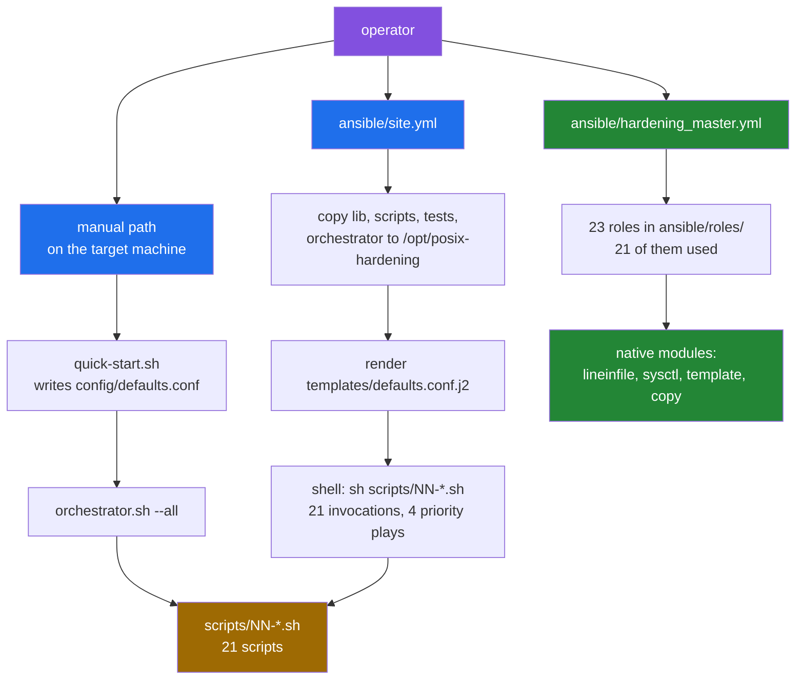
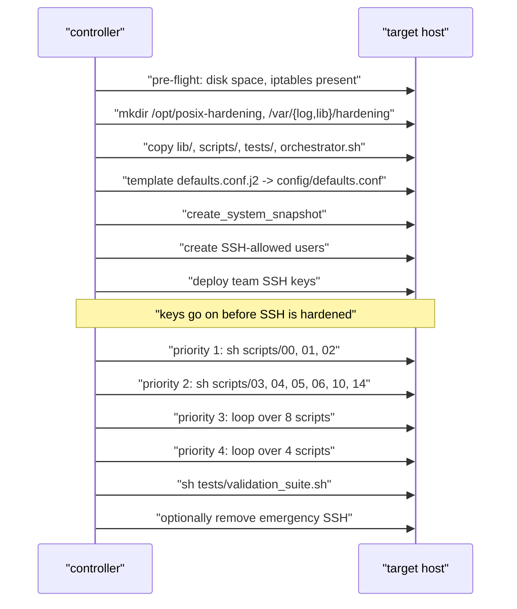
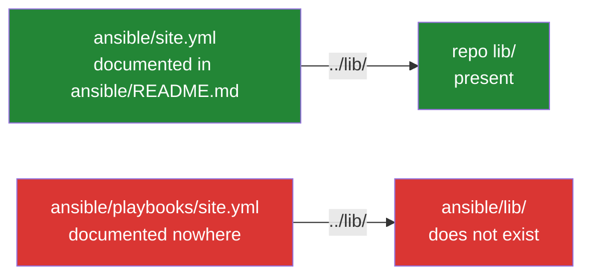

# Two deployment paths, side by side

[← back to the documentation index](README.md)

There are two ways to apply this toolkit to a machine: run the shell scripts on
the machine itself, or drive it from an Ansible controller. They are not two
front ends onto one engine. The manual path runs `scripts/NN-*.sh` through
`orchestrator.sh`; the Ansible side contains *two* entry points that disagree
with each other, one of which copies the same shell scripts to the target and
runs them, and one of which reimplements the work as native Ansible roles.

This page maps all three, says which parts were exercised and which were only
read, and points at what breaks. Every number here comes from
[`media/captures/ansible.txt`](../media/captures/ansible.txt), produced by
[`tools/capture-ansible.sh`](../tools/capture-ansible.sh).

## The three entry points



The blue boxes all end at the same 21 shell scripts. The green path never
touches them.

## What each path is, in one table

| | Manual | `ansible/site.yml` | `ansible/hardening_master.yml` |
|---|---|---|---|
| Where the work happens | on the target | on the target, over SSH | on the target, over SSH |
| What applies the change | `scripts/NN-*.sh` | the same scripts, copied to `/opt/posix-hardening` | 21 Ansible roles |
| Scripts invoked | 21, via `orchestrator.sh` | 21, 9 named and 12 in two loops | 0 |
| Role references | — | 0 | 21 |
| Configuration | `config/defaults.conf` from `quick-start.sh` | `templates/defaults.conf.j2` rendered onto the target | `group_vars/all.yml` and role defaults |
| Uses `orchestrator.sh` | yes | copies it, never runs it | no |
| Idempotence mechanism | `/var/lib/hardening/completed` markers | the same markers, on the target | Ansible's own change detection |
| Documented in | `README.md`, `docs/GETTING_STARTED.md` | `ansible/README.md` | `docs/ROLE_EXECUTION_ORDER.md`, `docs/GETTING_STARTED.md` |

The last row is the important one. No single document presents both Ansible
entry points, and neither Ansible entry point mentions the other.

## The `site.yml` path in detail

`ansible/site.yml` is 555 lines and nine plays. It is a deployment wrapper,
not a reimplementation: the hardening decisions still live in the shell
scripts.



Two things follow from this shape:

- **Every defect in the shell scripts reaches this path too.** The scripts are
  copied verbatim, so `BUG-1` through `BUG-6` and `BUG-13` apply unchanged. The
  one difference is that `templates/defaults.conf.j2` sets
  `ENABLE_EMERGENCY_ACCESS=1`, which `config/defaults.conf.template` does not,
  so the emergency-SSH fallback is live here and dead on the manual path
  ([BUG-21](BUGS-FOUND.md#bug-21)).
- **The orchestrator's own bugs do not.** `site.yml` calls the scripts
  directly, one `shell:` task each, so `orchestrator.sh`'s dependency handling,
  `FAIL_FAST` behaviour and `--priority` parsing
  ([BUG-9](BUGS-FOUND.md#bug-9), [BUG-15](BUGS-FOUND.md#bug-15),
  [BUG-16](BUGS-FOUND.md#bug-16)) are bypassed. The orchestrator is copied to
  the target and never executed.

## The `hardening_master.yml` path in detail

This is the one that uses the roles. It is 341 lines and eight plays, and it
shares nothing with `site.yml` but the target. Role names below are given
without their `posix_hardening_` prefix.

| Play | Roles | Tags |
|---|---|---|
| Pre-flight validation | `validation` | `always`, `preflight`, `validation` |
| Priority 1 — SSH and firewall | `ssh`, `firewall` | `harden`, `priority1`, `critical` |
| Priority 2 — core system | `kernel`, `network`, `sysctl`, `files`, `tmp`, `mount` | `harden`, `priority2`, `core` |
| Priority 3 — access control | `password`, `accounts`, `sudo`, `limits`, `coredump`, `shell` | `harden`, `priority3`, `access` |
| Priority 4 — services | `services`, `cron` | `harden`, `priority4`, `services` |
| Priority 5 — audit | `audit`, `logs`, `integrity` | `harden`, `priority5`, `audit` |
| Priority 6 — final touches | `banner` | `harden`, `priority6`, `final` |
| Final validation and report | none; tasks only | `always`, `validate`, `report` |

The priority numbering is its own:

```text
    plays, and the priority levels each entry point defines:
      site.yml                 9 plays, priorities: priority1 priority2 priority3 priority4
      hardening_master.yml     8 plays, priorities: priority1 priority2 priority3 priority4 priority5 priority6
      ../orchestrator.sh       priorities: 1 2 3 4
```

`orchestrator.sh` and `ansible/site.yml` both stop at priority 4; this playbook
has six. `--tags priority4` therefore selects different work depending on which
path you are on, and a reader moving between `docs/ROLE_EXECUTION_ORDER.md` and
`ansible/README.md` gets no warning of it.

Twenty-three roles exist; twenty-one are listed above. The two left over are
the ones that would deploy the toolkit and its keys:

```text
=== 5. roles on disk vs roles a playbook uses
    roles in ansible/roles/: 23
    roles used by hardening_master.yml: 21
    roles not reachable from hardening_master.yml, and what does use them:
      posix_hardening_deploy     playbooks/test_week2_roles.yml
      posix_hardening_users      playbooks/test_week2_roles.yml
```

`posix_hardening_deploy` and `posix_hardening_users` are reachable only from a
test playbook. On the `hardening_master.yml` path nothing creates the SSH-allowed
users or installs the team keys before `posix_hardening_ssh` hardens `sshd` —
the step `site.yml` spends two whole plays on. Whether that is a gap or a
deliberate division of labour is not stated anywhere in the repository; the
role-execution document does not mention it.

## Which files each path actually reads

`ansible.cfg` and `ansible/README.md` disagree about the inventory:

```text
=== 6. which inventory ansible.cfg actually loads
      inventory = inventories/production/hosts.ini
      remote_user = ansible
      host_key_checking = False
      roles_path = roles
    file structure section of ansible/README.md names inventory.ini:
      39:Edit `inventory.ini` to add your target servers:
      410:├── inventory.ini         # Server inventory
```

Both files are tracked. Editing the one the README names has no effect on a run
that uses the default configuration. Note also `host_key_checking = False`,
which `inventory.ini` reinforces with
`-o StrictHostKeyChecking=no -o UserKnownHostsFile=/dev/null`: a toolkit whose
purpose is SSH hardening ships with host-key verification disabled on the
controller side.

## The duplicated playbooks

Four playbooks exist twice — once at the `ansible/` root, once under
`ansible/playbooks/`:

```text
=== 3. duplicated playbooks: root copy vs playbooks/ copy
    site.yml               differ: 3 changed hunks
    preflight.yml          differ: 4 changed hunks
    rollback.yml           differ: 14 changed hunks
    deploy_team_keys.yml   identical
```

The `playbooks/` copy of `site.yml` cannot deploy anything: Ansible resolves a
`copy:` module's `src:` against the playbook's own directory, so `../lib/`
means `ansible/playbooks/../lib/`, which does not exist
([BUG-22](BUGS-FOUND.md#bug-22)). The root copy resolves correctly.

The `preflight.yml` pair differs in behaviour rather than in naming: the root
copy — the documented one — starts `ssh` and `sshd` rather than reporting on
them ([BUG-23](BUGS-FOUND.md#bug-23)).



## Static checks that were run

All ten playbooks parse:

```text
=== 7. ansible-playbook --syntax-check
    site.yml                     exit=0
    hardening_master.yml         exit=0
    preflight.yml                exit=0
    rollback.yml                 exit=0
    validate_config.yml          exit=0
    deploy_team_keys.yml         exit=0
    playbooks/site.yml           exit=0
    playbooks/preflight.yml      exit=0
    playbooks/rollback.yml       exit=0
    playbooks/validate.yml       exit=0
```

`--syntax-check` parses; it does not resolve `src:` paths, which is why it
passes on the playbook that cannot find any of its files.

`ansible-lint` 25.9.2, run over the six top-level playbooks and every role they
pull in, reports 1394 findings across 138 files:

| Rule | Count | What it is |
|---|---|---|
| `var-naming` | 1091 | role variables without the role's own prefix |
| `yaml` | 78 | formatting, mostly line length and trailing spaces |
| `key-order` | 55 | task keys out of the conventional order |
| `name` | 50 | unnamed or badly named tasks |
| `command-instead-of-module` | 41 | `command:`/`shell:` where a module exists |
| `schema` | 21 | `meta/main.yml` metadata, e.g. unquoted `min_ansible_version` |
| `risky-shell-pipe` | 19 | pipelines without `set -o pipefail` |
| `ignore-errors` | 18 | `ignore_errors: true` rather than a checked condition |
| `fqcn` | 16 | short module names |
| `meta-no-tags` | 3 | galaxy metadata |
| `literal-compare`, `jinja` | 2 | one each |

The run ends `Profile 'production' was required, but 'min' profile passed`.
These are style findings, not the defects in
[BUGS-FOUND.md](BUGS-FOUND.md); none of them was counted as a bug. The
`var-naming` total dominates the list and is cosmetic.

## Choosing between the paths

| If you want | Use | Because |
|---|---|---|
| One machine, hands on the keyboard | manual path | It is the path the README documents and the one the captures in this repository exercise |
| Many machines, shell scripts as the source of truth | `ansible/site.yml` | It deploys and runs the same scripts, and handles user and key setup first |
| Many machines, Ansible as the source of truth | `ansible/hardening_master.yml` | Native modules, per-role tags, real change reporting — but no key or user bootstrap |

There is no supported way to mix them. The roles and the scripts implement
overlapping settings with separate defaults (`ansible/group_vars/all.yml`
against `config/defaults.conf.template`), and nothing reconciles the two.

## Known limitations of this page

- **No Ansible run against a host was performed.** Everything above is static:
  file contents, `--syntax-check`, `ansible-lint`, and one isolated
  reproduction of Ansible's `src:` search path. Driving either playbook needs a
  managed host with systemd and a reachable SSH account; the throwaway
  containers used elsewhere in this documentation run `sshd` directly and have
  no systemd, so `preflight.yml`, the `service`/`systemd` tasks and every
  handler would fail for reasons unrelated to the toolkit.
- **The comparison of what the roles and the scripts each change was not
  made.** Both claim to harden `sshd`, sysctl, PAM and the firewall, but no
  setting-by-setting diff between `ansible/roles/*/defaults/main.yml` and
  `config/defaults.conf.template` was produced. They are known to have separate
  defaults; whether they agree on values is not established here.
- **`ansible-lint`'s findings were counted, not triaged.** The table above is
  its own summary output. Individual findings were not assessed, beyond
  confirming that the 21 `schema` findings are metadata typing and not task
  errors.
- **Role tags were read from `hardening_master.yml`, not exercised.** Whether
  `--tags priority2` selects exactly the six roles in the table was not tested.
