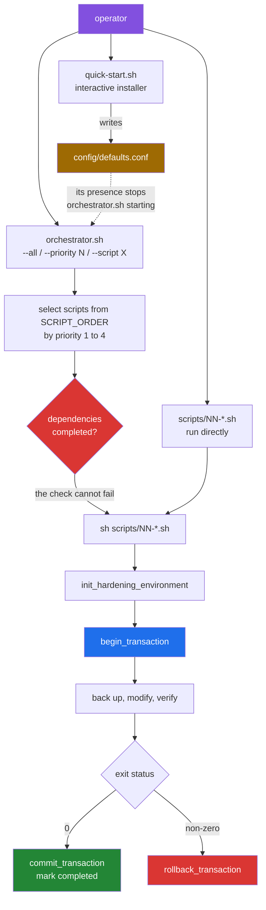

# The execution model: what a hardening run actually does

[← back to the documentation index](README.md)

This page follows one hardening run from the command line to the completion
marker. It describes the code as it is, which in several places is not what the
README describes; where the two differ, the difference is flagged and linked to
[BUGS-FOUND.md](BUGS-FOUND.md).

## The shape of a run



Two red boxes are red for a reason. The dependency gate is drawn as a decision
it cannot actually make ([BUG-9a](BUGS-FOUND.md#bug-9)), and the rollback branch
does not restore what it backed up ([BUG-3](BUGS-FOUND.md#bug-3)).

## Three entry points, and which of them work

| Entry point | What it is for | State as measured |
|---|---|---|
| `quick-start.sh` | Interactive first-time setup; writes `config/defaults.conf` | Runs. Parses no arguments, so `--help` starts the installer ([BUG-11](BUGS-FOUND.md#bug-11)) |
| `orchestrator.sh` | Runs many scripts in dependency order | Aborts if `config/defaults.conf` exists ([BUG-7](BUGS-FOUND.md#bug-7)); `--dry-run` aborts either way ([BUG-8](BUGS-FOUND.md#bug-8)); `--priority N` runs nothing and exits 0 ([BUG-15](BUGS-FOUND.md#bug-15)); `--all` ran 13 of its 20 declared scripts ([BUG-16](BUGS-FOUND.md#bug-16)) |
| `scripts/NN-*.sh` | One hardening concern, run directly | The intended path, and the one the captures use |

All three abort on the repository as it stands, before any of the above, because
the two libraries cannot find `posix_compat.sh` ([BUG-1](BUGS-FOUND.md#bug-1)).

## Inside one script

Every script in `scripts/` has the same skeleton. `scripts/01-ssh-hardening.sh`
is the fullest example.

```mermaid
sequenceDiagram
    participant S as "scripts/NN-*.sh"
    participant C as "lib/common.sh"
    participant B as "lib/backup.sh"
    participant R as "lib/rollback.sh"
    participant SYS as "the system"

    S->>S: "load config/defaults.conf FIRST"
    S->>C: "source common.sh, then the rest"
    Note over C: "common.sh marks<br/>SAFETY_MODE, DRY_RUN,<br/>BACKUP_DIR readonly"
    S->>C: "init_hardening_environment"
    C->>C: "require_root, check_requirements,<br/>check_disk_space"
    C->>C: "if SAFETY_MODE: validate_debian,<br/>verify_ssh_alive, preserve_admin_access"
    C->>C: "trap cleanup_on_exit EXIT INT TERM"
    S->>R: "begin_transaction"
    R->>R: "trap transaction_cleanup EXIT INT TERM"
    S->>B: "safe_backup_file /etc/thing"
    B-->>S: "path, with a log line in front of it"
    S->>R: "register_file_rollback"
    S->>SYS: "modify /etc/thing"
    S->>S: "validate the result"
    alt "exit status 0"
        R->>R: "commit_transaction"
        S->>SYS: "append name to /var/lib/hardening/completed"
    else "non-zero"
        R->>R: "rollback_transaction"
        Note over R,SYS: "logs Rollback completed;<br/>the file is not restored"
    end
```

The ordering in the first two lines matters. Configuration must be sourced
before `lib/common.sh`, because `common.sh` makes those same variables
read-only. Every script in `scripts/` does this and says so in a comment. The
orchestrator does it the other way round, which is [BUG-7](BUGS-FOUND.md#bug-7).

## Priorities and dependencies

`orchestrator.sh` holds a table of `priority:script:dependencies`. It walks
priorities 1 through 4 in order and, within each, the table order.

| Priority | Scripts | Intent |
|---|---|---|
| 1 | `01-ssh-hardening`, `02-firewall-setup` | Remote access must survive; do it first and verify it |
| 2 | `03-kernel-params`, `04-network-stack`, `05-file-permissions`, `06-process-limits`, `10-sudo-restrictions`, `14-sysctl-hardening` | Core system hardening |
| 3 | `07-audit-logging`, `08-password-policy`, `09-account-lockdown`, `11-service-disable`, `12-tmp-hardening`, `15-cron-restrictions`, `16-mount-options`, `19-log-retention` | Policy and services |
| 4 | `13-core-dump-disable`, `17-shell-timeout`, `18-banner-warnings`, `20-integrity-baseline` | Finishing touches; the baseline depends on `all` |

The table lists 20 scripts. `scripts/` contains 21: `00-ssh-verification.sh` is
not in the table ([BUG-10](BUGS-FOUND.md#bug-10)). It is not dead code —
`01-ssh-hardening.sh` invokes it during its pre-flight checks, which is why it
appears in the completion markers after a successful run:

```text
--- completion markers ---
00-ssh-verification
01-ssh-hardening
05-file-permissions
```

The dependency column is currently decorative, and doubly so. Dependencies are
spelled with the `.sh` suffix while completion markers are written without it,
so no dependency check can ever succeed ([BUG-9d](BUGS-FOUND.md#bug-9)) — a
full run warns `Dependency not met: 01-ssh-hardening.sh` on the line after
`Completed: 01-ssh-hardening.sh`. And `check_script_dependencies` returns 0
unconditionally regardless ([BUG-9a](BUGS-FOUND.md#bug-9)), so the warning
never blocks anything. The two defects cancel: every dependency is unmet, and
being unmet has no effect.

Priority ordering does not survive a failure either. `FAIL_FAST` defaults to
on, and its `break 2` runs inside a pipeline subshell where the outer loop is
not visible, so a failing script abandons the rest of *its own* priority level
while every later level still runs ([BUG-16](BUGS-FOUND.md#bug-16)). A measured
`--all` run in a fresh container executed 13 of the 20 declared scripts and
reported `Completed: 0  Failed: 0`.

## Completion markers

`/var/lib/hardening/completed` is a flat list of script names. `is_completed`
greps it; a script already listed is skipped on the next run. It is the only
persistent record of what has been applied.

The marker is written by the script itself on success, so a script that fails
partway leaves no marker and will be retried. A script that succeeds in
`DRY_RUN` mode also gets a marker, because `mark_completed` sits outside the
`DRY_RUN` branch in all 21 scripts: a simulation marks the machine as hardened
and the orchestrator then skips the real work ([BUG-13](BUGS-FOUND.md#bug-13)).

Reaching `DRY_RUN` mode at all takes some care. `config/defaults.conf` assigns
`DRY_RUN=0` unconditionally and is sourced before `lib/common.sh`, so
`DRY_RUN=1 sh scripts/05-file-permissions.sh` applies changes whenever that
file exists — which is the state `quick-start.sh` leaves behind
([BUG-14](BUGS-FOUND.md#bug-14)). The file has to be moved aside for a dry run
to be a dry run.

## Where state lives

| Path | Written by | Contents |
|---|---|---|
| `/var/lib/hardening/completed` | each script | names of completed scripts |
| `/var/lib/hardening/rollback_stack` | `lib/rollback.sh` | pending rollback actions for the open transaction |
| `/var/lib/hardening/current_transaction` | `lib/rollback.sh` | the open transaction id, if any |
| `/var/backups/hardening/` | `lib/backup.sh`, `lib/common.sh` | timestamped file backups, `.meta` and `.sha256` sidecars, `manifest` |
| `/var/backups/hardening/snapshots/` | `lib/backup.sh` | system snapshots taken at orchestrator start |
| `/var/log/hardening/hardening-<timestamp>.log` | `log()` | the full run log |
| `/var/log/hardening/rollback.log` | `lib/rollback.sh` | one line per rollback |

All of these are configurable in `config/defaults.conf` — which is the file
that currently prevents the orchestrator from starting.

## What a real run looked like

From `media/captures/`, with the [BUG-1](BUGS-FOUND.md#bug-1) workaround applied
so the scripts could start:

| Script | Exit | Effect, read back from the system afterwards |
|---|---|---|
| `01-ssh-hardening.sh` | 0 | 11 `sshd -T` settings changed as advertised, port 22 still answering |
| `03-kernel-params.sh` | 1 | aborted on one unsupported sysctl key; rollback ran and restored nothing |
| `05-file-permissions.sh` | 0 | completed |

See [measurement.md](measurement.md) for exactly how this was produced and what
the container could not exercise.
