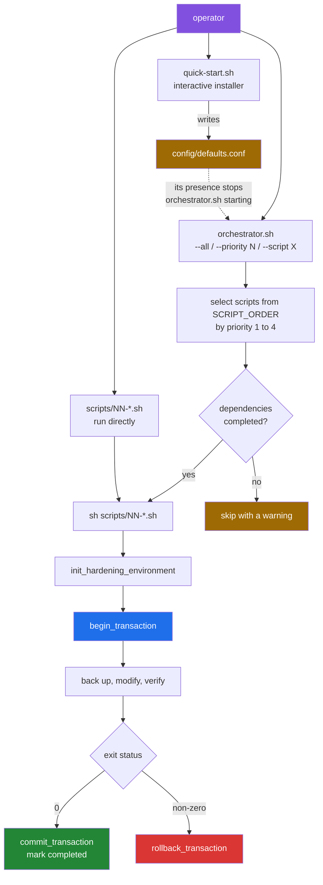
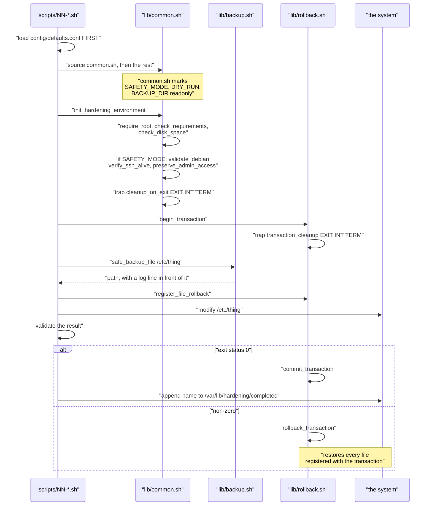

# The execution model: what a hardening run actually does

[← back to the documentation index](README.md)

This page follows one hardening run from the command line to the completion
marker. It describes the code on the default branch as it behaved in a Linux
container. Where a defect that is still open changes the picture, it is linked
to [BUGS-FOUND.md](BUGS-FOUND.md).

## The shape of a run



The amber box on the left is the one open problem in this picture: while
`config/defaults.conf` exists the orchestrator cannot start
([BUG-7](BUGS-FOUND.md#bug-7)). The rollback branch restores the files a script
registered, but only `02-firewall-setup.sh` registers any
([BUG-24](BUGS-FOUND.md#bug-24)); see [rollback.md](rollback.md).

## Three entry points, and which of them work

| Entry point | What it is for | State as measured |
|---|---|---|
| `quick-start.sh` | Interactive first-time setup; writes `config/defaults.conf` | Runs; `--help` prints usage and exits |
| `orchestrator.sh` | Runs many scripts in dependency order | Exits 2 while `config/defaults.conf` exists ([BUG-7](BUGS-FOUND.md#bug-7)); `--dry-run` exits 2 either way ([BUG-8](BUGS-FOUND.md#bug-8)). Without the config file, `--all`, `--priority N` and `--script X` run and honour dependencies |
| `scripts/NN-*.sh` | One hardening concern, run directly | Works with or without the config file; the captures of scripts 01, 03 and 05 use this path |

## Inside one script

Every script in `scripts/` has the same skeleton. `scripts/01-ssh-hardening.sh`
is the fullest example.



The ordering in the first two lines matters. Configuration must be sourced
before `lib/common.sh`, because `common.sh` makes those same variables
read-only. Every script in `scripts/` does this and says so in a comment. The
orchestrator does it the other way round, which is [BUG-7](BUGS-FOUND.md#bug-7).

## Priorities and dependencies

`orchestrator.sh` holds a table of `priority:script:dependencies`. It walks
priorities 1 through 4 in order and, within each, the table order.

| Priority | Scripts | Intent |
|---|---|---|
| 1 | `01-ssh-hardening`, `02-firewall-setup` | Remote access must survive; do it first and verify it |
| 2 | `03-kernel-params`, `04-network-stack`, `05-file-permissions`, `06-process-limits`, `10-sudo-restrictions`, `14-sysctl-hardening` | Core system hardening |
| 3 | `07-audit-logging`, `08-password-policy`, `09-account-lockdown`, `11-service-disable`, `12-tmp-hardening`, `15-cron-restrictions`, `16-mount-options`, `19-log-retention` | Policy and services |
| 4 | `13-core-dump-disable`, `17-shell-timeout`, `18-banner-warnings`, `20-integrity-baseline` | Finishing touches; the baseline depends on `all` |

The table lists 20 scripts. `scripts/` contains 21: `00-ssh-verification.sh` is
deliberately not in the table. `01-ssh-hardening.sh` runs it as its pre-flight
step, which is why it appears in the completion markers after a successful run:

```text
--- completion markers ---
00-ssh-verification
01-ssh-hardening
05-file-permissions
```

A script runs only once every dependency in its column has a completion
marker. Otherwise the orchestrator logs `Skipping <script> - dependencies not
met` and moves on. `all` (used by `20-integrity-baseline`) and `none` always
pass.

With `FAIL_FAST=1`, the default, the first failure ends the whole run. In the
container, `--all` ran 01 and 02, failed on 03 and stopped with
`Completed: 2  Failed: 1`. With `FAIL_FAST=0` the same run continued:

| Result | Scripts |
|---|---|
| Completed (13) | 01, 02, 05, 07, 08, 09, 11, 12, 16, 17, 18, 19, 20 |
| Failed (2) | `03-kernel-params` (the kernel has no `htcp`, so `net.ipv4.tcp_congestion_control` is rejected), `15-cron-restrictions` (the image has no cron, so `/etc/crontab` does not exist) |
| Skipped (5) | 04, 06, 13 and 14, which depend on 03; `10-sudo-restrictions` |

`10-sudo-restrictions` is skipped for a reason unrelated to the failures: it is
priority 2 but depends on `09-account-lockdown`, which is priority 3, so its
dependency can never have run by the time its turn comes. Both failures are
properties of the container, not of the scripts; on a Debian host with cron
installed and `htcp` available they would not occur. The full transcript is
scenario 7 of [`orchestrator.log`](../media/captures/orchestrator.log).

## Completion markers

`/var/lib/hardening/completed` is a flat list of script names. `is_completed`
greps it; a script already listed is skipped on the next run. It is the only
persistent record of what has been applied.

The marker is written by the script itself on success, so a script that fails
partway leaves no marker and will be retried. A dry run does not write one; it
logs `[DRY-RUN] Would mark as completed: <name>` instead.

Reaching `DRY_RUN` mode takes some care, because the config file wins over the
environment ([BUG-14](BUGS-FOUND.md#bug-14), open). `config/defaults.conf`
assigns `DRY_RUN=0` unconditionally and is sourced before `lib/common.sh`, so
`DRY_RUN=1 sh scripts/05-file-permissions.sh` applies changes whenever that
file exists — which is the state `quick-start.sh` leaves behind. The file has
to be moved aside for a dry run to be a dry run
([`dry-run.txt`](../media/captures/dry-run.txt), scenarios A and B).

## Where state lives

| Path | Written by | Contents |
|---|---|---|
| `/var/lib/hardening/completed` | each script | names of completed scripts |
| `/var/lib/hardening/rollback_stack` | `lib/rollback.sh` | pending rollback actions for the open transaction |
| `/var/lib/hardening/current_transaction` | `lib/rollback.sh` | the open transaction id, if any |
| `/var/backups/hardening/` | `lib/backup.sh`, `lib/common.sh` | timestamped file backups, `.meta` and `.sha256` sidecars, `manifest` |
| `/var/backups/hardening/snapshots/` | `lib/backup.sh` | system snapshots taken at orchestrator start |
| `/var/log/hardening/hardening-<timestamp>.log` | `log()` | the full run log |
| `/var/log/hardening/rollback.log` | `lib/rollback.sh` | one line per rollback |

All of these are configurable in `config/defaults.conf`, which is also the file
whose presence stops the orchestrator from starting ([BUG-7](BUGS-FOUND.md#bug-7)).

## What a container run looked like

From [`media/captures/`](../media/captures), each script run directly in a
Debian 12 container built from `ansible/testing/Dockerfile`:

| Script | Exit | Effect, read back from the system afterwards |
|---|---|---|
| `01-ssh-hardening.sh` | 0 | 11 `sshd -T` settings changed as advertised, port 22 still answering |
| `03-kernel-params.sh` | 1 | stopped on `net.ipv4.tcp_congestion_control`, which it names; the rollback left its block in `sysctl.conf` ([BUG-24](BUGS-FOUND.md#bug-24)) |
| `05-file-permissions.sh` | 0 | completed |

See [measurement.md](measurement.md) for exactly how this was produced and what
the container could not exercise.
