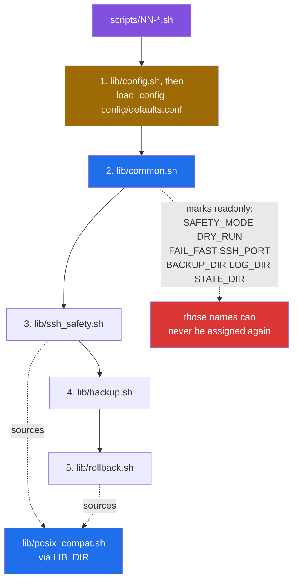
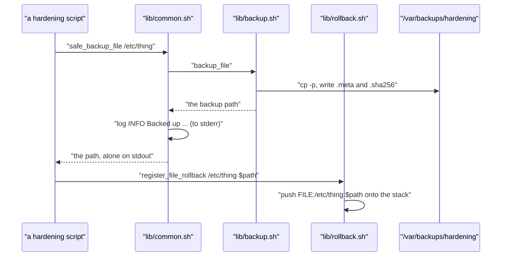

# The library layer: what lives in `lib/`, and how it is wired

[← back to the documentation index](README.md)

Six files in `lib/` hold everything the 21 hardening scripts share:
configuration, logging, backups, transactions and the SSH safety net. This page maps
them, shows the load order every script depends on, and marks the parts that
are defined but never reached.

## The six files

| File | Lines | Functions | What it owns |
|---|---|---|---|
| `lib/config.sh` | 47 | 1 | `load_config`: flags and environment win over `config/defaults.conf` |
| `lib/common.sh` | 565 | 25 | Configuration defaults, logging, the environment check, completion markers, progress output |
| `lib/ssh_safety.sh` | 630 | 13 | The SSH lockout-avoidance path: test daemon, watchdog, emergency access |
| `lib/rollback.sh` | 910 | 28 | Transactions, the undo stack, the `track_*` helpers, traps, checkpoints |
| `lib/backup.sh` | 448 | 9 | File and directory backups, system snapshots, restore |
| `lib/posix_compat.sh` | 271 | 7 | Portable replacements for `tac`, `mktemp`, `sed -i`, `realpath`, `timeout` |

Counts from `wc -l` and a grep for top-level `name() {` definitions.

## Load order, and why it is not negotiable

`lib/common.sh:15-26` marks twelve configuration variables `readonly` with a
`${NAME:-default}` expansion. That is the whole mechanism: whatever the value
is when `common.sh` is sourced becomes permanent for the rest of the process.

Two consequences follow, and both are load-bearing:

- **Configuration must be loaded first.** `orchestrator.sh` and every script
  in `scripts/` call `load_config config/defaults.conf` before
  `lib/common.sh`, with a comment saying why. `load_config` sources the file
  but keeps every variable that already had a non-empty value, so command-line
  flags (which the orchestrator exports before loading) and the environment
  win over the file ([#13](https://github.com/Bissbert/POSIX-hardening/issues/13), [#15](https://github.com/Bissbert/POSIX-hardening/issues/15)).
- **Nothing may assign those names later.** `emergency-rollback.sh` sets
  `SAFETY_MODE=0` and `DRY_RUN=0` before it sources `common.sh`, and
  `orchestrator.sh` handles `--dry-run` before it loads anything
  ([#14](https://github.com/Bissbert/POSIX-hardening/issues/14)).

The dotted edges are how the two consumers of `lib/posix_compat.sh` find it.
They cannot compute their own location, because in a sourced file `$0` is the
*calling* script. Instead, every entry point sets `LIB_DIR` before sourcing
anything, and `lib/rollback.sh:8` and `lib/ssh_safety.sh:8` source
`"${LIB_DIR}/posix_compat.sh"`. A new entry point has to do the same.

## `lib/common.sh`

The file every other one assumes. Twenty-five functions in five groups:

| Group | Functions |
|---|---|
| Output | `log`, `die`, `show_progress`, `show_success`, `show_warning`, `show_error` |
| Environment | `require_root`, `validate_debian`, `check_requirements`, `check_disk_space`, `init_hardening_environment`, `cleanup_on_exit` |
| Safety | `verify_ssh_alive`, `preserve_admin_access`, `check_port_listening` |
| Files | `safe_backup_file`, `safe_modify_file`, `file_modified` |
| State | `save_state`, `get_state`, `is_completed`, `mark_completed`, `safe_service_restart`, `safe_service_reload`, `execute_or_simulate` |

`init_hardening_environment` is the single entry point: it calls
`require_root`, `check_requirements` and `check_disk_space`, then — only when
`SAFETY_MODE` is 1 — `validate_debian`, `verify_ssh_alive` and
`preserve_admin_access`, and finally installs the `cleanup_on_exit` trap. None
of those six is called from anywhere else; they exist to be composed here.

`check_requirements` checks for `awk sed grep cp mv mkdir chmod chown cat` and
nothing else. `nc`, `ss`, `netstat`, `iptables` and `sshd` are all used later
without being required here. Port probes go through `check_port_listening`,
which tries `nc`, `ss`, `netstat` and `telnet` in turn, each behind a
`command -v` check, and logs an error when none is installed; every probe in
`lib/ssh_safety.sh` uses it.

## `lib/backup.sh` and how a backup reaches rollback

Callers capture the return value with command substitution, so the helpers
that return a path write their log lines to stderr and only the path to
stdout. [`rollback-demo.log`](../media/captures/rollback-demo.log) shows the
captured value is one line naming an existing file.

The backups are `cp -p` copies with a `.meta` and a `.sha256` sidecar, listed
in a `manifest` under `/var/backups/hardening/`.

The scripts mostly reach the stack through the `track_*` helpers in
`lib/rollback.sh` instead, which copy the file into
`/var/backups/hardening/transactions/` themselves and register the matching
undo action; [rollback.md](rollback.md#how-the-scripts-register-their-undo-actions)
lists them.

## `lib/posix_compat.sh`

Seven helpers that exist because the toolkit targets POSIX `sh` rather than
`bash`:

| Function | Replaces | Callers found in `lib/` |
|---|---|---|
| `posix_sed_inplace` | `sed -i` | `ssh_safety.sh:91`, `:98` (`create_ssh_test_config`), `:388` (`update_ssh_setting`) |
| `posix_reverse` | `tac` | `rollback.sh:101` (`rollback_transaction`), `:756` (`rollback_to_checkpoint`) |
| `posix_mktemp` | `mktemp` without a template | none |
| `posix_realpath` | `realpath` | none |
| `posix_timeout` | `timeout` | none |
| `posix_timestamp` | portable `date` | none |
| `posix_join` | joining a list | none |

Two of the seven are used. The other five have no caller anywhere in the
repository, and the code that would need them calls the external command
directly instead: `timeout` appears unwrapped at `lib/common.sh:170`, `:510`
and `:538`. `posix_reverse` was read closely because both rollback paths depend
on it, and it is a correct POSIX reversal.

## What is defined but never reached

Measured by grepping for callers outside `lib/`:

| Area | Functions with no caller outside `lib/` | Status |
|---|---|---|
| Checkpoints | `create_checkpoint`, `rollback_to_checkpoint` | No callers; the API works but nothing uses it |
| Undo registration | `register_service_rollback`, `register_firewall_rollback` | No callers; the scripts register through the `track_*` helpers, `register_file_rollback` and `register_command_rollback` |
| Backup browsing | `list_backups`, `list_snapshots`, `cleanup_old_backups`, `backup_directory`, `generate_backup_name` | Defined, no caller |
| SSH config testing | `create_ssh_test_config`, `test_ssh_config`, `manage_ssh_access` | Called only from within `lib/ssh_safety.sh` |
| Atomic helpers | `atomic_operation`, `atomic_file_update`, `safe_file_operation`, `safe_service_operation` | No callers |

The library is substantially larger than what the scripts use. That is not a
defect by itself — the environment and output groups in `common.sh` are used
everywhere — but roughly half of `lib/rollback.sh` and `lib/backup.sh` is never
reached by any documented workflow.

## Known limitations of this page

- **The caller counts are grep counts.** A function referenced inside a string,
  or invoked through a variable, would not be found. Nothing in this codebase
  does either as far as was read, but that was not proved.
- **Line and function counts are structural, not semantic.** `565 lines` counts
  comments and blank lines; `25 functions` counts top-level `name() {`
  definitions and would miss a function defined conditionally.
- **Few library functions are tested in isolation.** What was exercised is
  what the captured runs in [measurement.md](measurement.md) exercised, the
  targeted probes in `tools/capture-*.sh`, and the regression tests under
  `tests/regression/`, which cover `load_config`, the rollback default,
  `test_ssh_config` and every `track_*` helper. `lib/backup.sh`'s snapshot and
  restore functions, in particular, were never run.
- **`lib/posix_compat.sh` is exercised only indirectly.** It is loaded by every
  captured run, but no capture calls its functions directly.
