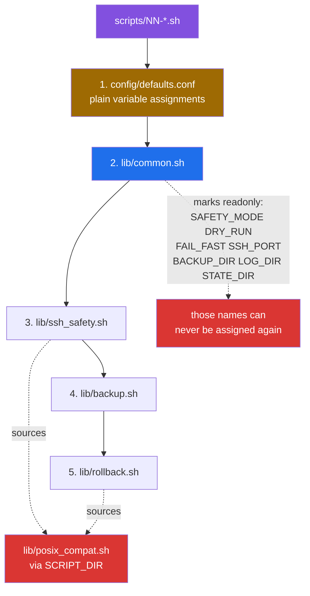
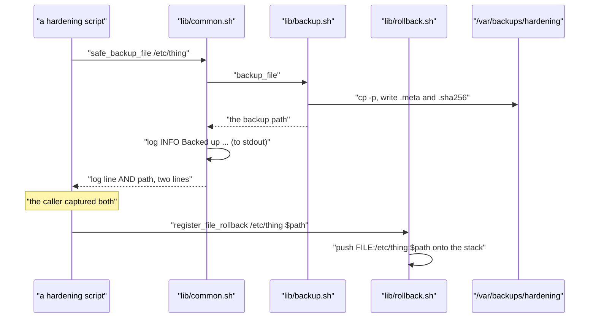

# The library layer: what lives in `lib/`, and how it is wired

[← back to the documentation index](README.md)

Five files in `lib/` hold everything the 21 hardening scripts share: logging,
configuration, backups, transactions and the SSH safety net. This page maps
them, shows the load order every script depends on, and marks the parts that
are defined but never reached.

## The five files

| File | Lines | Functions | What it owns |
|---|---|---|---|
| `lib/common.sh` | 545 | 25 | Configuration, logging, the environment check, completion markers, progress output |
| `lib/ssh_safety.sh` | 546 | 12 | The SSH lockout-avoidance path: test daemon, watchdog, emergency access |
| `lib/rollback.sh` | 533 | 19 | Transactions, the undo stack, traps, checkpoints |
| `lib/backup.sh` | 448 | 9 | File and directory backups, system snapshots, restore |
| `lib/posix_compat.sh` | 271 | 7 | Portable replacements for `tac`, `mktemp`, `sed -i`, `realpath`, `timeout` |

Counts from `wc -l` and a grep for top-level `name() {` definitions.

## Load order, and why it is not negotiable



`lib/common.sh:15-26` marks twelve configuration variables `readonly` with a
`${NAME:-default}` expansion. That is the whole mechanism: whatever the value
is when `common.sh` is sourced becomes permanent for the rest of the process.

Two consequences follow, and both are load-bearing:

- **Configuration must be sourced first.** Every script in `scripts/` sources
  `config/defaults.conf` at line 18 and `lib/common.sh` at line 21, with a
  comment saying why. `orchestrator.sh` does it the other way round and cannot
  start when the config file exists ([BUG-7](BUGS-FOUND.md#bug-7)).
- **Nothing may assign those names later.** `emergency-rollback.sh:14` tries to
  `export SAFETY_MODE=0` after the fact and dies on the spot
  ([BUG-2](BUGS-FOUND.md#bug-2)); `orchestrator.sh:342` does the same to
  `DRY_RUN` ([BUG-8](BUGS-FOUND.md#bug-8)).

The dotted red edges are the other structural defect. `lib/rollback.sh:8` and
`lib/ssh_safety.sh:8` both compute their own location as

```sh
SCRIPT_DIR="$(cd "$(dirname "$0")" && pwd)"
```

In a sourced file `$0` is the *calling* script, not the sourced one, so
`SCRIPT_DIR` resolves to `scripts/` and the `. "${SCRIPT_DIR}/posix_compat.sh"`
on the next line looks for `scripts/posix_compat.sh`, which does not exist
([BUG-1](BUGS-FOUND.md#bug-1)). This is why every capture in this documentation
runs against a container copy with `tools/bug-workarounds.patch` applied.

## `lib/common.sh`

The file every other one assumes. Twenty-five functions in five groups:

| Group | Functions |
|---|---|
| Output | `log`, `die`, `show_progress`, `show_success`, `show_warning`, `show_error` |
| Environment | `require_root`, `validate_debian`, `check_requirements`, `check_disk_space`, `init_hardening_environment`, `cleanup_on_exit` |
| Safety | `verify_ssh_alive`, `preserve_admin_access`, `check_port_listening` |
| Files | `safe_backup_file`, `safe_modify_file`, `file_modified` |
| State | `save_state`, `get_state`, `is_completed`, `mark_completed`, `safe_service_restart`, `safe_service_reload`, `execute_or_simulate` |

`init_hardening_environment` is the single entry point: it calls
`require_root`, `check_requirements` and `check_disk_space`, then — only when
`SAFETY_MODE` is 1 — `validate_debian`, `verify_ssh_alive` and
`preserve_admin_access`, and finally installs the `cleanup_on_exit` trap. None
of those six is called from anywhere else; they exist to be composed here.

`check_requirements` checks for `awk sed grep cp mv mkdir chmod chown cat` and
nothing else. `nc`, `ss`, `netstat`, `iptables` and `sshd` are all used later
without being required here; `check_port_listening` guards each of its three
probes with `command -v`, but `lib/ssh_safety.sh` does not
([BUG-19](BUGS-FOUND.md#bug-19)).

## `lib/backup.sh` and how a backup is meant to reach rollback



The `Note over S` is [BUG-3](BUGS-FOUND.md#bug-3): `log` writes to stdout, the
caller uses command substitution, and the two lines come back glued together,
so the registered path names no file.

The backups themselves are written correctly — `cp -p`, a `.meta` sidecar and a
`.sha256` sidecar, listed in a `manifest`. Restoring by hand from
`/var/backups/hardening/` works. It is only the path handed onward that is
malformed.

The bottom half of that diagram is also mostly hypothetical:
`register_file_rollback` is called from nowhere in `scripts/`
([BUG-24](BUGS-FOUND.md#bug-24)).

## `lib/posix_compat.sh`

Seven helpers that exist because the toolkit targets POSIX `sh` rather than
`bash`:

| Function | Replaces | Callers found in `lib/` |
|---|---|---|
| `posix_sed_inplace` | `sed -i` | `ssh_safety.sh:83`, `:90` (`create_ssh_test_config`), `:317` (`update_ssh_setting`) |
| `posix_reverse` | `tac` | `rollback.sh:89`, in `rollback_transaction` |
| `posix_mktemp` | `mktemp` without a template | none |
| `posix_realpath` | `realpath` | none |
| `posix_timeout` | `timeout` | none |
| `posix_timestamp` | portable `date` | none |
| `posix_join` | joining a list | none |

Two of the seven are used. The other five have no caller anywhere in the
repository, and the code that would need them calls the external command
directly instead: `timeout` appears unwrapped at `lib/common.sh:168`, `:501`,
`:525` and `lib/ssh_safety.sh:42`, `:130`, `:229`, `:255` — the same sites that
make the unguarded `nc` probes in [BUG-19](BUGS-FOUND.md#bug-19).
`posix_reverse` was read closely because `rollback_transaction` depends on it,
and it is a correct POSIX reversal.

The irony of this file is that it is the one that cannot be loaded. Both of its
consumers reach it through the broken `SCRIPT_DIR`
([BUG-1](BUGS-FOUND.md#bug-1)).

## What is defined but never reached

Measured by grepping for callers outside `lib/`:

| Area | Functions with no caller outside `lib/` | Status |
|---|---|---|
| Checkpoints | `create_checkpoint`, `rollback_to_checkpoint` | No callers anywhere; the action loop would not execute ([BUG-17](BUGS-FOUND.md#bug-17)) |
| Undo registration | all five `register_*_rollback` except one call site | One call in 21 scripts ([BUG-24](BUGS-FOUND.md#bug-24)) |
| Backup browsing | `list_backups`, `list_snapshots`, `cleanup_old_backups`, `backup_directory`, `generate_backup_name` | Defined, no caller |
| SSH config testing | `create_ssh_test_config`, `test_ssh_config`, `manage_ssh_access` | Called only from within `lib/ssh_safety.sh` |
| Atomic helpers | `atomic_operation`, `atomic_file_update`, `safe_file_operation`, `safe_service_operation` | No callers |

The library is substantially larger than what the scripts use. That is not a
defect by itself — the environment and output groups in `common.sh` are used
everywhere — but roughly half of `lib/rollback.sh` and `lib/backup.sh` is never
reached by any documented workflow.

## Known limitations of this page

- **The caller counts are grep counts.** A function referenced inside a string,
  or invoked through a variable, would not be found. Nothing in this codebase
  does either as far as was read, but that was not proved.
- **Line and function counts are structural, not semantic.** `545 lines` counts
  comments and blank lines; `25 functions` counts top-level `name() {`
  definitions and would miss a function defined conditionally.
- **No library function was unit-tested in isolation.** What was exercised is
  what the captured runs in [measurement.md](measurement.md) exercised, plus
  the targeted probes in `tools/capture-*.sh`. `lib/backup.sh`'s snapshot and
  restore functions, in particular, were never run.
- **`lib/posix_compat.sh` was read, not executed.** Its consumers cannot load
  it without the workaround patch, and no capture calls its functions directly.
