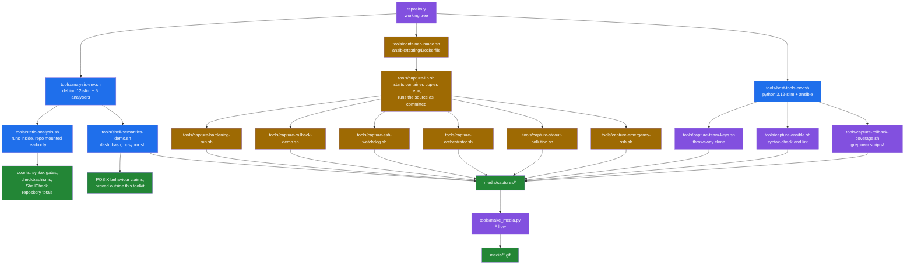

# How every number in this repository was produced

[← back to the documentation index](README.md)

Every figure published in `README.md` and in `docs/` comes from a command that
was run and whose script is committed. This page says which script, on what,
and with what caveats. Where something could not be measured, it says that
instead of estimating.

## The two harnesses



Every box runs inside a Linux container; nothing runs on the workstation
except `docker`. The static side and the read-only captures mount the
repository read-only. The capture side modifies `/etc/ssh`,
`/etc/sysctl.conf`, PAM configuration and firewall rules, so it only ever runs
inside a container that is destroyed afterwards.

## Static analysis

```sh
sh tools/analysis-env.sh
```

builds `posix-hardening-analysis:local` from `debian:12-slim` with `dash`,
`bash`, `busybox`, `shellcheck` and `devscripts`, mounts the repository
read-only at `/src`, and runs `tools/static-analysis.sh`. Nothing is installed
on the host.

`tools/static-analysis.sh` deliberately mirrors `.github/workflows/ci.yml`:
same file set, same severity, same three shells. The numbers below are
therefore the same numbers the project's own CI produces, plus two counts CI
does not report.

| Measurement | Value | Command |
|---|---|---|
| Files in the CI syntax set | 29 | `lib/*.sh scripts/*.sh` + 3 root scripts |
| `dash -n` failures | 0 of 29 | `dash -n "$f"` |
| `busybox sh -n` failures | 0 of 29 | `busybox sh -n "$f"` |
| `bash -n` failures | 0 of 29 | `bash -n "$f"` |
| `checkbashisms` files with findings | 0 of 29 | `checkbashisms "$f"` |
| ShellCheck CI gate findings | 0 over 31 files | `shellcheck -S error -s sh` |
| `SC3043` (`local` is not POSIX) | 77 | `shellcheck -s sh` |
| `SC3043` under `lib/` | 0 | as above |
| `SC3012` (lexicographical `\>`) | 2 | as above |

The ShellCheck set is 31 files rather than 29 because the CI also scans
`ansible/utils`.

The `SC3043` breakdown, which is what the "100% POSIX" claim turns on:

| File | Uses of `local` |
|---|---|
| `ansible/utils/generate-inventory.sh` | 38 |
| `orchestrator.sh` | 15 |
| `scripts/00-ssh-verification.sh` | 11 |
| `ansible/utils/verify_week2.sh` | 4 |
| `scripts/11-service-disable.sh` | 3 |
| `scripts/01-ssh-hardening.sh` | 3 |
| `scripts/02-firewall-setup.sh` | 2 |
| `scripts/10-sudo-restrictions.sh` | 1 |

`local` works in `dash`, `bash` and BusyBox `ash`, which is why the syntax
gates pass. It is simply not in POSIX, so "no bash required" is true while
"100% POSIX" is not.

Repository totals, from the same script:

| Item | Count |
|---|---|
| Numbered scripts in `scripts/` | 21 |
| Libraries in `lib/` | 5 |
| Entries in `orchestrator.sh` `SCRIPT_ORDER` | 20 |
| Ansible roles | 23 |
| Files tracked by git | 326 |
| Shell bytes in the CI file set | 188,246 |

## Captured runs

Everything below ran on Linux, inside containers on Docker Desktop
(`linux/arm64`, kernel 6.5.11-linuxkit). Nothing was run on the Mac itself;
the Mac is not a target this toolkit hardens.

Six tools in [`tools/`](../tools) use `tools/capture-lib.sh`, which:

1. uses `posix-hardening-target:local`, built by `tools/container-image.sh`
   from `ansible/testing/Dockerfile` (Debian 12 with `openssh-server`, `sudo`,
   `iptables`, `auditd`, `libpam-pwquality`). The Dockerfile copies an
   `authorized_keys` file that is gitignored, so the build context is a
   temporary directory holding the Dockerfile and an empty `authorized_keys`;
2. starts it `--privileged` with `sshd` running and `systemd` bypassed —
   `systemd` in a container adds noise without changing what the scripts do;
3. copies the repository in;
4. creates `config/defaults.conf` from `config/defaults.conf.template`, setting
   `SSH_ALLOW_USERS=ansible` because the value shipped in the template names no
   user that exists in the image.

The source runs as committed. No patch is applied.

`--privileged` is needed for `sysctl` and `iptables`. It also means that
`sysctl -p` in `03-kernel-params.sh` sets kernel parameters on the Docker
Desktop Linux VM that hosts the containers, not only inside the container.
Restarting Docker Desktop resets them.

### The documented entry points on a clean clone

The first section of `tools/capture-hardening-run.sh` runs each entry point
once, with `config/defaults.conf` created from the template, and records the
exit status ([`pristine.txt`](../media/captures/pristine.txt)):

| Entry point | Exit status | Why |
|---|---|---|
| `scripts/01-ssh-hardening.sh` | 0 | completes |
| `scripts/03-kernel-params.sh` | 1 | the container kernel has no `htcp` congestion control |
| `scripts/05-file-permissions.sh` | 0 | completes |
| `orchestrator.sh --status` | 2 | `BACKUP_DIR: is read only` ([BUG-7](BUGS-FOUND.md#bug-7), open) |
| `orchestrator.sh --dry-run --all` | 2 | the same, before it reaches the flag |
| `emergency-rollback.sh --help` | 1 | `--force`/`-f` is the only option it parses; anything else goes to the interactive menu, which has no terminal here |

### Capture 1 — a hardening run

```sh
sh tools/capture-hardening-run.sh
```

| Script | Exit | Output lines |
|---|---|---|
| `scripts/01-ssh-hardening.sh` | 0 | 129 |
| `scripts/03-kernel-params.sh` | 1 | 63 |
| `scripts/05-file-permissions.sh` | 0 | 16 |

The effects were read back from the system with `sshd -T`, not taken from the
script's own claims ([`effects.txt`](../media/captures/effects.txt)). All
eleven settings the toolkit advertises were in place, and port 22 was still
answering:

```text
port 22
logingracetime 60
maxauthtries 3
clientaliveinterval 300
clientalivecountmax 2
permitrootlogin no
pubkeyauthentication yes
passwordauthentication no
x11forwarding no
permitemptypasswords no
allowusers ansible
```

`03-kernel-params.sh` exits 1 because the linuxkit kernel offers only `reno`
and `cubic`, so `net.ipv4.tcp_congestion_control = htcp` is rejected. The
script now prints the key `sysctl -p` refused. After its rollback the
hardening block is still in `/etc/sysctl.conf`, because the script registers
no undo action ([BUG-24](BUGS-FOUND.md#bug-24), open).

The same tool also records the dry-run behaviour
([`dry-run.txt`](../media/captures/dry-run.txt)): with `config/defaults.conf`
present, `DRY_RUN=1` in the environment is overridden and changes are applied
([BUG-14](BUGS-FOUND.md#bug-14), open); with the file moved aside, the dry run
logs what it would do and writes no completion marker.

### Capture 2 — the transaction rollback

```sh
sh tools/capture-rollback-demo.sh
```

Calls `lib/rollback.sh` directly in the same sequence a hardening script does —
`begin_transaction`, `safe_backup_file`, `register_file_rollback`, modify,
`rollback_transaction` — then reads the file back. The library does the work;
the harness only drives it and prints the result.

Result: `safe_backup_file` returned one line naming the backup, the stack held
one `FILE_RESTORE` action, and after the rollback the file held its original
content. Full output in
[`rollback-demo.log`](../media/captures/rollback-demo.log).

### Capture 3 — the SSH lockout watchdog

```sh
sh tools/capture-ssh-watchdog.sh
```

This exercises the toolkit's central safety promise under the exact failure
that promise exists for.

`update_ssh_config_safe` arms a background watchdog before moving the new
`sshd_config` into place; if SSH is not answering after the timeout, the
watchdog restores the backup and restarts `sshd`. The harness creates that
situation by killing `sshd` one second after the script reloads it, then reads
`/etc/ssh/sshd_config` back.

Two deliberate deviations, both stated in the tool's own header:

- `SSH_ROLLBACK_TIMEOUT` is lowered from 60 to 15 through the supported
  configuration setting, so the capture finishes in under a minute.
- `sshd` is killed by the harness. Nothing else is touched; the watchdog code
  path is the shipped one.

Result: the watchdog fired on schedule, restored `sshd_config` (the SHA-256
before and after match) and brought `sshd` back up. Full output in
[`ssh-watchdog.log`](../media/captures/ssh-watchdog.log).

### Capture 4 — the orchestrator

```sh
sh tools/capture-orchestrator.sh
```

Runs `orchestrator.sh` seven ways and records each, with the orchestrator's
own exit status rather than that of whatever it was piped into. Output in
[`orchestrator.log`](../media/captures/orchestrator.log).

| Invocation | Result |
|---|---|
| `--status` with `config/defaults.conf` present | exits 2: `config/defaults.conf: BACKUP_DIR: is read only` ([BUG-7](BUGS-FOUND.md#bug-7), open) |
| `--status` with the config file removed | exits 0, prints the 20-script status table |
| `--dry-run` | exits 2: `export: DRY_RUN: is read only` ([BUG-8](BUGS-FOUND.md#bug-8), open) |
| `--script 02-firewall-setup.sh` with `01-ssh-hardening` not yet run | refuses: `Dependencies not met`, exits 1 |
| `--priority 2` | runs `03-kernel-params.sh`, which fails on `htcp`; `FAIL_FAST` stops the level, exits 1 |
| `--all` | runs 01 and 02, fails on 03, stops: `Completed: 2  Failed: 1`, exits 1 |
| `--all` with `FAIL_FAST=0` | 13 completed, 2 failed, 5 skipped for unmet dependencies, exits 1 |

In the last run the two failures are container artefacts: `03-kernel-params`
on `htcp`, and `15-cron-restrictions` because the image has no cron and so no
`/etc/crontab`. Of the five skipped, four depend on `03-kernel-params`. The
fifth, `10-sudo-restrictions`, is priority 2 but depends on
`09-account-lockdown`, which is priority 3, so it is skipped even when nothing
fails. That priority inversion is in `SCRIPT_ORDER` and is not yet an entry in
[BUGS-FOUND.md](BUGS-FOUND.md).

### Capture 5 — what the value-returning helpers put on standard output

```sh
sh tools/capture-stdout-pollution.sh
```

Calls the three log-then-`echo` helpers in a command substitution and counts
the lines that come back, at `VERBOSE=0` and `VERBOSE=1`. Output in
[`stdout-pollution.txt`](../media/captures/stdout-pollution.txt):

```text
=== VERBOSE=0
  safe_backup_file           lines=1  names an existing file: YES
  backup_file                lines=1  names an existing file: YES
  create_ssh_test_config     lines=1  names an existing file: YES
=== VERBOSE=1
  safe_backup_file           lines=1  names an existing file: YES
  backup_file                lines=1  names an existing file: YES
  create_ssh_test_config     lines=1  names an existing file: YES
```

The log lines still appear in the transcript, on stderr, but the captured value
is the path alone at both verbosity levels.

### Capture 6 — the emergency daemon and the test port

```sh
sh tools/capture-emergency-ssh.sh
```

Records three things: that `ENABLE_EMERGENCY_ACCESS` is not set by a
`config/defaults.conf` generated from the shipped template
([BUG-21](BUGS-FOUND.md#bug-21), open); that `create_emergency_ssh_access`
works when called directly; and that `test_ssh_config` then reports
`Test SSH daemon is accepting connections` while the only listener on port
2222 is the emergency daemon and no test pid file exists
([BUG-20](BUGS-FOUND.md#bug-20), unresolved). Output in
[`emergency-ssh.txt`](../media/captures/emergency-ssh.txt).

### Supporting demonstration — POSIX shell semantics

```sh
sh tools/shell-semantics-demo.sh
```

Several entries in BUGS-FOUND turn on shell behaviour rather than on this
toolkit: assignments lost in a pipeline subshell, `return` and `break N` that
cannot cross one, `A || B | C` precedence, and the dynamic scope of `local`.
This script demonstrates each in isolation, in `dash`, `bash` and
`busybox sh`, inside the analysis image. All three shells agreed on every
case. Output in
[`shell-semantics.txt`](../media/captures/shell-semantics.txt).

## Read-only captures

Three captures only read the repository. They run through
`tools/host-tools-env.sh`, which builds `posix-hardening-hosttools:local` from
`python:3.12-slim-bookworm` with `git`, `ansible-core` and `ansible-lint`, and
the collections from `ansible/collections/requirements.yml` installed in the
image. The repository is mounted read-only; only `media/captures/` is
writable. None of them contacts a managed host.

### Capture 7 — the shipped SSH keys

```sh
sh tools/host-tools-env.sh capture-team-keys.sh
```

Clones the repository into a temporary directory, lists what
`ansible/team_keys/` contains in that clone, and runs `generate_keys.sh` there.
Nothing outside the throwaway clone is touched and no keys are created. Output
in [`team-keys.txt`](../media/captures/team-keys.txt), written up as
[BUG-18](BUGS-FOUND.md#bug-18) (open).

### Capture 8 — the Ansible tree

```sh
sh tools/host-tools-env.sh capture-ansible.sh
```

Every `ansible-playbook` call in this tool is `--syntax-check`, which parses
and exits without connecting to anything. `ansible-lint` caches under
`ANSIBLE_HOME`, so the tool points that at a `mktemp -d` and removes it on
exit. Output in [`ansible.txt`](../media/captures/ansible.txt).

| Measurement | Value | How |
|---|---|---|
| Tracked playbooks at `ansible/` and `ansible/playbooks/` | 15 | `git ls-files`, excluding `roles/`, `group_vars/`, `host_vars/`, `inventories/`, `collections/`, `testing/`, `utils/` |
| Playbooks that exist in both places | 4 | `site.yml`, `preflight.yml`, `rollback.yml`, `deploy_team_keys.yml` |
| Of those, identical copies | 1 | `diff -q` per pair |
| Changed hunks between the two `site.yml` copies | 12 | `diff \| grep -c '^[0-9]'`, mostly the extra `../` the nested copy needs |
| Changed hunks between the two `rollback.yml` copies | 14 | as above |
| `src:` paths in both `site.yml` copies that resolve | 7 of 7 in each | section 6b: each `src:` value joined to its playbook's directory and tested |
| Plays in `ansible/site.yml` | 9 | `grep -c '^- name:'` |
| Plays in `ansible/hardening_master.yml` | 8 | as above |
| Role references in `site.yml` | 0 | `grep -c 'posix_hardening_'` |
| Role references in `hardening_master.yml` | 21 | `grep -cE '^\s+- role: posix_hardening_'` |
| Script invocations in `hardening_master.yml` | 0 | `grep -oE 'sh scripts/'` |
| Scripts named individually in `site.yml` | 9 | `grep -oE 'sh scripts/[0-9]+-[a-z-]+\.sh' \| sort -u` |
| Further scripts named in `site.yml` loops | 12 | `grep -cE '^\s+- "[0-9]+-[a-z-]+\.sh"'` |
| Priority levels: `site.yml` / `hardening_master.yml` / `orchestrator.sh` | 4 / 6 / 4 | `grep -oE 'priority[0-9]'`, and the first field of `SCRIPT_ORDER` |
| Roles on disk | 23 | `ls -1 ansible/roles` |
| Roles not reachable from `hardening_master.yml` | 2 | `comm -23` against the role references |
| `ansible-playbook --syntax-check` failures | 0 of 10 playbooks | exit status of each call |
| `ansible-lint` findings | 1394 in 138 files | `ansible-lint --nocolor -f pep8` over the six top-level playbooks |
| Largest single `ansible-lint` rule | `var-naming`, 1091 | the rule summary in the same run |

Section 6b also runs a controlled reproduction of Ansible's `src:` search path
in a throwaway directory, so the resolution rule is shown rather than
asserted:

```text
    /ansible/playbooks/../lib/
    /ansible/playbooks/files/../lib/
    (cwd is not among them: ../lib/ is ansible/playbooks/../lib/)
```

### Capture 9 — how much of the toolkit is inside a transaction

```sh
sh tools/host-tools-env.sh capture-rollback-coverage.sh
```

A `grep` over `scripts/` and `lib/`, counting the two halves of the rollback
API against each other. Output in
[`rollback-coverage.txt`](../media/captures/rollback-coverage.txt).

| Measurement | Value |
|---|---|
| Functions `lib/rollback.sh` defines | 19 |
| Scripts in `scripts/` | 21 |
| Scripts that call `begin_transaction` | 11 |
| `begin_transaction` / `commit_transaction` / `rollback_transaction` calls | 11 / 12 / 9 |
| `register_*_rollback` calls in all of `scripts/` | 1 |
| `safe_backup_file` calls in all of `scripts/` | 1 |
| `register_*` callers anywhere outside `lib/` | 1 |

The asymmetry in the middle row — 11 transactions opened, 12 commits — is
`scripts/01-ssh-hardening.sh`, which commits on two separate success paths.
The single registration is `scripts/02-firewall-setup.sh:94`. This is the
measurement behind [BUG-24](BUGS-FOUND.md#bug-24) (open).

Counting calls is a textual measurement, not an execution trace: it shows that
20 of the 21 scripts contain no registration, which is why their rollback
stacks are empty, but it does not prove that the one registration in
`02-firewall-setup.sh` replays correctly. That path was not executed.

## Media provenance

Both GIFs are rendered by `tools/make_media.py` from a capture file, one frame
per line, in the order the line appears. Nothing is typed, staged, re-ordered
or re-worded. If a line is not in the capture it is not in the GIF. They were
rendered inside `python:3.12-slim-bookworm` with `fonts-dejavu-core` and
Pillow, with tabs expanded to eight columns.

| File | Source capture | Frames | Size |
|---|---|---|---|
| `media/rollback-demo.gif` | `media/captures/rollback-demo.log` | 20 | 812×470, 177 KB |
| `media/ssh-watchdog.gif` | `media/captures/ssh-watchdog.log` | 15 | 812×470, 117 KB |

Colour is assigned by matching the text of each line (`[ERROR]` red, `[WARN]`
amber, `[INFO]` blue, `RESULT:` green or red by outcome). It adds no
information that is not already in the words.

## Tool versions

| Component | Version |
|---|---|
| Docker | 24.0.7 (Docker Desktop, `linux/arm64`, kernel 6.5.11-linuxkit) |
| Analysis base image | `debian:12-slim` `sha256:3783cc01769c7b2b1b83a5c5ad96c815348e28ed7da68e2e3687004faa906251` |
| Target image | built from `ansible/testing/Dockerfile` (Debian 12) |
| Read-only captures image | `python:3.12-slim-bookworm` |
| ShellCheck | 0.9.0 |
| checkbashisms | 2.23.4+deb12u2 (devscripts) |
| BusyBox | 1.35.0 (Debian 1:1.35.0-4+deb12u1+b1) |
| bash | 5.2.15(1) |
| dash | Debian 12 default |
| ansible-core | 2.19.3 |
| ansible-lint | 25.9.2 |

## What was not measured

| Not measured | Why |
|---|---|
| 14 of the hardening scripts run on their own | Only `01`, `03` and `05` were run directly. The orchestrator runs reached the rest except those skipped for dependencies, but their effects were not read back from the system. |
| `orchestrator.sh --dry-run --all` | It exits 2 on [BUG-8](BUGS-FOUND.md#bug-8) before running anything. |
| `03-kernel-params.sh` and `15-cron-restrictions.sh` completing | Both fail for reasons specific to the container (no `htcp`, no cron). Neither was run on a VM or host where those exist. |
| The Ansible path end to end | Running `ansible/site.yml` or `hardening_master.yml` needs an inventory of reachable hosts with systemd, and this pass had none. Both were parsed (`--syntax-check`, Capture 8) and are documented from their source; no task was executed against any host, so nothing here says whether the 23 roles do what they claim. |
| Which `ansible-lint` findings matter | 1394 findings were counted by rule (Capture 8); none was read individually, and 1091 of them are the single `var-naming` rule. The count is a measurement, the severity is not. |
| Behaviour on a remote host over a real SSH session | Every capture is local to a container, driven with `docker exec`. The lockout guarantees are about a remote operator's session, and that scenario was not reproduced. |
| Behaviour on non-Debian systems | The toolkit claims RHEL and Alpine support. Only Debian 12 was tested. |
| `emergency-rollback.sh`'s recovery functions | Its menu is interactive and was not driven. |
| Idempotence of repeated runs | Each capture starts from a fresh container. Running a script twice was not tested. |
| Timing or performance of anything | No benchmark was run and none is published. |
