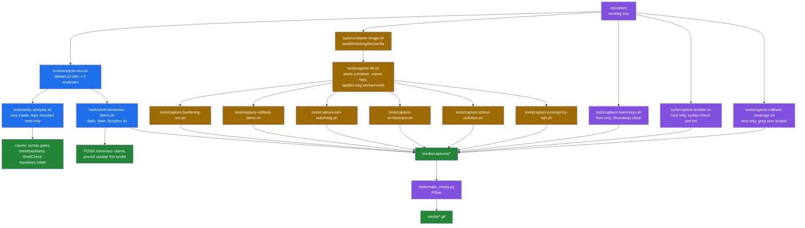

# How every number in this repository was produced

[← back to the documentation index](README.md)

Every figure published in `README.md` and in `docs/` comes from a command that
was run and whose script is committed. This page says which script, on what,
and with what caveats. Where something could not be measured, it says that
instead of estimating.

## The two harnesses



The static side is read-only and touches nothing. The capture side modifies
`/etc/ssh`, `/etc/sysctl.conf`, PAM configuration and firewall rules, so it
only ever runs inside a container that is destroyed afterwards.

## Static analysis

```sh
sh tools/analysis-env.sh
```

builds `posix-hardening-analysis:local` from `debian:12-slim` with `dash`,
`bash`, `busybox`, `shellcheck` and `devscripts`, mounts the repository
read-only at `/src`, and runs `tools/static-analysis.sh`. Nothing is installed
on the host.

`tools/static-analysis.sh` deliberately mirrors `.github/workflows/ci.yml`:
same file set, same severity, same three shells. The numbers below are
therefore the same numbers the project's own CI produces, plus two counts CI
does not report.

| Measurement | Value | Command |
|---|---|---|
| Files in the CI syntax set | 29 | `lib/*.sh scripts/*.sh` + 3 root scripts |
| `dash -n` failures | 0 of 29 | `dash -n "$f"` |
| `busybox sh -n` failures | 0 of 29 | `busybox sh -n "$f"` |
| `bash -n` failures | 0 of 29 | `bash -n "$f"` |
| `checkbashisms` files with findings | 0 of 29 | `checkbashisms "$f"` |
| ShellCheck CI gate findings | 0 over 31 files | `shellcheck -S error -s sh` |
| `SC3043` (`local` is not POSIX) | 74 | `shellcheck -s sh` |
| `SC3043` under `lib/` | 0 | as above |
| `SC3012` (lexicographical `\>`) | 2 | as above |

The ShellCheck set is 31 files rather than 29 because the CI also scans
`ansible/utils`.

The `SC3043` breakdown, which is what the "100% POSIX" claim turns on:

| File | Uses of `local` |
|---|---|
| `ansible/utils/generate-inventory.sh` | 38 |
| `orchestrator.sh` | 12 |
| `scripts/00-ssh-verification.sh` | 11 |
| `ansible/utils/verify_week2.sh` | 4 |
| `scripts/11-service-disable.sh` | 3 |
| `scripts/01-ssh-hardening.sh` | 3 |
| `scripts/02-firewall-setup.sh` | 2 |
| `scripts/10-sudo-restrictions.sh` | 1 |

`local` works in `dash`, `bash` and BusyBox `ash`, which is why the syntax
gates pass. It is simply not in POSIX, so "no bash required" is true while
"100% POSIX" is not.

Repository totals, from the same script:

| Item | Count |
|---|---|
| Numbered scripts in `scripts/` | 21 |
| Libraries in `lib/` | 5 |
| Entries in `orchestrator.sh` `SCRIPT_ORDER` | 20 |
| Ansible roles | 23 |
| Files tracked by git | 283 |
| Shell bytes in the CI file set | 180,365 |

## Captured runs

Nine tools in [`tools/`](../tools) produce captures. Six of them use
`tools/capture-lib.sh`, which:

1. builds `posix-hardening-target:local` from `ansible/testing/Dockerfile`
   (Debian 12 with `openssh-server`, `sudo`, `iptables`, `auditd`,
   `libpam-pwquality`);
2. starts it `--privileged` with `sshd` running and `systemd` bypassed —
   `systemd` in a container adds noise without changing what the scripts do;
3. copies the repository in;
4. creates `config/defaults.conf` from `config/defaults.conf.template`, setting
   `SSH_ALLOW_USERS=ansible` because the value shipped in the template names no
   user that exists in the image;
5. applies `tools/bug-workarounds.patch` **to the container's copy only**.

### Why a patch is needed, and what it changes

Step 5 is not cosmetic and it is the most important caveat on this page.

As the repository stands, every documented entry point aborts before doing any
work: `lib/rollback.sh:8` and `lib/ssh_safety.sh:8` look for
`posix_compat.sh` in the calling script's directory rather than in `lib/`, and
`emergency-rollback.sh:14` exports a variable `lib/common.sh` has already made
read-only. Both are recorded as [BUG-1 and BUG-2](BUGS-FOUND.md).

That state is itself measured, and it is measured first, on an unpatched copy,
before any workaround is applied. It is in `media/captures/pristine.txt`:

| Entry point | Exit status | First line |
|---|---|---|
| `scripts/01-ssh-hardening.sh` | 2 | `cannot open …/scripts/posix_compat.sh` |
| `scripts/03-kernel-params.sh` | 2 | `cannot open …/scripts/posix_compat.sh` |
| `scripts/05-file-permissions.sh` | 2 | `cannot open …/scripts/posix_compat.sh` |
| `orchestrator.sh --status` | 2 | `cannot open …/posix_compat.sh` |
| `orchestrator.sh --dry-run --all` | 2 | `cannot open …/posix_compat.sh` |
| `emergency-rollback.sh --help` | 2 | `export: SAFETY_MODE: is read only` |

Without the workaround there is nothing further to capture. With it, the
scripts run and everything below could be observed. The patch is three
hunks, it is committed at `tools/bug-workarounds.patch` so it can be read in
full, and it changes only where two libraries look for a sibling file and the
order of two statements. It changes no hardening logic.

**Read every captured result as: "this is what the toolkit does once it can
start."**

### Capture 1 — a hardening run that works

```sh
sh tools/capture-hardening-run.sh
```

| Script | Exit | Output lines |
|---|---|---|
| `scripts/01-ssh-hardening.sh` | 0 | 129 |
| `scripts/03-kernel-params.sh` | 1 | 18 |
| `scripts/05-file-permissions.sh` | 0 | 16 |

The effects were read back from the system with `sshd -T`, not taken from the
script's own claims (`media/captures/effects.txt`). All eleven settings the
toolkit advertises were in place, and port 22 was still answering:

```text
port 22
logingracetime 60
maxauthtries 3
clientaliveinterval 300
clientalivecountmax 2
permitrootlogin no
pubkeyauthentication yes
passwordauthentication no
x11forwarding no
permitemptypasswords no
allowusers ansible
```

`03-kernel-params.sh` exits 1 because `net.ipv4.tcp_congestion_control` cannot
be set in a container, and `sysctl -p` is fatal under `set -e`
([BUG-6](BUGS-FOUND.md#bug-6)). This may well succeed on a real host. It is
reported as measured rather than excused.

### Capture 2 — the transaction rollback

```sh
sh tools/capture-rollback-demo.sh
```

Calls `lib/rollback.sh` directly in the same sequence a hardening script does —
`begin_transaction`, `safe_backup_file`, `register_file_rollback`, modify,
`rollback_transaction` — then reads the file back. The library does the work;
the harness only drives it and prints the result.

Result: the rollback ran, logged `Rollback completed`, and the file still held
the modified content. Full output in `media/captures/rollback-demo.log`, root
cause in [BUG-3](BUGS-FOUND.md#bug-3).

### Capture 3 — the SSH lockout watchdog

```sh
sh tools/capture-ssh-watchdog.sh
```

This is the strongest artifact here, because it exercises the toolkit's central
safety promise under the exact failure that promise exists for.

`update_ssh_config_safe` arms a background watchdog before moving the new
`sshd_config` into place; if SSH is not answering after the timeout, the
watchdog restores the backup and restarts `sshd`. The harness creates that
situation by killing `sshd` one second after the script reloads it, then reads
`/etc/ssh/sshd_config` back.

Two deliberate deviations, both stated in the tool's own header:

- `SSH_ROLLBACK_TIMEOUT` is lowered from 60 to 15 through the supported
  configuration setting, so the capture finishes in under a minute.
- `sshd` is killed by the harness. Nothing else is touched; the watchdog code
  path is the shipped one.

Result: the watchdog fired on schedule, `cp` failed on a path that had a log
line glued to the front of it, the SHA-256 of `sshd_config` did not change back,
and `sshd` did not come back up. Full output in
`media/captures/ssh-watchdog.log`.

### Capture 4 — the orchestrator

```sh
sh tools/capture-orchestrator.sh
```

Runs `orchestrator.sh` six ways and records each, with the orchestrator's own
exit status rather than that of whatever it was piped into. Output in
`media/captures/orchestrator.log`.

| Invocation | Result |
|---|---|
| `--status` with `config/defaults.conf` present | dies: `config/defaults.conf: BACKUP_DIR: is read only` |
| `--status` with the config file removed | works, prints the 20-script status table |
| `--dry-run --all` | dies: `export: DRY_RUN: is read only` |
| `--script 02-firewall-setup.sh` with its declared dependency unmet | runs the script anyway, then reports `Script not found` and exits 1 |
| `--priority 2` | runs nothing, prints `Script completed successfully`, exits 0 |
| `--all` | runs 13 of the 20 declared scripts, exits 0, reports `Completed: 0  Failed: 0` |

These are [BUG-7](BUGS-FOUND.md#bug-7), [BUG-8](BUGS-FOUND.md#bug-8),
[BUG-9](BUGS-FOUND.md#bug-9), [BUG-15](BUGS-FOUND.md#bug-15) and
[BUG-16](BUGS-FOUND.md#bug-16).

Two of those rows need their evidence spelled out, because the surface
behaviour looks benign.

For `--priority 2`, the capture first derives the priority-2 entries from
`SCRIPT_ORDER` itself, so the list cannot drift from the source, then shows
what `get_scripts_by_priority` was actually called with, from `sh -x`:

```text
    the argument get_scripts_by_priority was actually called with,
    from sh -x:
      get_scripts_by_priority INFO
```

`INFO`, not `2`: `show_progress` calls `log "INFO" …`, `log` assigns to an
unlocalised `level`, and that is the same name `run_priority_level` used for
its own `local`.

For `--all`, the capture diffs the scripts declared in `SCRIPT_ORDER` against
the ones the run reported executing:

```text
    scripts in SCRIPT_ORDER that were never executed:
      04-network-stack.sh  05-file-permissions.sh  06-process-limits.sh
      10-sudo-restrictions.sh  14-sysctl-hardening.sh  16-mount-options.sh
      19-log-retention.sh
    declared / executed: 20 / 13
    final summary: Total Scripts: 20 / Completed: 0 / Failed: 0
```

An earlier hypothesis that the short run was caused by a script consuming
standard input was wrong: re-running with `</dev/null` still executed 13 of the
20 declared scripts. The cause is `FAIL_FAST`'s `break 2` inside a pipeline
subshell.

### Capture 5 — which functions pollute standard output

```sh
sh tools/capture-stdout-pollution.sh
```

Calls the three log-then-`echo` functions in a command substitution and counts
the lines that come back, at `VERBOSE=0` and `VERBOSE=1`. Output in
`media/captures/stdout-pollution.txt`:

```text
=== VERBOSE=0
  safe_backup_file           lines=2  names an existing file: NO
  backup_file                lines=2  names an existing file: NO
  create_ssh_test_config     lines=1  names an existing file: YES
=== VERBOSE=1
  safe_backup_file           lines=2  names an existing file: NO
  backup_file                lines=2  names an existing file: NO
  create_ssh_test_config     lines=2  names an existing file: NO
```

`create_ssh_test_config` logs at `DEBUG`, so it is correct at the default
verbosity and breaks when the operator asks for more logging
([BUG-3](BUGS-FOUND.md#bug-3)).

### Capture 6 — the emergency daemon and the test port

```sh
sh tools/capture-emergency-ssh.sh
```

Records three things: that `ENABLE_EMERGENCY_ACCESS` is not set by a
`config/defaults.conf` generated from the shipped template
([BUG-21](BUGS-FOUND.md#bug-21)); that `create_emergency_ssh_access` works when
called directly; and that `test_ssh_config` then reports
`Test SSH daemon is accepting connections` without a test daemon existing,
because the emergency daemon already holds the port both default to
([BUG-20](BUGS-FOUND.md#bug-20)). Output in
`media/captures/emergency-ssh.txt`.

The line numbers printed in its first section are one lower than the ones in
the repository, because the container copy has `tools/bug-workarounds.patch`
applied.

### Capture 7 — the shipped SSH keys

```sh
sh tools/capture-team-keys.sh
```

The only capture that does not use Docker. It clones the repository into a
temporary directory, lists what `ansible/team_keys/` contains in that clone,
and runs `generate_keys.sh` there. Nothing outside the throwaway clone is
touched and no keys are created. Output in `media/captures/team-keys.txt`,
written up as [BUG-18](BUGS-FOUND.md#bug-18).

### Supporting demonstration — POSIX shell semantics

```sh
sh tools/shell-semantics-demo.sh
```

Several bugs on this list turn on shell behaviour rather than on this
toolkit: assignments lost in a pipeline subshell, `return` and `break N` that
cannot cross one, `A || B | C` precedence, and the dynamic scope of `local`.
This script demonstrates each in isolation, in `dash`, `bash` and
`busybox sh`, inside the analysis image. All three shells agreed on every
case. Output in `media/captures/shell-semantics.txt`.

## Host-only measurements

Two of the measurements need no container, because they only read the
repository. Both run on the host, neither writes anything into the working
tree, and neither contacts a managed host.

### Capture 8 — the Ansible tree

```sh
sh tools/capture-ansible.sh
```

Every `ansible-playbook` call in this tool is `--syntax-check`, which parses
and exits without connecting to anything. `ansible-lint` caches under
`ANSIBLE_HOME`, so the tool points that at a `mktemp -d` and removes it on
exit; without that it leaves an `.ansible/` directory in the repository root.
Output in
[`media/captures/ansible.txt`](../media/captures/ansible.txt).

| Measurement | Value | How |
|---|---|---|
| Tracked playbooks at `ansible/` and `ansible/playbooks/` | 15 | `git ls-files`, excluding `roles/`, `group_vars/`, `host_vars/`, `inventories/`, `collections/`, `testing/`, `utils/` |
| Playbooks that exist in both places | 4 | `site.yml`, `preflight.yml`, `rollback.yml`, `deploy_team_keys.yml` |
| Of those, identical copies | 1 | `diff -q` per pair |
| Changed hunks between the two `rollback.yml` copies | 14 | `diff \| grep -c '^[0-9]'` |
| Plays in `ansible/site.yml` | 9 | `grep -c '^- name:'` |
| Plays in `ansible/hardening_master.yml` | 8 | as above |
| Role references in `site.yml` | 0 | `grep -c 'posix_hardening_'` |
| Role references in `hardening_master.yml` | 21 | `grep -cE '^\s+- role: posix_hardening_'` |
| Script invocations in `hardening_master.yml` | 0 | `grep -oE 'sh scripts/'` |
| Scripts named individually in `site.yml` | 9 | `grep -oE 'sh scripts/[0-9]+-[a-z-]+\.sh' \| sort -u` |
| Further scripts named in `site.yml` loops | 12 | `grep -cE '^\s+- "[0-9]+-[a-z-]+\.sh"'` |
| Priority levels: `site.yml` / `hardening_master.yml` / `orchestrator.sh` | 4 / 6 / 4 | `grep -oE 'priority[0-9]'`, and the first field of `SCRIPT_ORDER` |
| Roles on disk | 23 | `ls -1 ansible/roles` |
| Roles not reachable from `hardening_master.yml` | 2 | `comm -23` against the role references |
| `ansible-playbook --syntax-check` failures | 0 of 10 playbooks | exit status of each call |
| `ansible-lint` findings | 1394 in 138 files | `ansible-lint --nocolor -f pep8` over the six top-level playbooks |
| Largest single `ansible-lint` rule | `var-naming`, 1091 | the rule summary in the same run |

The `src:` resolution check in section 6b is the evidence for
[BUG-22](BUGS-FOUND.md#bug-22). Rather than assert Ansible's rule, the tool
builds a throwaway repository with one playbook under `playbooks/`, runs it,
and prints the paths Ansible reports having searched:

```text
    /ansible/playbooks/../lib/
    /ansible/playbooks/files/../lib/
    (cwd is not among them: ../lib/ is ansible/playbooks/../lib/)
```

The playbook in that reproduction copies into `/tmp/ph-never-written/` and
fails before writing anything, because the source it names does not exist —
which is the point being demonstrated.

### Capture 9 — how much of the toolkit is inside a transaction

```sh
sh tools/capture-rollback-coverage.sh
```

A `grep` over `scripts/` and `lib/`, counting the two halves of the rollback
API against each other. Output in
[`media/captures/rollback-coverage.txt`](../media/captures/rollback-coverage.txt).

| Measurement | Value |
|---|---|
| Functions `lib/rollback.sh` defines | 19 |
| Scripts in `scripts/` | 21 |
| Scripts that call `begin_transaction` | 11 |
| `begin_transaction` / `commit_transaction` / `rollback_transaction` calls | 11 / 12 / 9 |
| `register_*_rollback` calls in all of `scripts/` | 1 |
| `safe_backup_file` calls in all of `scripts/` | 1 |
| `register_*` callers anywhere outside `lib/` | 1 |

The asymmetry in the middle row — 11 transactions opened, 12 commits — is
`scripts/01-ssh-hardening.sh`, which commits on two separate success paths.
The single registration is `scripts/02-firewall-setup.sh:94`. This is the
measurement behind [BUG-24](BUGS-FOUND.md#bug-24).

Counting calls is a textual measurement, not an execution trace: it shows that
20 of the 21 scripts contain no registration, which is why their rollback
stacks are empty, but it does not prove that the one registration in
`02-firewall-setup.sh` replays correctly. That path was not executed.

## Media provenance

Both GIFs are rendered by `tools/make_media.py` from a capture file, one frame
per line, in the order the line appears. Nothing is typed, staged, re-ordered
or re-worded. If a line is not in the capture it is not in the GIF.

| File | Source capture | Frames | Size |
|---|---|---|---|
| `media/rollback-demo.gif` | `media/captures/rollback-demo.log` | 31 | 796×502, 422 KB |
| `media/ssh-watchdog.gif` | `media/captures/ssh-watchdog.log` | 19 | 860×374, 167 KB |

Colour is assigned by matching the text of each line (`[ERROR]` red, `[WARN]`
amber, `[INFO]` blue, `RESULT:` green or red by outcome). It adds no
information that is not already in the words.

## Tool versions

| Component | Version |
|---|---|
| Docker | 24.0.7 |
| Analysis base image | `debian:12-slim` `sha256:3783cc01769c7b2b1b83a5c5ad96c815348e28ed7da68e2e3687004faa906251` |
| Target image | built from `ansible/testing/Dockerfile` |
| ShellCheck | 0.9.0 |
| checkbashisms | 2.23.4+deb12u2 (devscripts) |
| BusyBox | 1.35.0 (Debian 1:1.35.0-4+deb12u1+b1) |
| bash | 5.2.15(1) |
| dash | Debian 12 default |
| Pillow | 12.0.0 (host, for GIF rendering only) |
| ansible-core | 2.19.3 (host) |
| ansible-lint | 25.9.2 (host) |

Host: macOS 15 on arm64. The container images are `linux/arm64`.

## What was not measured

| Not measured | Why |
|---|---|
| Any of the other 18 hardening scripts | Only `01`, `02`, `03` and `05` were run. The rest are documented from their source. |
| `orchestrator.sh --dry-run --all` | It dies on [BUG-8](BUGS-FOUND.md#bug-8) before running anything. A real `--all` was run and is reported in Capture 4; the dry-run path was not. |
| The Ansible path end to end | Running `ansible/site.yml` or `hardening_master.yml` needs an inventory of reachable hosts, and this pass had none. Both were parsed (`--syntax-check`, Capture 8) and are documented from their source; no task was executed against any host, so nothing here says whether the 23 roles do what they claim. |
| Which `ansible-lint` findings matter | 1394 findings were counted by rule (Capture 8); none was read individually, and 1091 of them are the single `var-naming` rule. The count is a measurement, the severity is not. |
| Whether the drifted `playbooks/` copies are dead or in use | `ansible/playbooks/site.yml` cannot resolve its own sources ([BUG-22](BUGS-FOUND.md#bug-22)), but nothing in the repository says which copy is the intended one. That is a question for the maintainer, not a measurement. |
| Behaviour on a real remote host over a real SSH session | Every capture is local to a container. The lockout guarantees are about a remote operator's session, and that scenario was not reproduced. |
| Behaviour on non-Debian systems | The toolkit claims RHEL and Alpine support. Only Debian 12 was tested. |
| `emergency-rollback.sh`'s recovery functions | The script aborts on line 14 ([BUG-2](BUGS-FOUND.md#bug-2)); with the workaround applied its menu is interactive and was not driven. |
| Idempotence of repeated runs | Each capture starts from a fresh container. Running a script twice was not tested. |
| Timing or performance of anything | No benchmark was run and none is published. |
