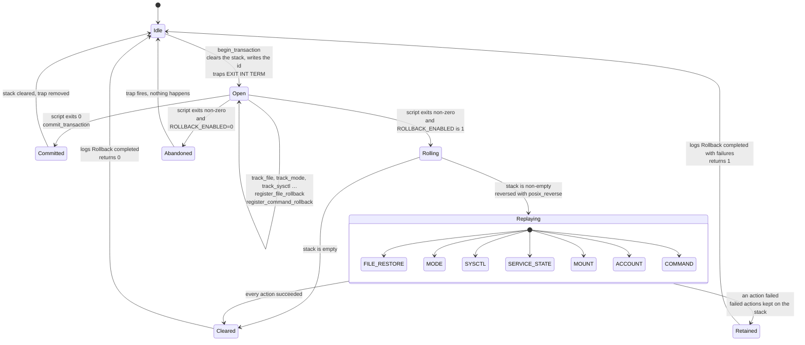
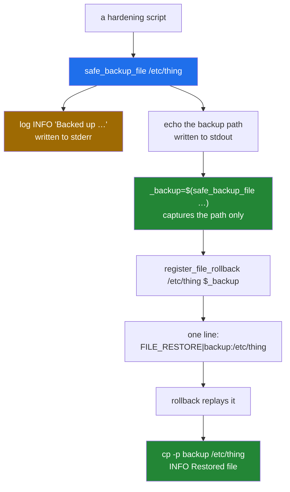

# Rollback: the transaction model, and what it does not undo

[← back to the documentation index](README.md)

`lib/rollback.sh` is the safety story of this toolkit. Every hardening script
opens a transaction, registers an undo action before each change, and relies on
an `EXIT` trap to replay those actions in reverse if anything fails. This page
describes that machinery, shows a captured file restore, lists what each
script registers, and names the few changes that are deliberately not undone.

## The state machine



`ROLLBACK_ENABLED` defaults to 1, with or without `config/defaults.conf`, so
`Open --> Abandoned` happens only when an operator sets `ROLLBACK_ENABLED=0`
([#12](https://github.com/Bissbert/POSIX-hardening/issues/12)).

## What a rollback action looks like

The stack at `/var/lib/hardening/rollback_stack` is a flat text file, one
action per line, `TYPE|DATA`:

| Type | `DATA` | Replayed by |
|---|---|---|
| `FILE_RESTORE` | `backup_path:original_path` | `cp -p` back over the original |
| `FILE_REMOVE` | a path | `rm -f`, for a file the transaction created |
| `DIR_REMOVE` | a path | `rmdir`, for a directory the transaction created |
| `LINK` | `path:target` | `ln -sfn`, puts a symlink back |
| `MODE` | `mode:uid:gid:path` | `chmod` and `chown` |
| `SERVICE_STATE` | `name:enabled:active` | enables and starts the service again if it was enabled or running |
| `MOUNT` | `mountpoint:options` | `mount -o remount` with the old options |
| `ACCOUNT` | `user:shell:lastchg:password` | `usermod -s -p`, then `chage -d` |
| `COMMAND` | a shell command | `eval` |
| `SERVICE` | `name:start`, `name:stop`, `name:restart`, `name:reload` | `safe_service_<action>` |
| `SYSCTL` | `parameter:value` | `sysctl -w`, or a write to the `/proc/sys` path |
| `FIREWALL` | a shell command | `eval`, if `iptables` exists |

`rollback_transaction` moves the stack aside, reverses it with `posix_reverse`,
and calls `execute_rollback_action` for each line. Any action that fails is
written back to the stack, and the function logs
`Rollback completed with failures` and returns 1, so a caller can tell a
partial rollback from a complete one.

## The registration path



## A rollback, captured

`tools/capture-rollback-demo.sh` starts a throwaway Debian container, creates
`/etc/demo.conf`, backs it up through the toolkit's own functions, modifies it,
and rolls the transaction back. Full output:
[`media/captures/rollback-demo.log`](../media/captures/rollback-demo.log).


The captured return value and the stack:

```text
== what safe_backup_file actually returns ==
[INFO] Backed up /etc/demo.conf to /var/backups/hardening/demo.conf.20260924-193506.bak
     1	/var/backups/hardening/demo.conf.20260924-193506.bak
lines captured: 1
names an existing file: yes

== rollback stack contents ==
     1	FILE_RESTORE|/var/backups/hardening/demo.conf.20260924-193506.bak:/etc/demo.conf
```

The `[INFO]` line is on stderr, so it appears in the terminal but not in the
captured value. The result:

```text
== after rollback ==
ORIGINAL - this must come back after rollback

RESULT: file was restored
```

## How the scripts register their undo actions

Every script opens a transaction, and before each change it calls one of the
`track_*` helpers in `lib/rollback.sh`
([#19](https://github.com/Bissbert/POSIX-hardening/issues/19)). Each helper
records the current state and registers the undo action for it, once per
object per transaction, so a rollback returns to the state before the script
started:

| Helper | Called before | Registers |
|---|---|---|
| `track_file PATH` | editing, replacing or creating a file | a copy under `/var/backups/hardening/transactions/` and `FILE_RESTORE`; `FILE_REMOVE` if the file did not exist; `LINK` for a symlink |
| `track_dir PATH` | creating a directory | `DIR_REMOVE` if it did not exist |
| `track_mode PATH` | `chmod` or `chown` | `MODE` |
| `track_sysctl NAME`, `track_sysctl_file FILE` | `sysctl -w`, `sysctl -p` or a write to `/proc/sys` | `SYSCTL` with the live value, for every key the file sets |
| `track_service NAME` | stopping or disabling a service | `SERVICE_STATE` |
| `track_mount MOUNTPOINT` | a remount | `MOUNT` with the current options |
| `track_account USER` | `usermod -L` or `-s` | `ACCOUNT` |

In a dry run, or outside a transaction, the helpers record nothing.
`update_ssh_config_safe` registers the restore of `sshd_config` and an sshd
reload for its caller. `02-firewall-setup.sh` registers `iptables-restore` of
the saved rules, and before that a reset of the filter tables to `ACCEPT`, so
that a host that had no rules gets back to none.

`tools/capture-rollback-coverage.sh` counts the calls per script
([`media/captures/rollback-coverage.txt`](../media/captures/rollback-coverage.txt)):

```text
    script                     begin commit register  track
    00-ssh-verification.sh         1      1        2      0
    01-ssh-hardening.sh            1      2        0      2
    02-firewall-setup.sh           1      1        3      7
    03-kernel-params.sh            1      1        0      2
    04-network-stack.sh            1      1        0     12
    05-file-permissions.sh         1      1        0      1
    06-process-limits.sh           1      1        0      1
    07-audit-logging.sh            1      1        1      2
    08-password-policy.sh          1      1        0      2
    09-account-lockdown.sh         1      1        0      2
    10-sudo-restrictions.sh        1      1        0      2
    11-service-disable.sh          1      1        0      2
    12-tmp-hardening.sh            1      1        0      3
    13-core-dump-disable.sh        1      1        0      4
    14-sysctl-hardening.sh         1      1        0      2
    15-cron-restrictions.sh        1      1        0      5
    16-mount-options.sh            1      1        0      3
    17-shell-timeout.sh            1      1        0      2
    18-banner-warnings.sh          1      1        0      3
    19-log-retention.sh            1      1        0      2
    20-integrity-baseline.sh       1      1        0      3
    TOTAL over 21 scripts         21     22        6     62
```

`00-ssh-verification.sh` has no `track_*` call because its only change goes
through `update_ssh_config_safe`, which registers for it.

A count shows that a call is there, not that it undoes the change. That is
what `tests/regression/rollback-coverage.sh` checks, in a Debian 12 container
(`sh tests/docker.sh rollback-coverage`). For each of scripts 01 to 20 it:

1. takes a snapshot of the files, modes, kernel parameters, mounts, firewall
   rules, accounts and service state the scripts touch;
2. runs the script so that it fails after its last change (the completion
   marker cannot be written), and checks that it exits non-zero, that the
   rollback log records a rollback, and that the snapshot is unchanged;
3. runs the script again normally and checks that the snapshot does change,
   so the comparison is not vacuous.

All 20 scripts come back to the snapshot. `00-ssh-verification.sh` reinstalls
the SSH package, which the offline container cannot do, so the test checks
its registrations statically.

In the captured hardening run, `03-kernel-params.sh` fails on
`net.ipv4.tcp_congestion_control = htcp`, which the container kernel lacks.
Its rollback restores `/etc/sysctl.conf` and the kernel values
([`media/captures/03-kernel-params.log`](../media/captures/03-kernel-params.log)),
and afterwards the hardening block is gone from the file and `sysctl -p` loads
it cleanly ([`media/captures/effects.txt`](../media/captures/effects.txt)).

## What rollback does not undo

Three changes are left in place on purpose:

- `12-tmp-hardening.sh` deletes files in `/tmp` and `/var/tmp` that were not
  accessed for seven days. They are not copied first, so they do not come
  back.
- `00-ssh-verification.sh` reinstalls the SSH package when it finds modified
  binaries. Rollback restores `sshd_config` and reloads sshd, but leaves the
  package files at the packaged version, since putting them back would restore
  the modified binaries.
- An emergency sshd started for the run (`ENABLE_EMERGENCY_SSH=1`) keeps
  running after a rollback, so a rollback never takes away a way back in.

## What the rest of the machinery guarantees

- The `EXIT INT TERM` trap is installed by `begin_transaction` and removed by
  `commit_transaction`, so an interrupted script does attempt a rollback
  unless `ROLLBACK_ENABLED=0`.
- The stack is cleared at the start of every transaction, so a stale stack from
  a previous run is not replayed.
- The regression test replays every action type the scripts register.
  `SERVICE` and `FIREWALL` are registered by no script and are not exercised.
- `posix_reverse` in `lib/posix_compat.sh` is a correct POSIX reversal and is
  used by both `rollback_transaction` and `rollback_to_checkpoint`.

## The manual escape hatch

`emergency-rollback.sh` restores backups without the rest of the toolkit. It
sets `SAFETY_MODE=0` and `DRY_RUN=0` before it loads `lib/common.sh`, so it
now gets past its start-up and reaches its interactive menu. The only argument
it recognises is `--force`/`-f`, a full reset without prompting; anything
else, `--help` included, opens the menu. In the capture, with no terminal on
stdin, that run exits 1
([`pristine.txt`](../media/captures/pristine.txt)). Restoring a file by hand from
`/var/backups/hardening/` with `cp -p` works as well; each backup has `.meta`
and `.sha256` sidecars.

## Checkpoints

`create_checkpoint` and `rollback_to_checkpoint` are defined in
`lib/rollback.sh` and called from nowhere. `rollback_to_checkpoint` replays the
actions added since the checkpoint in reverse order and keeps the stack intact
if one fails. No capture exercises it.

See [measurement.md](measurement.md) for how the captures on this page were
produced.
