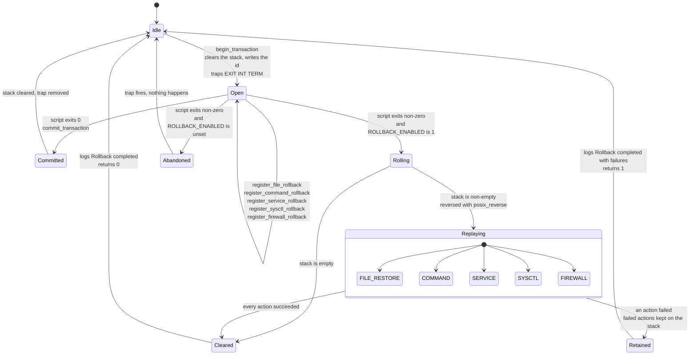
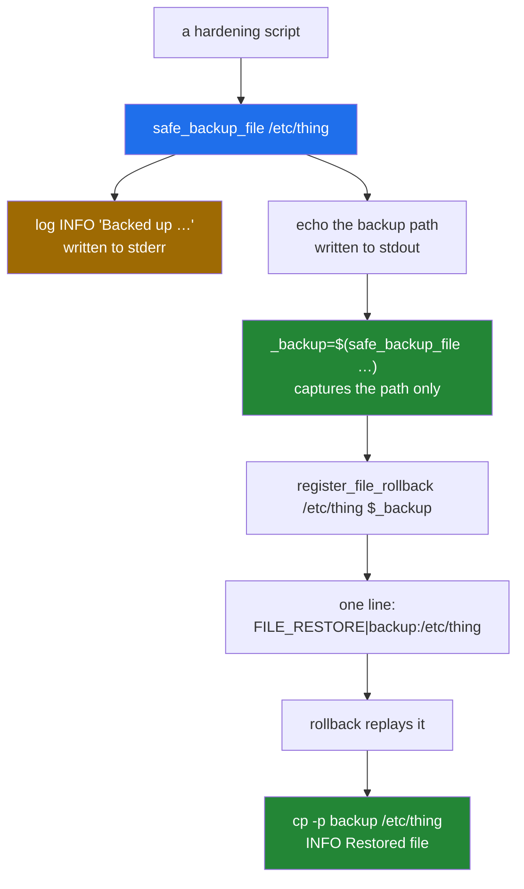
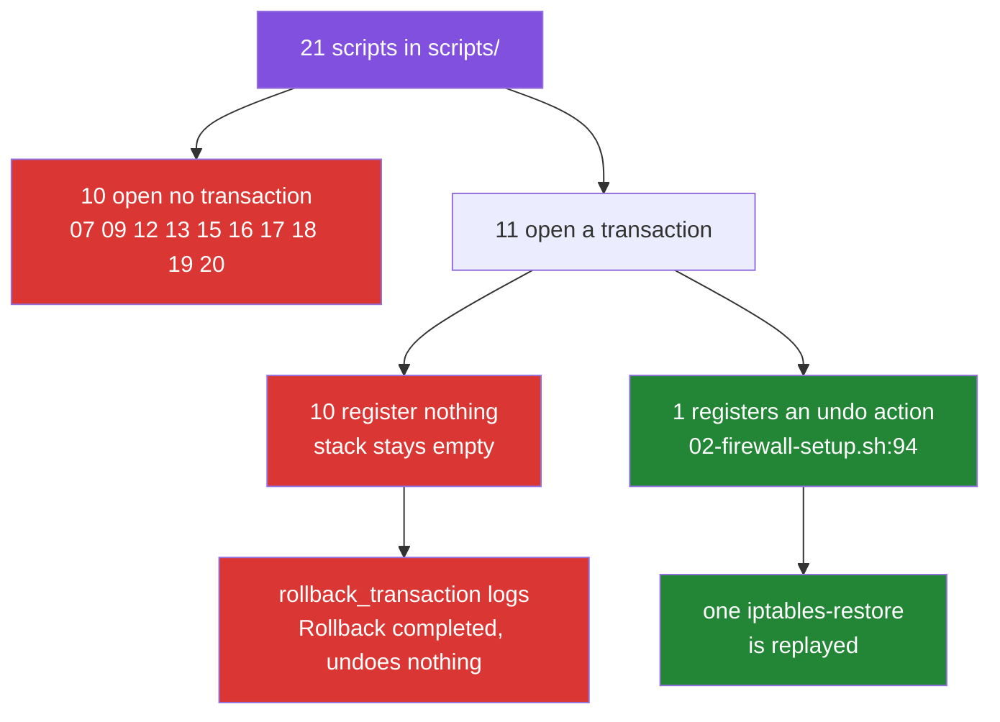

# Rollback: the transaction model, and what it does not undo

[← back to the documentation index](README.md)

`lib/rollback.sh` is the safety story of this toolkit. Every hardening script
opens a transaction, registers an undo action before each change, and relies on
an `EXIT` trap to replay those actions in reverse if anything fails. This page
describes that machinery, shows a captured file restore, and then measures how
little of the toolkit actually registers anything to restore.

## The state machine



One transition in that diagram is still a risk:
`Open --> Abandoned`. `ROLLBACK_ENABLED` has no default, so without
`config/defaults.conf` the trap runs and does nothing
([BUG-4](BUGS-FOUND.md#bug-4), open). The fix is not a one-liner, because the
same missing file is what lets the orchestrator start at all
([BUG-7](BUGS-FOUND.md#bug-7)); see the README for how the two interact.

## What a rollback action looks like

The stack at `/var/lib/hardening/rollback_stack` is a flat text file, one
action per line, `TYPE|DATA`:

| Type | `DATA` | Replayed by |
|---|---|---|
| `FILE_RESTORE` | `backup_path:original_path` | `cp -p` back over the original |
| `COMMAND` | a shell command | `eval` |
| `SERVICE` | `name:start`, `name:stop`, `name:restart`, `name:reload` | `safe_service_<action>` |
| `SYSCTL` | `parameter:value` | `sysctl -w` |
| `FIREWALL` | a shell command | `eval`, if `iptables` exists |

`rollback_transaction` moves the stack aside, reverses it with `posix_reverse`,
and calls `execute_rollback_action` for each line. Any action that fails is
written back to the stack, and the function logs
`Rollback completed with failures` and returns 1, so a caller can tell a
partial rollback from a complete one.

## The registration path



## A rollback, captured

`tools/capture-rollback-demo.sh` starts a throwaway Debian container, creates
`/etc/demo.conf`, backs it up through the toolkit's own functions, modifies it,
and rolls the transaction back. Full output:
[`media/captures/rollback-demo.log`](../media/captures/rollback-demo.log).


The captured return value and the stack:

```text
== what safe_backup_file actually returns ==
[INFO] Backed up /etc/demo.conf to /var/backups/hardening/demo.conf.20260924-084115.bak
     1	/var/backups/hardening/demo.conf.20260924-084115.bak
lines captured: 1
names an existing file: yes

== rollback stack contents ==
     1	FILE_RESTORE|/var/backups/hardening/demo.conf.20260924-084115.bak:/etc/demo.conf
```

The `[INFO]` line is on stderr, so it appears in the terminal but not in the
captured value. The result:

```text
== after rollback ==
ORIGINAL - this must come back after rollback

RESULT: file was restored
```

The demo registers its own undo action. None of the scripts that edit
`/etc/sysctl.conf` do, so in the captured `03-kernel-params.sh` run
([`media/captures/03-kernel-params.log`](../media/captures/03-kernel-params.log))
the hardening block was still in the file after `Rollback completed`. The next
section is why.

## How much of the toolkit is actually inside a transaction

The demo above shows that a registered file comes back. The larger question is
how often a hardening script registers anything at all.

Once. `tools/capture-rollback-coverage.sh` counts both sides of the API across
`scripts/`:

```text
    script                     begin commit rollback register
    00-ssh-verification.sh         1      1        3        0
    01-ssh-hardening.sh            1      2        4        0
    02-firewall-setup.sh           1      1        1        1
    03-kernel-params.sh            1      1        0        0
    04-network-stack.sh            1      1        0        0
    05-file-permissions.sh         1      1        0        0
    06-process-limits.sh           1      1        0        0
    07-audit-logging.sh            0      0        0        0
    08-password-policy.sh          1      1        0        0
    09-account-lockdown.sh         0      0        0        0
    10-sudo-restrictions.sh        1      1        0        0
    11-service-disable.sh          1      1        1        0
    12-tmp-hardening.sh            0      0        0        0
    13-core-dump-disable.sh        0      0        0        0
    14-sysctl-hardening.sh         1      1        0        0
    15-cron-restrictions.sh        0      0        0        0
    16-mount-options.sh            0      0        0        0
    17-shell-timeout.sh            0      0        0        0
    18-banner-warnings.sh          0      0        0        0
    19-log-retention.sh            0      0        0        0
    20-integrity-baseline.sh       0      0        0        0
    TOTAL over 21 scripts         11     12        9        1
```

Full output:
[`media/captures/rollback-coverage.txt`](../media/captures/rollback-coverage.txt).



`scripts/01-ssh-hardening.sh` is the clearest case. It calls
`rollback_transaction` on four separate failure paths — a failed config update,
lost connectivity, failed validation, failed verification — and registers
nothing on any of them. Each of those four calls reaches
`rollback_transaction` with an empty stack, takes the `Cleared` transition in
the state machine at the top of this page, logs `Rollback completed` and
returns 0.

This is [BUG-24](BUGS-FOUND.md#bug-24), and it is still open: it needs a
decision about which undo action each script should register, not a one-line
patch. Until then, the restore path works for exactly the one script that uses
it.

## What the rest of the machinery guarantees

- The `EXIT INT TERM` trap is installed by `begin_transaction` and removed by
  `commit_transaction`, so an interrupted script does attempt a rollback, as
  long as `ROLLBACK_ENABLED` is set ([BUG-4](BUGS-FOUND.md#bug-4)).
- The stack is cleared at the start of every transaction, so a stale stack from
  a previous run is not replayed.
- `SYSCTL`, `COMMAND`, `SERVICE` and `FIREWALL` actions were not exercised by
  any capture. Only `FILE_RESTORE` has been seen to work.
- `posix_reverse` in `lib/posix_compat.sh` is a correct POSIX reversal and is
  used by both `rollback_transaction` and `rollback_to_checkpoint`.

## The manual escape hatch

`emergency-rollback.sh` restores backups without the rest of the toolkit. It
sets `SAFETY_MODE=0` and `DRY_RUN=0` before it loads `lib/common.sh`, so it
now gets past its start-up and reaches its interactive menu. The only argument
it recognises is `--force`/`-f`, a full reset without prompting; anything
else, `--help` included, opens the menu. In the capture, with no terminal on
stdin, that run exits 1
([`pristine.txt`](../media/captures/pristine.txt)). Restoring a file by hand from
`/var/backups/hardening/` with `cp -p` works as well; each backup has `.meta`
and `.sha256` sidecars.

## Checkpoints

`create_checkpoint` and `rollback_to_checkpoint` are defined in
`lib/rollback.sh` and called from nowhere. `rollback_to_checkpoint` replays the
actions added since the checkpoint in reverse order and keeps the stack intact
if one fails. No capture exercises it.

See [measurement.md](measurement.md) for how the captures on this page were
produced, and [BUGS-FOUND.md](BUGS-FOUND.md) for the entries that are still
open.
