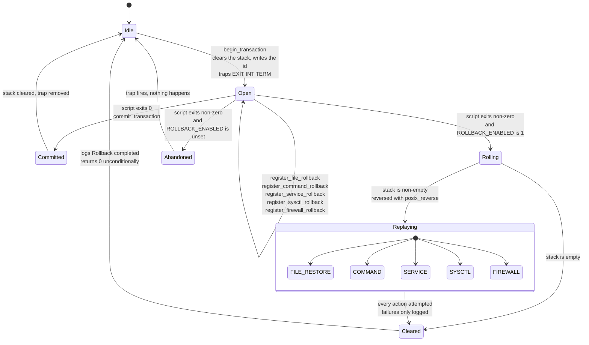
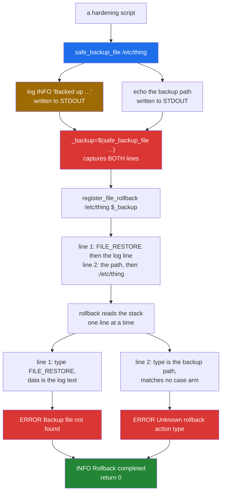
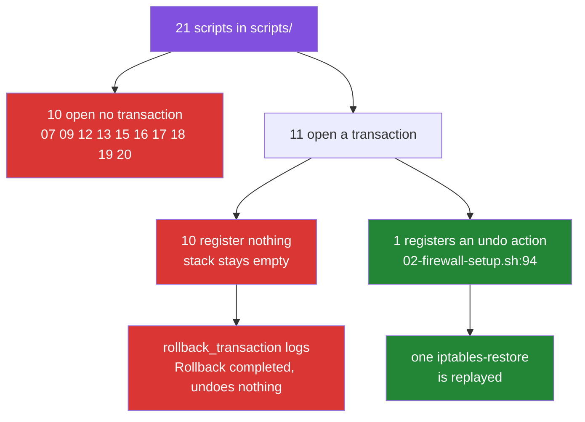

# Rollback: the transaction model, and what it does not undo

[← back to the documentation index](README.md)

`lib/rollback.sh` is the safety story of this toolkit. Every hardening script
opens a transaction, registers an undo action before each change, and relies on
an `EXIT` trap to replay those actions in reverse if anything fails. This page
describes that machinery and then shows, from a captured run, that the file
restore at the end of it does not currently work.

## The state machine



Three transitions in that diagram are where the risk lives, and each is a
separate defect:

| Transition | What is wrong |
|---|---|
| `Open --> Abandoned` | `ROLLBACK_ENABLED` has no default, so without `config/defaults.conf` the trap runs and does nothing ([BUG-4](BUGS-FOUND.md#bug-4)) |
| inside `Replaying` | `FILE_RESTORE` is handed a backup path with a log line glued to the front, so it restores nothing ([BUG-3](BUGS-FOUND.md#bug-3)) |
| `Cleared --> Idle` | `rollback_transaction` logs `Rollback completed` and returns 0 whether or not any action succeeded ([BUG-5](BUGS-FOUND.md#bug-5)) |

## What a rollback action looks like

The stack at `/var/lib/hardening/rollback_stack` is a flat text file, one
action per line, `TYPE|DATA`:

| Type | `DATA` | Replayed by |
|---|---|---|
| `FILE_RESTORE` | `backup_path:original_path` | `cp -p` back over the original |
| `COMMAND` | a shell command | `eval` |
| `SERVICE` | `name:start`, `name:stop`, `name:restart`, `name:reload` | `safe_service_<action>` |
| `SYSCTL` | `parameter:value` | `sysctl -w` |
| `FIREWALL` | a shell command | `eval`, if `iptables` exists |

`rollback_transaction` moves the stack aside, reverses it with `posix_reverse`,
and calls `execute_rollback_action` for each line. Failures are logged and
ignored; there is no second attempt and no error propagation.

## The registration path, and where it breaks



The green box at the bottom is the point. The run reports success.

## A rollback, captured

`tools/capture-rollback-demo.sh` builds a throwaway container, creates
`/etc/demo.conf`, backs it up through the toolkit's own functions, modifies it,
and rolls the transaction back. Full output:
[`media/captures/rollback-demo.log`](../media/captures/rollback-demo.log).


The two lines that explain everything:

```text
== what safe_backup_file actually returns ==
     1	[INFO] Backed up /etc/demo.conf to /var/backups/hardening/demo.conf.20260921-195638.bak
     2	/var/backups/hardening/demo.conf.20260921-195638.bak
lines captured: 2
names an existing file: NO
```

and the result:

```text
== after rollback ==
HARDENED - this must not survive the rollback

RESULT: file was NOT restored - the hardened content survived
```

This is not specific to the demo file. The same sequence appears in the
captured `03-kernel-params.sh` run
([`media/captures/03-kernel-params.log`](../media/captures/03-kernel-params.log)),
where the stray path is visible on its own line and the hardening block was
still in `/etc/sysctl.conf` after `Rollback completed`.

## How much of the toolkit is actually inside a transaction

The section above is about a registration that arrives corrupted. There is a
larger question underneath it: how often does a hardening script register
anything at all?

Once. `tools/capture-rollback-coverage.sh` counts both sides of the API across
`scripts/`:

```text
    script                     begin commit rollback register
    00-ssh-verification.sh         1      1        3        0
    01-ssh-hardening.sh            1      2        4        0
    02-firewall-setup.sh           1      1        1        1
    03-kernel-params.sh            1      1        0        0
    04-network-stack.sh            1      1        0        0
    05-file-permissions.sh         1      1        0        0
    06-process-limits.sh           1      1        0        0
    07-audit-logging.sh            0      0        0        0
    08-password-policy.sh          1      1        0        0
    09-account-lockdown.sh         0      0        0        0
    10-sudo-restrictions.sh        1      1        0        0
    11-service-disable.sh          1      1        1        0
    12-tmp-hardening.sh            0      0        0        0
    13-core-dump-disable.sh        0      0        0        0
    14-sysctl-hardening.sh         1      1        0        0
    15-cron-restrictions.sh        0      0        0        0
    16-mount-options.sh            0      0        0        0
    17-shell-timeout.sh            0      0        0        0
    18-banner-warnings.sh          0      0        0        0
    19-log-retention.sh            0      0        0        0
    20-integrity-baseline.sh       0      0        0        0
    TOTAL over 21 scripts         11     12        9        1
```

Full output:
[`media/captures/rollback-coverage.txt`](../media/captures/rollback-coverage.txt).



`scripts/01-ssh-hardening.sh` is the clearest case. It calls
`rollback_transaction` on four separate failure paths — a failed config update,
lost connectivity, failed validation, failed verification — and registers
nothing on any of them. Each of those four calls reaches
`rollback_transaction` with an empty stack, takes the `Cleared` transition in
the state machine at the top of this page, logs `Rollback completed` and
returns 0.

This is [BUG-24](BUGS-FOUND.md#bug-24), and it matters more than
[BUG-3](BUGS-FOUND.md#bug-3): fixing the corrupted backup path would make
rollback work for the one script that registers something. The other twenty
would still roll back to nothing, because there is nothing on their stacks to
correct.

## What still works

The transaction bookkeeping around the broken part is sound, and worth keeping
in mind when reading the fix:

- The `EXIT INT TERM` trap is installed by `begin_transaction` and removed by
  `commit_transaction`, so an interrupted script does attempt a rollback.
- The stack is cleared at the start of every transaction, so a stale stack from
  a previous run is not replayed.
- `SYSCTL`, `COMMAND`, `SERVICE` and `FIREWALL` actions are not affected by
  [BUG-3](BUGS-FOUND.md#bug-3); their `DATA` does not come from a command
  substitution around a logging function. They were not exercised by any
  capture in this pass, so this page says only that the defect does not reach
  them, not that they work.
- `posix_reverse` in `lib/posix_compat.sh` is a correct POSIX reversal and is
  used by `rollback_transaction`.

## The manual escape hatch

`emergency-rollback.sh` exists to restore backups without the rest of the
toolkit. It aborts on its second statement, because it tries to `export
SAFETY_MODE=0` after `lib/common.sh` has already made `SAFETY_MODE` read-only
([BUG-2](BUGS-FOUND.md#bug-2)):

```text
emergency-rollback.sh: 14: export: SAFETY_MODE: is read only
```

Until that is fixed, restoring a file by hand from `/var/backups/hardening/`
with `cp -p` is the reliable path. The backups themselves are written
correctly, with `.meta` and `.sha256` sidecars; it is only the path handed to
the rollback machinery that is malformed.

## Checkpoints

`create_checkpoint` and `rollback_to_checkpoint` are defined in
`lib/rollback.sh` and called from nowhere. They are not part of any documented
workflow and, as written, would not replay their actions
([BUG-17](BUGS-FOUND.md#bug-17)). Treat the checkpoint API as unimplemented.

See [measurement.md](measurement.md) for how the captures on this page were
produced, and [BUGS-FOUND.md](BUGS-FOUND.md) for the diffs that would fix what
it shows.
