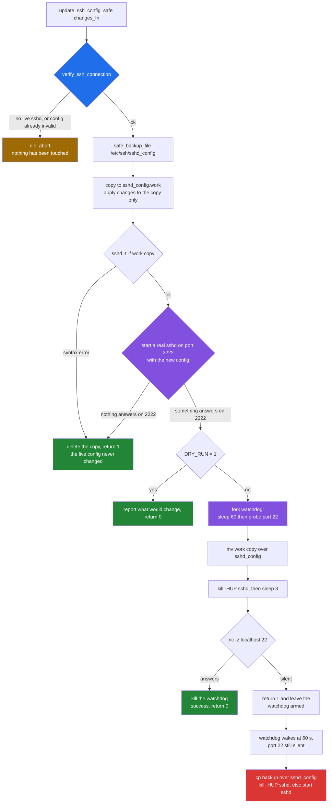
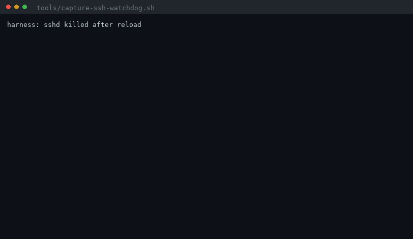
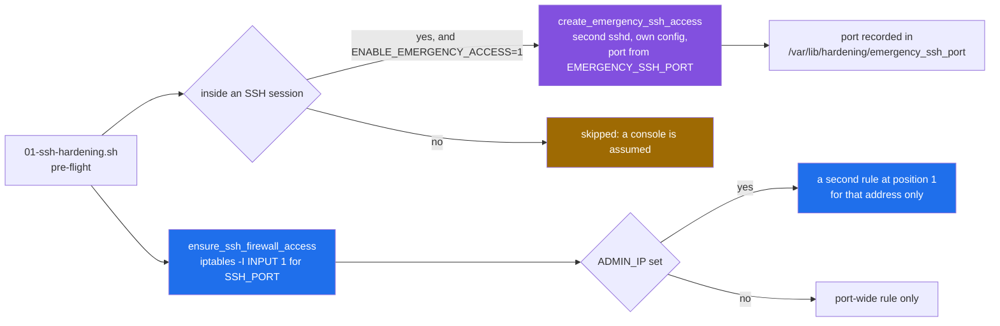
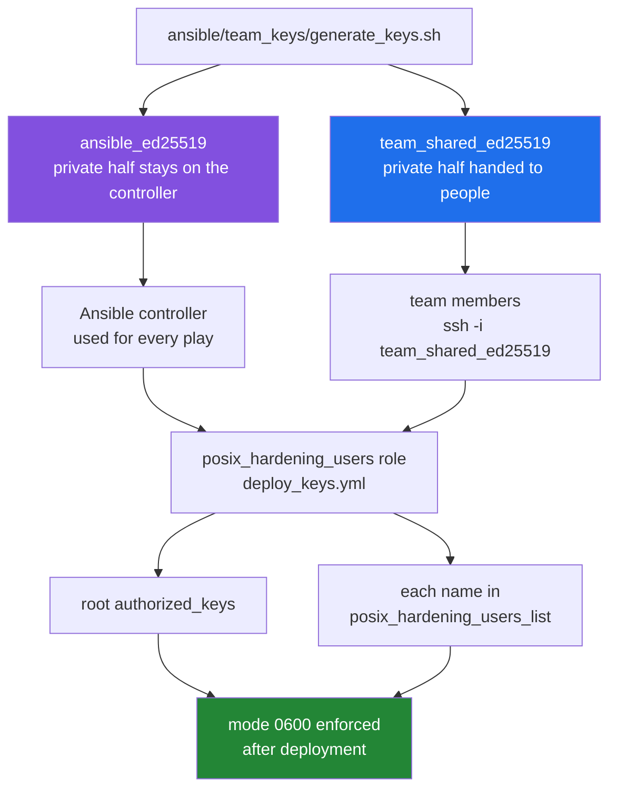

# SSH safety: why the toolkit says you will not lock yourself out

[← back to the documentation index](README.md)

Every other hardening step can be undone from a console. SSH cannot: the
machine you are hardening is usually the machine you are hardening it *from*.
`lib/ssh_safety.sh` is the part of the toolkit that exists for that single
problem, and this page draws its promise as a decision flow so the guarantee
can be read rather than inferred — including the point where, as the code
stands today, the guarantee does not hold.

## The five defences, and whether each one works

| Defence | Where | State as measured |
|---|---|---|
| Refuse to start unless SSH is verifiably alive | `verify_ssh_connection`, `lib/ssh_safety.sh:22` | Works |
| Syntax-check the new config before it is installed | `test_ssh_config`, `lib/ssh_safety.sh:101` | Works |
| Boot a throwaway sshd on port 2222 with the new config | `test_ssh_config`, `lib/ssh_safety.sh:126` | Reports success without starting one ([BUG-20](BUGS-FOUND.md#bug-20)) |
| Background watchdog that restores the backup after 60 s of silence | `update_ssh_config_safe`, `lib/ssh_safety.sh:227` | Fires, then fails to restore ([BUG-3](BUGS-FOUND.md#bug-3)) |
| Emergency sshd on a second port, opened before hardening starts | `create_emergency_ssh_access`, `lib/ssh_safety.sh:484` | Works when called; never armed on the manual path ([BUG-21](BUGS-FOUND.md#bug-21)) |

Two of the five hold unconditionally. The rest are examined below.

## The decision flow

This is `update_ssh_config_safe`, the single function every SSH change in the
toolkit goes through. `scripts/01-ssh-hardening.sh:306` calls it with
`apply_ssh_hardening`; `manage_ssh_access` calls it for `AllowUsers` and
friends. Nothing writes `sshd_config` directly.



Read the green boxes as the safe exits. Two of the four failure modes — no
verified connection, and a config that will not parse — are caught *before*
anything is written to `/etc/ssh/sshd_config`. For those the guarantee is
structural: the live file is still the file that was working a moment ago.

The purple box is weaker than it looks. `test_ssh_config` starts `sshd`
without `-D`, so the parent forks and exits 0 before the child has tried to
bind, and the `nc -z localhost 2222` that follows is answered by whatever holds
the port rather than by the daemon that was just asked for. Since the
toolkit's own emergency daemon defaults to that same port 2222, the check can
be satisfied entirely by a daemon running a different configuration
([BUG-20](BUGS-FOUND.md#bug-20)).

The red box is the last case, where the new config parses, satisfies the port
probe, and still leaves you unable to log in. That is the case the watchdog
exists for, and it is the case that does not work.

## Where the guarantee breaks

The watchdog closes over `$_backup_file`, which is set at
`lib/ssh_safety.sh:187`:

```sh
_backup_file=$(safe_backup_file "$SSHD_CONFIG")
```

`safe_backup_file` logs to stdout and then echoes the path, so the command
substitution captures two lines: a log line and the path. Every later use of
`$_backup_file` is therefore a two-line string starting with `[INFO]`.
See [BUG-3](BUGS-FOUND.md#bug-3) for the mechanism and the one-line fix.

The consequence is not theoretical. A container run with the timeout lowered
to 15 s, sshd deliberately killed after the reload, recorded in
`media/captures/ssh-watchdog.log`:

```text
[INFO] SSH config backed up to: [INFO] Backed up /etc/ssh/sshd_config to /var/backups/hardening/sshd_config.20260921-195655.bak
[INFO] Setting up automatic rollback (15s timeout)
[INFO] Reloading SSH daemon
[ERROR] SSH not responding after reload
[ERROR] SSH not responding - executing rollback
cp: cannot stat '[INFO] Backed up /etc/ssh/sshd_config to /var/backups/hardening/sshd_config.20260921-195655.bak'$'\n''/var/backups/hardening/sshd_config.20260921-195655.bak': No such file or directory
RESULT: sshd_config was NOT restored
sshd back up: no
```



The watchdog detected the outage correctly and fired on time. The `cp` it
then ran was given a filename with a log line glued to the front of it, so the
backup was never copied back. The config file's SHA-256 before and after the
rollback differ; `sshd` did not come back. On a remote machine that is a
lockout.

Two smaller defects sit in the same subshell and would matter once BUG-3 is
fixed:

| Line | Problem | Effect |
|---|---|---|
| `lib/ssh_safety.sh:229` | The probe calls `nc` with no `command -v` guard, unlike `check_port_listening` in `lib/common.sh:488` | On a host without `nc` the probe always fails, so the watchdog fires on every run — including successful ones |
| `lib/ssh_safety.sh:234` | `SSH configuration rolled back` is logged whether or not the `cp` succeeded | The log says the machine was rescued when it was not; this is what the capture above shows |

Both are [BUG-19](BUGS-FOUND.md#bug-19). The `nc`-absent path was not
reproduced — the analysis container has `nc` — and is marked as inferred
there.

## What is still standing when the watchdog fails

The watchdog is the last line, not the only one. Before
`scripts/01-ssh-hardening.sh` touches anything it arranges two independent
routes back in:



One thing to set before using this path: `EMERGENCY_SSH_PORT` defaults to
2222, the same value as `SSHD_TEST_PORT`, on both the manual path
(`config/defaults.conf.template:64`) and the Ansible one
(`ansible/group_vars/all.yml:60` and `:70`). Give the emergency daemon its own
port, or it will be the thing answering every later config test — the
mechanism behind [BUG-20](BUGS-FOUND.md#bug-20).

The emergency daemon is a deliberate hole: its generated config sets
`PermitRootLogin yes` and `PasswordAuthentication yes`
(`lib/ssh_safety.sh:494-495`). It is a way back in, not a hardened service,
and `kill_emergency_ssh` is what closes it again. Nothing in the toolkit
closes it automatically at the end of a run.

On the manual path it is never opened at all. The gate at
`scripts/01-ssh-hardening.sh:108` tests `ENABLE_EMERGENCY_ACCESS`, which only
the two Ansible `defaults.conf.j2` templates ever set — it is absent from
`config/defaults.conf.template`, so a script that has sourced the generated
config sees the empty string and skips the branch. The line
`Currently in SSH session - extra safety measures enabled` is printed just
above it either way ([BUG-21](BUGS-FOUND.md#bug-21)). Called directly, the
function works: it writes `/etc/ssh/sshd_emergency_config`, starts a daemon and
records the port, as section 3 of
[`media/captures/emergency-ssh.txt`](../media/captures/emergency-ssh.txt)
shows.

`ensure_ssh_firewall_access` inserts its rules with `-I INPUT 1`, so they sit
ahead of whatever `02-firewall-setup.sh` adds afterwards. That ordering is
what keeps the firewall script from locking out the session that is running
it.

## Keys: two keys, two different jobs

The Ansible path separates automation from human access, which is the right
shape:



The intent, from `ansible/team_keys/README.md`: the automation key never
leaves the controller, the team key is what humans carry, and both are
installed before `01-ssh-hardening` turns off password authentication. Only
public halves are meant to reach git —
`.gitignore:87-95` blocks `*_ed25519` and re-admits `*.pub`.

That last part is where it goes wrong. Both public keys are committed, and
the deployment defaults point straight at them:

```yaml
posix_hardening_ansible_key_path: "{{ playbook_dir }}/team_keys/ansible_ed25519.pub"
posix_hardening_team_key_path:    "{{ playbook_dir }}/team_keys/team_shared_ed25519.pub"
```

A fresh clone therefore arrives with two usable-looking public keys whose
private halves exist only on whichever machine first ran `generate_keys.sh`.
`generate_keys.sh` will not replace them, because its `key_exists` test
matches the `.pub` file alone. Reproduced with
`tools/capture-team-keys.sh`, output in `media/captures/team-keys.txt`:

```text
=== 4. generate_keys.sh run in that fresh clone
    [INFO] Generating ansible_ed25519...
    [WARNING] Key ansible_ed25519 already exists, skipping generation
    [INFO] Generating team_shared_ed25519...
    [WARNING] Key team_shared_ed25519 already exists, skipping generation
      (No private keys found)
    exit status: 0

=== 5. private keys present in the clone afterwards
    (nothing listed above means none)
```

Run the Ansible path on a fresh clone and `deploy_keys.yml` finds both files
present, skips its "keys are missing" warning, and installs those public keys
into `root/.ssh/authorized_keys` on every host — while `01-ssh-hardening`
disables password login. The operator holds no matching private key. This is
[BUG-18](BUGS-FOUND.md#bug-18).

The two committed keys, so you can check whether a clone still carries them:

| File | Fingerprint | Comment |
|---|---|---|
| `ansible_ed25519.pub` | `SHA256:S7Z7K/80/EdFifFBu7xnq8s5SAY3H2NGnweT4TguV9s` | `ansible-automation@posix-hardening` |
| `team_shared_ed25519.pub` | `SHA256:7yHffuV420KbdPbB4PAXodEqG0WY4/GEpm4BOXzPwBQ` | `team-access@posix-hardening` |

Deleting both `.pub` files and re-running `generate_keys.sh` produces a fresh
pair and restores the intended behaviour.

## The manual path has no key management at all

`scripts/01-ssh-hardening.sh` does not deploy keys. It checks for
`/root/.ssh/authorized_keys` or `$HOME/.ssh/authorized_keys`
(`scripts/01-ssh-hardening.sh:120`) and, finding neither, prompts on a TTY and
refuses if the answer is not yes. Run without a TTY it logs two warnings and
carries on to disable password authentication:

```text
[WARN] Non-interactive mode: Continuing without authorized_keys
[WARN] Ensure you have alternate console/emergency access!
```

That is a defensible default for an automated run, but it means the manual
path's lockout protection is exactly the watchdog described above — which is
the one that does not work. Put a key in place yourself before running it.

## Known limitations of this page

- The watchdog capture used `SSH_ROLLBACK_TIMEOUT=15` rather than the default
  60 s, to keep the run short. Nothing else was altered.
- The container had `nc` installed, so the missing-`nc` failure mode above was
  not exercised.
- `create_emergency_ssh_access` was called directly and observed to work. The
  gated call site in `scripts/01-ssh-hardening.sh` was not reached, because
  `docker exec` is not an SSH session and `$SSH_CONNECTION` is empty there.
- No multi-host Ansible run was performed. The key-deployment behaviour is
  read from `deploy_keys.yml` and from the reproduced state of a fresh clone,
  not from a play against real hosts.

See [measurement.md](measurement.md) for how the captures on this page were
produced.
