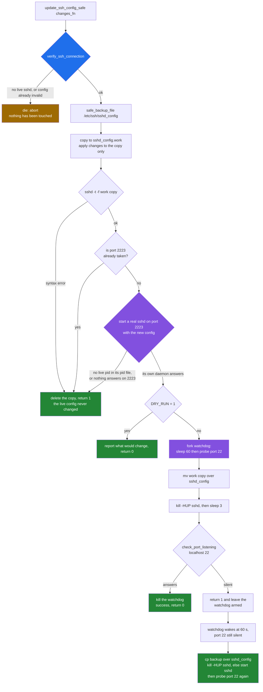
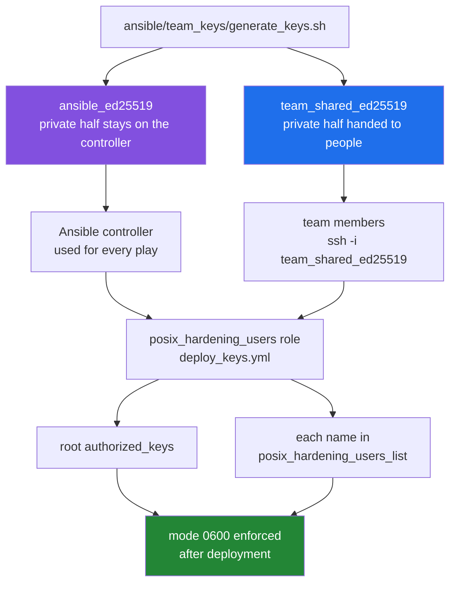

# SSH safety: why the toolkit says you will not lock yourself out

[← back to the documentation index](README.md)

Every other hardening step can be undone from a console. SSH cannot: the
machine you are hardening is usually the machine you are hardening it *from*.
`lib/ssh_safety.sh` is the part of the toolkit that exists for that single
problem, and this page draws its promise as a decision flow so the guarantee
can be read rather than inferred.

## The five defences, and whether each one works

| Defence | Where | State as measured |
|---|---|---|
| Refuse to start unless SSH is verifiably alive | `verify_ssh_connection`, `lib/ssh_safety.sh:24` | Works |
| Syntax-check the new config before it is installed | `test_ssh_config`, `lib/ssh_safety.sh:109` | Works |
| Boot a throwaway sshd on port 2223 with the new config | `test_ssh_config`, `lib/ssh_safety.sh:133` | Works: fails if the port is already taken or its own daemon did not start ([#17](https://github.com/Bissbert/POSIX-hardening/issues/17)) |
| Background watchdog that restores the backup after 60 s of silence | `update_ssh_config_safe`, `lib/ssh_safety.sh:265` | Works: fired and restored `sshd_config` in the container capture |
| Emergency sshd on a second port, opened before hardening starts | `create_emergency_ssh_access`, `lib/ssh_safety.sh:568` | Works when called; off unless `ENABLE_EMERGENCY_SSH=1` ([#18](https://github.com/Bissbert/POSIX-hardening/issues/18)) |

## The decision flow

This is `update_ssh_config_safe`, the single function every SSH change in the
toolkit goes through. `scripts/01-ssh-hardening.sh:321` calls it with
`apply_ssh_hardening`; `manage_ssh_access` calls it for `AllowUsers` and
friends. Nothing writes `sshd_config` directly.



Read the green boxes as the safe exits. Three of the four failure modes — no
verified connection, a config that will not parse, and a config a real sshd
will not serve — are caught *before* anything is written to
`/etc/ssh/sshd_config`. For those the guarantee is structural: the live file
is still the file that was working a moment ago.

The purple box starts a real `sshd` on `SSHD_TEST_PORT`, 2223 by default
(`SSH_TEST_PORT` in `config/defaults.conf` sets it too), away from the
emergency daemon's 2222. Because a probe of the port would be answered by
whatever holds it, the test first refuses a port that is already in use, and
after starting the daemon it requires a live pid in the daemon's own pid file:
`sshd` forks, so its exit status alone does not show that it came up
([#17](https://github.com/Bissbert/POSIX-hardening/issues/17)). In the container capture, with the emergency daemon
on 2222, the test on 2223 returns 0, the same test pointed at 2222 fails with
`Test port 2222 is already in use`, and once 2222 is free it passes again
(sections 4 to 6 of
[`emergency-ssh.txt`](../media/captures/emergency-ssh.txt)). Section 5 shows
why the pid check is needed: a test `sshd` started by hand on the taken port
exits 0 and writes no pid file.

The last case is a new config that parses, satisfies the port probe, and still
leaves sshd silent after the reload. That is the case the watchdog exists
for.

## The watchdog, captured

The watchdog closes over `$_backup_file`, set at `lib/ssh_safety.sh:219` from
`safe_backup_file`, which returns the backup path alone on stdout. When it
fires it copies that backup over `sshd_config`, reloads or restarts `sshd`, and
probes port 22 again before it logs success. Every probe goes through
`check_port_listening`, which falls back from `nc` to `ss`, `netstat` and
`telnet`, and treats "no probe tool installed" as a failure to verify rather
than as an outage.

A container run with the timeout lowered to 15 s and sshd deliberately killed
after the reload, recorded in
[`media/captures/ssh-watchdog.log`](../media/captures/ssh-watchdog.log):

```text
sshd_config sha256 before : f7fdf0268371acf5d7277b652179c23ef53ca60d95e934451517f20113463e8e
sshd_config sha256 after  : f7fdf0268371acf5d7277b652179c23ef53ca60d95e934451517f20113463e8e
RESULT: sshd_config was restored
sshd back up: yes

== the lines that matter, from the run ==
79:[INFO] SSH config backed up to: /var/backups/hardening/sshd_config.20260924-193810.bak
87:[INFO] Setting up automatic rollback (15s timeout)
88:[INFO] Reloading SSH daemon
89:[ERROR] SSH not responding after reload
101:[ERROR] SSH not responding - executing rollback
102:[INFO] SSH configuration rolled back and connectivity restored
```


The watchdog detected the outage, fired on time, put the original file back
(the SHA-256 before and after match) and brought `sshd` up again. The success
line is logged only after a second probe of port 22 answers.

## What is still standing when the watchdog fails

The watchdog is the last line, not the only one. Before
`scripts/01-ssh-hardening.sh` touches anything it arranges two independent
routes back in:


`EMERGENCY_SSH_PORT` defaults to 2222 and the config test to 2223, on both
the manual path (`config/defaults.conf.template:58` and `:70`) and the Ansible
one (`ansible/group_vars/all.yml:60` and `:70`). If both are set to the same
port while the emergency daemon runs, the config test fails rather than
passing.

The emergency daemon is a deliberate hole: its generated config sets
`PermitRootLogin yes` and `PasswordAuthentication yes`
(`lib/ssh_safety.sh:578-579`). It is a way back in, not a hardened service,
and `kill_emergency_ssh` is what closes it again. Nothing in the toolkit
closes it automatically at the end of a run, and a rollback leaves it
running.

Because it is a hole, it is off by default. The gate at
`scripts/01-ssh-hardening.sh:111` opens it only when `ENABLE_EMERGENCY_SSH=1`,
the name `config/defaults.conf.template` uses, or `ENABLE_EMERGENCY_ACCESS=1`,
the name the Ansible `defaults.conf.j2` templates write; unset means off
([#18](https://github.com/Bissbert/POSIX-hardening/issues/18)). With it off, a run inside an SSH session logs that
emergency SSH is off and that the session should stay open until the run
completes. Called directly, the function writes
`/etc/ssh/sshd_emergency_config`, starts a daemon and records the port, as
section 3 of
[`media/captures/emergency-ssh.txt`](../media/captures/emergency-ssh.txt)
shows.

`ensure_ssh_firewall_access` inserts its rules with `-I INPUT 1`, so they sit
ahead of whatever `02-firewall-setup.sh` adds afterwards. That ordering is
what keeps the firewall script from locking out the session that is running
it.

## Keys: two keys, two different jobs

The Ansible path separates automation from human access, which is the right
shape:



The intent, from `ansible/team_keys/README.md`: the automation key never
leaves the controller, the team key is what humans carry, and both are
installed before `01-ssh-hardening` turns off password authentication. No key
is committed: `.gitignore:89` and `:93` ignore both halves, so every operator
generates their own pair
([#16](https://github.com/Bissbert/POSIX-hardening/issues/16)). The deployment defaults point at the generated files:

```yaml
posix_hardening_ansible_key_path: "{{ playbook_dir }}/team_keys/ansible_ed25519.pub"
posix_hardening_team_key_path:    "{{ playbook_dir }}/team_keys/team_shared_ed25519.pub"
```

On a fresh clone those files do not exist, so nothing is deployed until
`generate_keys.sh` has run. `generate_keys.sh` counts a key as present only
when its private half exists, replaces a stray `.pub`, and exits non-zero if a
pair is incomplete. Reproduced with `tools/capture-team-keys.sh`, output in
`media/captures/team-keys.txt`:

```text
=== 4. generate_keys.sh run in that fresh clone
    [INFO] Generating ansible_ed25519...
    [INFO] Generating team_shared_ed25519...
    exit status: 0

=== 5. private keys present in the clone afterwards
    /tmp/tmp.UxLGnVeVWz/clone/ansible/team_keys/team_shared_ed25519
    /tmp/tmp.UxLGnVeVWz/clone/ansible/team_keys/ansible_ed25519
```

Earlier versions of the repository committed two public keys whose private
halves nobody else holds, and the Ansible path deployed them to
`root/.ssh/authorized_keys`. They are still in the git history. If a host was
hardened from such a clone, remove these two keys from its `authorized_keys`:

| File | Fingerprint | Comment |
|---|---|---|
| `ansible_ed25519.pub` | `SHA256:S7Z7K/80/EdFifFBu7xnq8s5SAY3H2NGnweT4TguV9s` | `ansible-automation@posix-hardening` |
| `team_shared_ed25519.pub` | `SHA256:7yHffuV420KbdPbB4PAXodEqG0WY4/GEpm4BOXzPwBQ` | `team-access@posix-hardening` |

## The manual path has no key management at all

`scripts/01-ssh-hardening.sh` does not deploy keys. It checks for
`/root/.ssh/authorized_keys` or `$HOME/.ssh/authorized_keys`
(`scripts/01-ssh-hardening.sh:130`) and, finding neither, prompts on a TTY and
refuses if the answer is not yes. Run without a TTY it logs two warnings and
carries on to disable password authentication:

```text
[WARN] Non-interactive mode: Continuing without authorized_keys
[WARN] Ensure you have alternate console/emergency access!
```

That is a defensible default for an automated run, but it means the manual
path's lockout protection is exactly the watchdog described above. The watchdog
restores a config that sshd will not serve; it cannot help if the restored
config itself refuses your login. Put a key in place yourself before running
it.

## Known limitations of this page

- The watchdog capture used `SSH_ROLLBACK_TIMEOUT=15` rather than the default
  60 s, to keep the run short. Nothing else was altered.
- The container had `nc` installed, so the `ss`/`netstat`/`telnet` fallbacks
  and the no-probe-tool path were not exercised.
- `create_emergency_ssh_access` was called directly and observed to work. The
  gated call site in `scripts/01-ssh-hardening.sh` is covered by
  `tests/regression/emergency-ssh-setting.sh`, which sets `SSH_CONNECTION`
  itself; no real SSH session was used.
- No multi-host Ansible run was performed. The key-deployment behaviour is
  read from `deploy_keys.yml` and from the reproduced state of a fresh clone,
  not from a play against real hosts.

See [measurement.md](measurement.md) for how the captures on this page were
produced.
